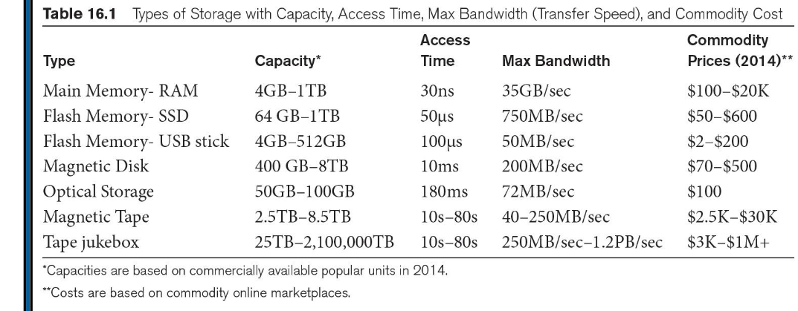
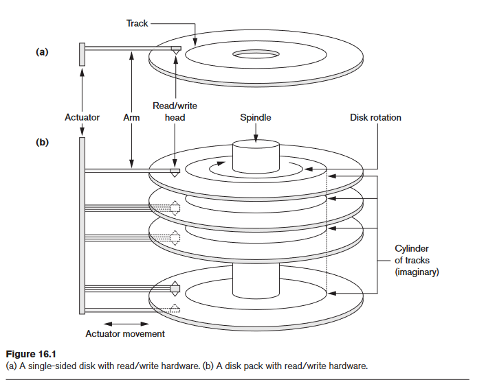
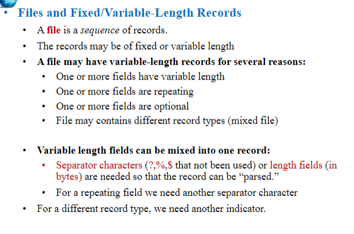
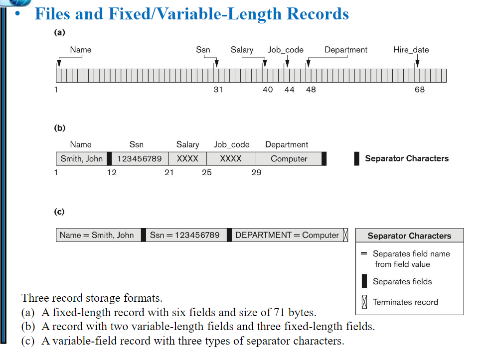

  
 Lecture 11. | Distributed Databases | NoSQL, Big Data
  

  

Distributed computing systems and distributed database (DDB) concepts form the cornerstone of modern big data and database management technologies. Let's dive deep into these concepts, providing technical details and examples.

### Distributed Computing System

1. **Definition & Structure**: A distributed computing system is an assembly of interconnected nodes (or processing sites) through a computer network. These nodes work together to perform tasks.

2. **Task Partitioning**: It involves breaking down a large task into smaller subtasks, which are then distributed among different nodes. This approach enhances efficiency and speed, as tasks are processed in parallel.

3. **Technological Roots**: Distributed Database (DDB) technology is the convergence of database technology and distributed systems technology. This fusion is essential in handling big data challenges.

4. **Example**: Consider a scenario where a large dataset needs to be processed for insights. The dataset is partitioned and distributed across multiple servers (nodes). Each server processes its portion of data, and the results are combined to form the final output.

### Big Data Technologies

1. **Origins**: Arising from distributed systems and database systems, big data technologies integrate data mining and machine learning algorithms. These technologies handle and analyze vast amounts of data to extract valuable knowledge.

2. **Practical Example**: In a big data scenario, such as analyzing social media trends, data is collected from various sources, distributed across multiple nodes for processing, and machine learning algorithms are applied to identify patterns or trends.

### Distributed Database (DDB) Concepts

1. **Distributed Database**: It is a collection of logically interrelated databases distributed over a network.

   - **Key Characteristics**:
     - Databases are connected over a network.
     - There's a logical interrelation among the connected databases.
     - Nodes may not be homogeneous, implying different systems or software could be in use at different nodes.

2. **Distributed Database Management System (DDBMS)**: This software manages the distributed database and makes the distribution transparent to the user.

   - **General Example**: Oracle and IBM offer DDBMS solutions. In these systems, the user queries the database as if it were a single entity, but the DDBMS manages the complexities of distributed data storage and retrieval.

    - **Technical Example**: In a banking system using a DDBMS, customer data might be distributed across different servers located in various regions. When a user accesses their account information, the DDBMS retrieves data from these distributed nodes and presents it seamlessly.

### Combining Concepts for Efficiency

In practice, these concepts are often combined. **For example**, a large online retailer might use a distributed computing system to manage its inventory across various warehouses (nodes). Each warehouse database might hold inventory data relevant to its location, and the central system might use a DDBMS to manage this distributed data. Queries about stock levels or product locations are processed by the DDBMS, which retrieves and consolidates information from these distributed nodes.

  ---

  

  
 Lecture 10. | Disk Storage, Buffering & Hardware Techniques
  

*Types of Storage, with Memory, Access Time and Pricing*

Table 16.1 summarizes the current state of these devices and systems and shows the range of capacities, average access times, bandwidths *(transfer speeds)*, and costs on the open commodity market.

### **There are several primary file organizations:**
- Determine how the file records are physically placed on the disk,
- Determine how the records can be accessed.

* **A heap file** *(or unordered file)* places the records on disk in no particular order by appending new records at the end of the file.
* **A sorted file** *(or sequential file)* keeps the records ordered by the value of a particular field (called the sort key).
* **A hashed file** uses a hash function applied to a particular field (called the hash key) to determine a record’s placement on disk.
* **B-trees**, use tree structures.

---

## Secondary Storage Devices

---
### Disk Storage:

Whole blocks are transferred between disk and main memory for processing.

1. **Logical Block Addressing (LBA)**: In disk drives, each block of data is identified by a unique number called the Logical Block Address (LBA). For example, if a disk has 1,000 blocks, they are numbered from 0 to 999. This system allows the disk drive controller to locate any block efficiently.

2. **Disk Storage Device Mechanics**:
   - **Read-Write Head Movement**: To access data, a read-write head moves to the track containing the desired block. For instance, if data is stored in block 500, the read-write head shifts to the track holding this block.
   - **Disk Rotation and Data Access**: Once the head is positioned, the disk rotates, aligning the block under the read-write head for reading or writing. Imagine a vinyl record player where the needle *(read-write head)* must align with a specific track (block) on the record (disk).

3. **Disk Controller**: This component controls the disk drive and interfaces it with the computer. The disk controller acts as a mediator between the computer and the disk drive, managing data transfers. 
   Common interfaces include: 
- SCSI (Small Computer System Interface),
- SATA (Serial ATA) 
- SAS (Serial Attached SCSI) 

4. **Performance Factors**:
   - **Seek Time**: This is the time taken to position the read/write head over the correct track. It usually ranges from 5 to 10 milliseconds. For instance, moving the head to access data at the start of the disk versus the end can take this amount of time.
   - **Rotational Delay**: This delay occurs while waiting for the disk to rotate the desired block under the read/write head. In a 15,000 RPM (rotations per minute) hard drive, this delay is about 4 milliseconds.

5. **Data Organization and Access Optimization**:
   - **Placing Related Information on Contiguous Blocks**: To speed up access, related data is stored in adjacent blocks. For example, a document might be stored in blocks 100, 101, and 102, so reading it requires minimal movement of the read-write head.
   - **Minimizing Block Transfers**: The goal is to reduce the number of transfers needed to move data between the disk and main memory. This is achieved through efficient data placement and retrieval strategies.
   - **Double Buffering**: This technique can speed up the transfer of contiguous blocks. It involves pre-loading the next expected block into a buffer while the current block is being processed, thus reducing wait time for subsequent data.
  - **Use of Flash & SSD Memory**: Write the blocks first to the SSD then to the HDD during the idle time. Or In applications where updates occur with high frequency, updates can be lost from main memory if the system crashes. A preventive measure would be to increase the speed of updates/writes to disk.
  - **Use of log disks to temporarily hold writes**: A single disk is assigned to log the write commands. Then all blocks to be written can go to that disk sequentially, thus eliminating any seek time.  This works much faster than doing the writes to a file at random locations, which requires a seek for each write. The log disk can order these writes in *(cylinder, track)* ordering to minimize arm movement when writing.

Each circle on DISC is called a **Track** is divided into blocks *(sectors)*
- The block size B is fixed for each system.
- Typical block sizes range from B=512 bytes to B=8192 bytes.
- **Block**s reside within Tracks *(Blocks are unique identified by Block Number also)*
- The *(Actuator & Needle)* **Read/write head** shifts arround to different *Tracks* containing different *Blocks* for Read/Write
- Disk units with an *actuator* are called **movable-head disks** 

The number of **tracks on a disk ranges** from a few thousand to 152,000 on the disk drives shown above, and the capacity of each track typically ranges from tens of kilobytes to 150 Kbytes. 
* Often measured as *Bytes per Surface* for 1 Surface of the Disk! (usually about 152k BYTE) Whereas Bytes per track is closer to *1,000 BYTE*
* Because a track usually contains a large amount of information, it is divided into smaller blocks or sectors.

---

#### TL:DR Disc Elaborations:

1. **Platters**: A hard disk contains one or more flat, circular disks called platters, which are coated with a magnetic material. These platters spin around a central axis.

2. **Tracks**: Each platter's surface is divided into concentric circles called tracks. These tracks are the paths along which data is magnetically recorded and read.

3. **Sectors**: Each track is further divided into segments known as sectors. A sector is the smallest unit of storage on a disk and typically holds a fixed amount of data (for example, 512 bytes).

4. **Read/Write Heads**: These are positioned above and below each platter and move in and out to access data on different tracks.

Now, onto the concept of a cylinder:

- **Cylinder Definition**: A cylinder in disk storage is a set of tracks that are in the same position on different platters. Imagine the disk's read/write heads aligned at a specific track number across all platters. The collection of these aligned tracks forms a cylinder.

- **Example**: 
- Imagine a stack of vinyl records on a spindle, where each record represents a platter in the hard disk.
- Each record (platter) has its own set of concentric circles (tracks) where data is stored.
- Now, if you were to select one circle (track) from a record and then choose the same circle from all the other records in the stack, you'd have a set of circles all aligned on top of each other. This stack of aligned circles, spanning across all the platters, is what we call a "cylinder" in hard disk terminology.
---
### Solid State Device (SSD) Storage:
- Known as Enterprise Flash Device *(EFD)* as it's basically a bunch of inter-connected FLASH memory cards. *(Known as Flash Memory)*
- Data is less likely to be fragmented because it is addressed as RAM.
- Flash-based SSD's aren't Volatile Storage!

- DRAM-Based SSD's are faster, but are volatile storage

---
## Buffering of Blocks

Your understanding is correct. The concepts of interleaved and parallel buffering are methods used to optimize the process of transferring data between a disk and main memory, particularly when handling multiple processes or tasks. Let's elaborate on these concepts:

### Interleaved Fashion of Buffering

In interleaved buffering, multiple processes (like A and B in your example) are handled in an alternating, sequential manner. This is especially relevant when you have a single CPU managing multiple tasks. Here's how it works:

- **Sequential Execution**: The CPU switches back and forth between tasks, executing a bit of one before switching to the other. This creates the appearance of simultaneous execution, but in reality, the CPU is rapidly alternating between tasks.
- **Application in Disk I/O**: When applied to disk I/O, while one block of data is being read from or written to the disk, the CPU can process another block of data that has already been loaded into a different buffer in memory.
- **Example**: Think of it like a chef (CPU) cooking two dishes (processes A and B). The chef starts cooking dish A, then while it's simmering, they start preparing dish B. They keep switching between the two, doing a bit at a time.

### Parallel Fashion of Buffering

Parallel buffering involves simultaneous processing, made possible by having multiple processors or a separate disk I/O processor.

- **Simultaneous Execution**: Different processors handle different tasks concurrently. Unlike interleaving, where a single processor juggles multiple tasks, parallel processing literally processes multiple tasks at the same time.
- **Application in Disk I/O**: While the main CPU processes data in one buffer, the disk I/O processor can independently handle data transfer to or from another buffer. This genuinely parallel approach increases efficiency.
- **Example**: Using the cooking analogy, imagine two chefs (CPU and disk I/O processor) working in the same kitchen, each preparing a different dish (processes C and D) at the same time.

In summary, interleaved buffering is like a single performer juggling multiple tasks in a sequence, while parallel buffering is like a team working on different tasks simultaneously. Double buffering enhances both methods by ensuring that data is always ready for processing, thus reducing waiting times.

---

### Understanding Buffer Management

1. **Buffer and Buffer Pool**: 
   - **Concept**: A buffer is a part of main memory designated to temporarily hold data *(pages or blocks)* read from the disk. The **buffer pool** is a collection of such buffers.
   - **Application Example**: Imagine a database of a large online retailer with millions of product records. Not all records can be loaded into main memory at once due to its limited size. Buffers allow parts of this data to be loaded as needed.

2. **Buffer Manager** *(Akin to Cache Management at a larger Scale)*:
   - **Role**: It decides which buffers to use and what pages to replace when new data is requested.
   - **Example**: In our online retailer's database, when a user queries for products in a specific category, the buffer manager decides which data to load into the buffer pool from disk.

3. **Replacement Strategies**:
   - **Purpose**: To decide which data to keep in the buffer and which to replace.
   - **Example**: Common strategies like Least Recently Used (LRU) might be employed. If product details of 'electronics' were least recently accessed and now 'clothing' details are needed, the 'electronics' data might be replaced.
      - Clock policy: a round-robin variant of the LRU policy
      -  First-in-first-out (FIFO)

### Double Buffering Technique

1. **Concept**: Uses two buffers (A and B) to enhance I/O efficiency. While one buffer is used for reading data from the disk, the other is used for processing data.
2. **Application Example**: Buffer A is loading new product prices from the disk, while Buffer B is being used to update the current prices in the main memory.

### Types of Buffer Managers

1. **Direct Main Memory Control**:
   - **Example**: Traditional RDBMS where the buffer manager directly controls which data resides in the main memory.
2. **Virtual Memory Allocation**:
   - **Example**: Some object-oriented DBMSs where buffers are allocated in virtual memory, and the operating system decides which buffers stay in main memory.

### Buffer Manager Operations

1. **Pin-Count and Dirty Bit**:
   - **Pin-Count**: Number of requests or users for a page. A page with zero pin-count can be replaced.
   - **Dirty Bit**: Indicates if a page has been modified.
   - **Example**: A product description page being edited has a high pin-count and a set dirty bit, indicating it's actively used and modified.

2. **Handling Page Requests**:
   - **Scenario**: A query for product reviews is made.
   - **Buffer Manager Actions**: Checks if the page is in the buffer pool and either increments its pin-count or loads it into a buffer, replacing another page based on the replacement policy.

---

  
 Lecture 10. | Placing of File Records (On "Disk")

### "Disk" Refers to: 
*magnetic disks with rotational memory or solid-state disks with electronic access and no mechanical delays.*

---

**In General** Databases store *records* which are Table Entities (Tuple)

In some database applications, the need may arise for storing data items that consist of large unstructured objects, which represent images, digitized video or audio streams, or free text. These are referred to as BLOBs *(binary large objects).*

Each record consists of a collection of related data **values** or **items** (attributes)
Each **value** is formed of one or more bytes and corresponds to a particular **field** of the record.

In summary, in a database:
- A **record** is a complete set of related data (like a row in a table).
- A **field** is a specific part of a record, defined to hold a certain type of data (like a column in a table).
- A **value** is the actual data stored in a field of a record (like the data in each cell of a table).

**In Example B)** 'Name' and 'Department' Fields are Variable Length, that's why they need a seperation field in between.

---

# Record Blocking | Spanned VS. Unspanned Records

A file can have fixed-length records or variable-length records.

#### *File records can be unspanned or spanned*

- **Unspanned:** Records not allowed to cross block boundaries! *(It's fine for smaller record sizes, as multiple records can still be bunched up on a block!)* 
- **Spanned:** a record can be stored in more than one block. A *pointer* at the end of the first block points to the block containing the remainder of the record in case it is not the next consecutive block on disk. This organization is called spanned because records can span more than one block.
  
The physical disk blocks that are allocated to hold the file records can be:

1. Contiguous: the file blocks are allocated to consecutive disk blocks
2. Linked: each file block contains a pointer to the next file block
3. Indexed: one or more index blocks contain pointers to the actual file blocks

* It is also common to use combinations of these techniques.

## Blocking Factor

The blocking factor **bfr** represents the average number of records per block for the file. We can use **bfr** to calculate the number of blocks **b** needed for a file of **r** records: `Math.Ceiling( r / bfr) * blocks`

---

## Allocation Methods

1. **Contiguous Allocation**
   - Contiguous: the file blocks are allocated to consecutive disk blocks
   - **Example**: Imagine a bookshelf where books (file blocks) are placed side by side in order (consecutive disk blocks). This arrangement makes it easy to find and read a whole book (file) quickly. However, if you want to add pages (expand the file), it's challenging unless there's free space right next to it.
   - **Advantages**: Fast reading of entire files.
   - **Disadvantages**: Difficult to expand files.

2. **Linked Allocation**
   -  Linked: each file block contains a pointer to the next file block
   - **Example**: Think of a scavenger hunt where each clue (file block) points to the location of the next clue (next file block). This setup allows easy addition of new clues (expanding the file), but finding and reading all the clues (the whole file) takes time.
   - **Advantages**: Easy file expansion.
   - **Disadvantages**: Slow to read the entire file. *(Slower File Reading)*

3. **Combination of Contiguous and Linked (Clustered Allocation)**
   - **Example**: Imagine a hybrid of the bookshelf and scavenger hunt. Books (clusters of file blocks) are placed side by side, and each book has a note indicating where to find the next book (linked clusters). This balances the ease of reading a set of pages (clusters) and the flexibility of adding more pages (clusters).
   - **Advantages**: Balances read speed and file expansion.

4. **Indexed Allocation**
   - Indexed: one or more index blocks contain pointers to the actual file blocks
   - Uses index blocks for direct access to file blocks, optimizing individual block access at the cost of additional index space.
   - **Example**: Consider a library catalog where the catalog (index block) lists the locations of all pages (file blocks). This allows direct access to any page without needing to go through the entire book.
   - **Advantages**: Efficient access to individual blocks.
   - **Disadvantages**: Requires additional space for index blocks.

### File Headers
- **def**: Contain crucial file information for system programs, aiding in efficient record management and retrieval.
- **Description**: File headers contain essential metadata about a file, *(field names, order, data types, addresses of blocks)* like the disk addresses of file blocks and record formats. This information is used to locate and manage records on disk efficiently.
- **Example**: It's akin to a table of contents in a book, providing quick reference to the exact location of chapters (records).
- The goal of a good file organization is to avoid linear search or full scan of the file and to locate the block that contains a desired record with a minimal number of block transfers

  
 Operations on Files, Heap & Sorted Records (Unordered & Ordered)
  

