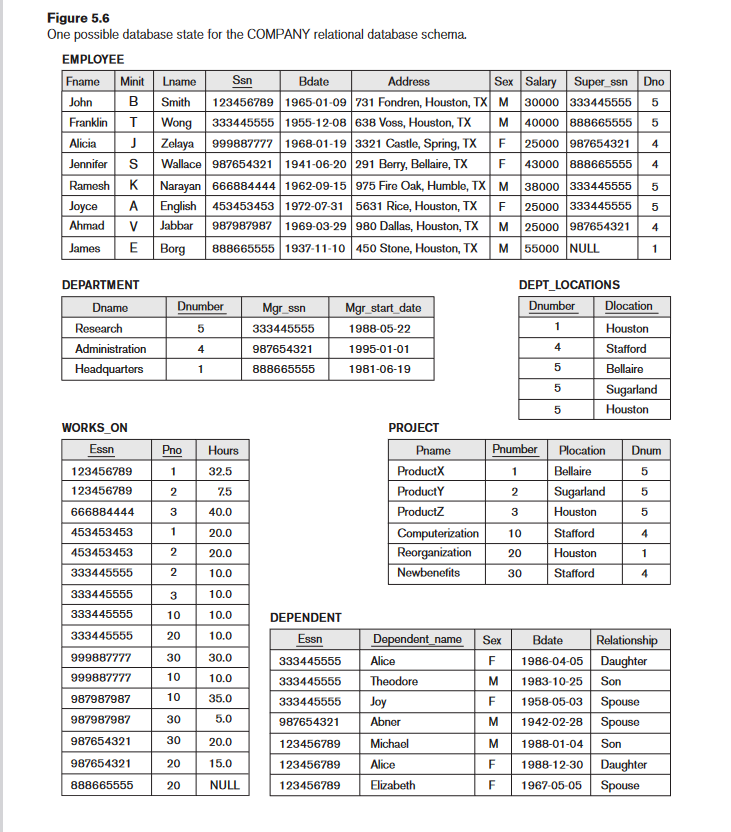

<details>
  <summary style="font-size: 30px; font-weight: 500; cursor: pointer;"> Company Example | SQL
  </summary>




## All Creation Queries for `Company` Tables:

```sql
CREATE TABLE EMPLOYEE (
    Fname VARCHAR(50),
    Minit CHAR,
    Lname VARCHAR(50),
    Ssn CHAR(9) PRIMARY KEY,
    Bdate DATE,
    Address VARCHAR(100),
    Sex CHAR(1),
    Salary DECIMAL(10, 2),
    Super_ssn CHAR(9),
    Dno INT,

    -- Foreign keys, on different attributes of same tbl
    FOREIGN KEY (Super_ssn) REFERENCES EMPLOYEE(Ssn), 
    FOREIGN KEY (Dno) REFERENCES Department(Dnumber)
);

CREATE TABLE DEPARTMENT (
    Dname VARCHAR(50),
    Dnumber INT PRIMARY KEY,
    Mgr_ssn CHAR(9),
    Mgr_start_date DATE,

    FOREIGN KEY (Mgr_ssn) REFERENCES Employee(Ssn)
);

CREATE TABLE DEPT_LOCATIONS (
    Dnumber INT,
    Dlocation VARCHAR(50),
    
    FOREIGN KEY (Dnumber) REFERENCES Department(Dnumber)
);

CREATE TABLE WORKS_ON (
    Essn CHAR(9),
    Pno INT,
    Hours DECIMAL(5,2),

    FOREIGN KEY (Essn) REFERENCES EMPLOYEE(Ssn),
    FOREIGN KEY (Pno) REFERENCES PROJECT(Pnumber)
);

CREATE TABLE PROJECT (
    Pname VARCHAR(50),
    Pnumber INT PRIMARY KEY,
    Plocation VARCHAR(50),
    Dnum INT,
    
    FOREIGN KEY (Dnum) REFERENCES Department(Dnumber)
);

CREATE TABLE DEPENDENT (
    Essn CHAR(9),
    Dependent_name VARCHAR(50),
    Sex CHAR(1),
    Bdate DATE,
    Relationship VARCHAR(50),
    FOREIGN KEY (Essn) REFERENCES EMPLOYEE(Ssn)
);
```

---

### Generation Script: (Thank you GPT 4)

```sql
-- Step 1: Create EMPLOYEE without the foreign key constraints
CREATE TABLE EMPLOYEE (
    Fname VARCHAR(50),
    Minit CHAR,
    Lname VARCHAR(50),
    Ssn CHAR(9) PRIMARY KEY,
    Bdate DATE,
    Address VARCHAR(100),
    Sex CHAR(1),
    Salary DECIMAL(10, 2),
    Super_ssn CHAR(9),
    Dno INT
);

-- Step 2: Create DEPARTMENT
CREATE TABLE DEPARTMENT (
    Dname VARCHAR(50),
    Dnumber INT PRIMARY KEY,
    Mgr_ssn CHAR(9),
    Mgr_start_date DATE,
    FOREIGN KEY (Mgr_ssn) REFERENCES EMPLOYEE(Ssn)
);

-- Step 3: Alter EMPLOYEE to add the foreign key constraints
ALTER TABLE EMPLOYEE
ADD FOREIGN KEY (Super_ssn) REFERENCES EMPLOYEE(Ssn),
ADD FOREIGN KEY (Dno) REFERENCES DEPARTMENT(Dnumber);

-- Step 4: Create DEPT_LOCATIONS
CREATE TABLE DEPT_LOCATIONS (
    Dnumber INT,
    Dlocation VARCHAR(50),
    FOREIGN KEY (Dnumber) REFERENCES DEPARTMENT(Dnumber)
);

-- Step 5: Create PROJECT
CREATE TABLE PROJECT (
    Pname VARCHAR(50),
    Pnumber INT PRIMARY KEY,
    Plocation VARCHAR(50),
    Dnum INT,
    FOREIGN KEY (Dnum) REFERENCES DEPARTMENT(Dnumber)
);

-- Step 6: Create WORKS_ON
CREATE TABLE WORKS_ON (
    Essn CHAR(9),
    Pno INT,
    Hours DECIMAL(5,2),
    FOREIGN KEY (Essn) REFERENCES EMPLOYEE(Ssn),
    FOREIGN KEY (Pno) REFERENCES PROJECT(Pnumber)
);

-- Step 7: Create DEPENDENT
CREATE TABLE DEPENDENT (
    Essn CHAR(9),
    Dependent_name VARCHAR(50),
    Sex CHAR(1),
    Bdate DATE,
    Relationship VARCHAR(50),
    FOREIGN KEY (Essn) REFERENCES EMPLOYEE(Ssn)
);
```

## Populating DB:

```sql

USE Company;

SET FOREIGN_KEY_CHECKS = 0;

INSERT INTO EMPLOYEE(Fname, Minit, Lname, Ssn, Bdate, Address, Sex, Salary, Super_ssn, Dno) VALUES 
('John', 'B', 'Smith', '123456789', '1965-01-09', '731 Fondren, Houston, TX', 'M', 30000, '333445555', 5),
('Franklin', 'T', 'Wong', '333445555', '1955-12-08', '638 Voss, Houston, TX', 'M', 40000, '888665555', 5),
('Alicia', 'J', 'Zelaya', '999887777', '1968-01-19', '3321 Castle, Spring, TX', 'F', 25000, '987654321', 4),
('Jennifer', 'S', 'Wallace', '987654321', '1941-06-20', '291 Berry, Bellaire, TX', 'F', 43000, '888665555', 4),
('Ramesh', 'K', 'Narayan', '666884444', '1962-09-15', '975 Fire Oak, Humble, TX', 'M', 38000, '333445555', 5),
('Joyce', 'A', 'English', '453453453', '1972-07-31', '5631 Rice, Houston, TX', 'F', 25000, '333445555', 5),
('Ahmad', 'V', 'Jabbar', '987987987', '1969-03-29', '980 Dallas, Houston, TX', 'M', 25000, '987654321', 4),
('James', 'E', 'Borg', '888665555', '1937-11-10', '450 Stone, Houston, TX', 'M', 55000, NULL, 1);

INSERT INTO DEPARTMENT(Dname, Dnumber, Mgr_ssn, Mgr_start_date) VALUES 
('Research', 5, '333445555', '1988-05-22'),
('Administration', 4, '987654321', '1995-01-01'),
('Headquarters', 1, '888665555', '1981-06-19');

INSERT INTO DEPT_LOCATIONS(Dnumber, Dlocation) VALUES 
(1, 'Houston'),
(4, 'Stafford'),
(5, 'Bellaire'),
(5, 'Sugarland'),
(4, 'Houston');

INSERT INTO PROJECT(Pname, Pnumber, Plocation, Dnum) VALUES 
('ProductX', 1, 'Bellaire', 5),
('ProductY', 2, 'Sugarland', 5),
('ProductZ', 3, 'Houston', 5),
('Computerization', 10, 'Stafford', 4),
('Reorganization', 20, 'Houston', 1),
('Newbenefits', 30, 'Stafford', 4);


INSERT INTO WORKS_ON(Essn, Pno, Hours) VALUES 
('123456789', 1, 32.5),
('123456789', 2, 7.5),
('668884444', 3, 40.0),
('453453453', 1, 20.0),
('453453453', 2, 20.0),
('333445555', 2, 10.0),
('333445555', 3, 10.0),
('333445555', 10, 10.0),
('333445555', 20, 10.0),
('999887777', 30, 30.0),
('999887777', 10, 10.0),
('987987987', 10, 35.0),
('987987987', 30, 5.0),
('987654321', 30, 20.0),
('987654321', 20, 15.0),
('888665555', 20, NULL);

INSERT INTO DEPENDENT(Essn, Dependent_name, Sex, Bdate, Relationship) VALUES 
('333445555', 'Alice', 'F', '1986-04-05', 'Daughter'),
('333445555', 'Theodore', 'M', '1983-10-25', 'Son'),
('333445555', 'Joy', 'F', '1958-05-03', 'Spouse'),
('987654321', 'Abner', 'M', '1942-02-28', 'Spouse'),
('123456789', 'Michal', 'M', '1988-01-04', 'Son'),
('123456789', 'Alice', 'F', '1988-12-30', 'Daughter'),
('123456789', 'Elizabeth', 'F', '1967-05-05', 'Spouse');


SET FOREIGN_KEY_CHECKS = 1;
```


</details>


<details>
  <summary style="font-size: 30px; font-weight: 500; cursor: pointer;"> Section 6 | In Lecture
  </summary>

## Nested Queries:

Get all Employees with the same salary as an Employee named Alicia.

```sql
SELECT * FROM EMPLOYEE e WHERE e.Salary = (SELECT e2.Salary FROM EMPLOYEE e2 WHERE e2.fname = 'Alicia')
```

Evaluating = to the nested query...

A WHERE clause of a query may contain one or more subqueries combined using operators **AND** or **OR**

Get all Employees with the same salary as an Employee named Alicia, or Employees with salaries lesser or equal to John

```sql
SELECT * FROM EMPLOYEE e 
	WHERE e.Salary = (SELECT e2.Salary FROM EMPLOYEE e2 WHERE e2.fname = 'Alicia')
	OR Salary <= (SELECT e2.Salary FROM EMPLOYEE e2 WHERE e2.fname = 'John')
```


Retrieve the name of each employee that:
    - Has a Dependent of the same firstname & same sex 

```sql
SELECT e.Fname, e.Lname FROM EMPLOYEE e 
	WHERE e.Ssn IN (
		SELECT d.Essn FROM DEPENDENT d WHERE e.Fname = d.Dependent_name AND e.Sex = d.Sex
	);
```


---

## Correlated Nested Query

Whenever a condition in the WHERE clause of a nested query references some attribute of a relation declared in the outer query, the two queries are said to be correlated.

- A correlated nested query is evaluated once for each row in the outer query
- Queries that are nested using the = or IN comparison operator can be collapsed into one single block

```sql
SELECT * FROM EMPLOYEE e 
	WHERE e.Ssn IN (
		SELECT d.Essn FROM DEPENDENT d WHERE e.Fname = d.Dependent_name AND e.Sex = d.Sex
	);
```

</details>