<details>
  <summary style="font-size: 30px; font-weight: 500; cursor: pointer;"> Company Example | SQL
  </summary>


## All Creation Queries for `Company` Tables:

```sql
CREATE TABLE EMPLOYEE (
    Fname VARCHAR(50),
    Minit CHAR,
    Lname VARCHAR(50),
    Ssn CHAR(9) PRIMARY KEY,
    Bdate DATE,
    Address VARCHAR(100),
    Sex CHAR(1),
    Salary DECIMAL(10, 2),
    Super_ssn CHAR(9),
    Dno INT,

    -- Foreign keys, on different attributes of same tbl
    FOREIGN KEY (Super_ssn) REFERENCES EMPLOYEE(Ssn), 
    FOREIGN KEY (Dno) REFERENCES Department(Dnumber)
);

CREATE TABLE DEPARTMENT (
    Dname VARCHAR(50),
    Dnumber INT PRIMARY KEY,
    Mgr_ssn CHAR(9),
    Mgr_start_date DATE,

    FOREIGN KEY (Mgr_ssn) REFERENCES Employee(Ssn)
);

CREATE TABLE DEPT_LOCATIONS (
    Dnumber INT,
    Dlocation VARCHAR(50),
    
    FOREIGN KEY (Dnumber) REFERENCES Department(Dnumber)
);

CREATE TABLE WORKS_ON (
    Essn CHAR(9),
    Pno INT,
    Hours DECIMAL(5,2),

    FOREIGN KEY (Essn) REFERENCES EMPLOYEE(Ssn),
    FOREIGN KEY (Pno) REFERENCES PROJECT(Pnumber)
);

CREATE TABLE PROJECT (
    Pname VARCHAR(50),
    Pnumber INT PRIMARY KEY,
    Plocation VARCHAR(50),
    Dnum INT,
    
    FOREIGN KEY (Dnum) REFERENCES Department(Dnumber)
);

CREATE TABLE DEPENDENT (
    Essn CHAR(9),
    Dependent_name VARCHAR(50),
    Sex CHAR(1),
    Bdate DATE,
    Relationship VARCHAR(50),
    FOREIGN KEY (Essn) REFERENCES EMPLOYEE(Ssn)
);
```

---

### Generation Script: (Thank you GPT 4)

```sql
-- Step 1: Create EMPLOYEE without the foreign key constraints
CREATE TABLE EMPLOYEE (
    Fname VARCHAR(50),
    Minit CHAR,
    Lname VARCHAR(50),
    Ssn CHAR(9) PRIMARY KEY,
    Bdate DATE,
    Address VARCHAR(100),
    Sex CHAR(1),
    Salary DECIMAL(10, 2),
    Super_ssn CHAR(9),
    Dno INT
);

-- Step 2: Create DEPARTMENT
CREATE TABLE DEPARTMENT (
    Dname VARCHAR(50),
    Dnumber INT PRIMARY KEY,
    Mgr_ssn CHAR(9),
    Mgr_start_date DATE,
    FOREIGN KEY (Mgr_ssn) REFERENCES EMPLOYEE(Ssn)
);

-- Step 3: Alter EMPLOYEE to add the foreign key constraints
ALTER TABLE EMPLOYEE
ADD FOREIGN KEY (Super_ssn) REFERENCES EMPLOYEE(Ssn),
ADD FOREIGN KEY (Dno) REFERENCES DEPARTMENT(Dnumber);

-- Step 4: Create DEPT_LOCATIONS
CREATE TABLE DEPT_LOCATIONS (
    Dnumber INT,
    Dlocation VARCHAR(50),
    FOREIGN KEY (Dnumber) REFERENCES DEPARTMENT(Dnumber)
);

-- Step 5: Create PROJECT
CREATE TABLE PROJECT (
    Pname VARCHAR(50),
    Pnumber INT PRIMARY KEY,
    Plocation VARCHAR(50),
    Dnum INT,
    FOREIGN KEY (Dnum) REFERENCES DEPARTMENT(Dnumber)
);

-- Step 6: Create WORKS_ON
CREATE TABLE WORKS_ON (
    Essn CHAR(9),
    Pno INT,
    Hours DECIMAL(5,2),
    FOREIGN KEY (Essn) REFERENCES EMPLOYEE(Ssn),
    FOREIGN KEY (Pno) REFERENCES PROJECT(Pnumber)
);

-- Step 7: Create DEPENDENT
CREATE TABLE DEPENDENT (
    Essn CHAR(9),
    Dependent_name VARCHAR(50),
    Sex CHAR(1),
    Bdate DATE,
    Relationship VARCHAR(50),
    FOREIGN KEY (Essn) REFERENCES EMPLOYEE(Ssn)
);
```

## Populating DB:

```sql

USE Company;

SET FOREIGN_KEY_CHECKS = 0;

INSERT INTO EMPLOYEE(Fname, Minit, Lname, Ssn, Bdate, Address, Sex, Salary, Super_ssn, Dno) VALUES 
('John', 'B', 'Smith', '123456789', '1965-01-09', '731 Fondren, Houston, TX', 'M', 30000, '333445555', 5),
('Franklin', 'T', 'Wong', '333445555', '1955-12-08', '638 Voss, Houston, TX', 'M', 40000, '888665555', 5),
('Alicia', 'J', 'Zelaya', '999887777', '1968-01-19', '3321 Castle, Spring, TX', 'F', 25000, '987654321', 4),
('Jennifer', 'S', 'Wallace', '987654321', '1941-06-20', '291 Berry, Bellaire, TX', 'F', 43000, '888665555', 4),
('Ramesh', 'K', 'Narayan', '666884444', '1962-09-15', '975 Fire Oak, Humble, TX', 'M', 38000, '333445555', 5),
('Joyce', 'A', 'English', '453453453', '1972-07-31', '5631 Rice, Houston, TX', 'F', 25000, '333445555', 5),
('Ahmad', 'V', 'Jabbar', '987987987', '1969-03-29', '980 Dallas, Houston, TX', 'M', 25000, '987654321', 4),
('James', 'E', 'Borg', '888665555', '1937-11-10', '450 Stone, Houston, TX', 'M', 55000, NULL, 1);

INSERT INTO DEPARTMENT(Dname, Dnumber, Mgr_ssn, Mgr_start_date) VALUES 
('Research', 5, '333445555', '1988-05-22'),
('Administration', 4, '987654321', '1995-01-01'),
('Headquarters', 1, '888665555', '1981-06-19');

INSERT INTO DEPT_LOCATIONS(Dnumber, Dlocation) VALUES 
(1, 'Houston'),
(4, 'Stafford'),
(5, 'Bellaire'),
(5, 'Sugarland'),
(4, 'Houston');

INSERT INTO PROJECT(Pname, Pnumber, Plocation, Dnum) VALUES 
('ProductX', 1, 'Bellaire', 5),
('ProductY', 2, 'Sugarland', 5),
('ProductZ', 3, 'Houston', 5),
('Computerization', 10, 'Stafford', 4),
('Reorganization', 20, 'Houston', 1),
('Newbenefits', 30, 'Stafford', 4);


INSERT INTO WORKS_ON(Essn, Pno, Hours) VALUES 
('123456789', 1, 32.5),
('123456789', 2, 7.5),
('668884444', 3, 40.0),
('453453453', 1, 20.0),
('453453453', 2, 20.0),
('333445555', 2, 10.0),
('333445555', 3, 10.0),
('333445555', 10, 10.0),
('333445555', 20, 10.0),
('999887777', 30, 30.0),
('999887777', 10, 10.0),
('987987987', 10, 35.0),
('987987987', 30, 5.0),
('987654321', 30, 20.0),
('987654321', 20, 15.0),
('888665555', 20, NULL);

INSERT INTO DEPENDENT(Essn, Dependent_name, Sex, Bdate, Relationship) VALUES 
('333445555', 'Alice', 'F', '1986-04-05', 'Daughter'),
('333445555', 'Theodore', 'M', '1983-10-25', 'Son'),
('333445555', 'Joy', 'F', '1958-05-03', 'Spouse'),
('987654321', 'Abner', 'M', '1942-02-28', 'Spouse'),
('123456789', 'Michal', 'M', '1988-01-04', 'Son'),
('123456789', 'Alice', 'F', '1988-12-30', 'Daughter'),
('123456789', 'Elizabeth', 'F', '1967-05-05', 'Spouse');


SET FOREIGN_KEY_CHECKS = 1;
```
</details>

---

<details>
  <summary style="font-size: 30px; font-weight: 500; cursor: pointer;"> Section 6 | Focus on Nesting & Corrolation of Queries
  </summary>

*In Lecture for when I was there*

## Nested Queries:

Get all Employees with the same salary as an Employee named Alicia.

```sql
SELECT * FROM EMPLOYEE e WHERE e.Salary = (SELECT e2.Salary FROM EMPLOYEE e2 WHERE e2.fname = 'Alicia')
```

Evaluating = to the nested query...

A WHERE clause of a query may contain one or more subqueries combined using operators **AND** or **OR**

Get all Employees with the same salary as an Employee named Alicia, or Employees with salaries lesser or equal to John

```sql
SELECT * FROM EMPLOYEE e 
	WHERE e.Salary = (SELECT e2.Salary FROM EMPLOYEE e2 WHERE e2.fname = 'Alicia')
	OR Salary <= (SELECT e2.Salary FROM EMPLOYEE e2 WHERE e2.fname = 'John')
```


Retrieve the name of each employee that:
    - Has a Dependent of the same firstname & same sex 

```sql
SELECT e.Fname, e.Lname FROM EMPLOYEE e 
	WHERE e.Ssn IN (
		SELECT d.Essn FROM DEPENDENT d WHERE e.Fname = d.Dependent_name AND e.Sex = d.Sex
	);
```


---

## Correlated Nested Query

Whenever a condition in the WHERE clause of a nested query references some attribute of a relation declared in the outer query, the two queries are said to be correlated.

- A correlated nested query is evaluated once for each row in the outer query
- Queries that are nested using the = or IN comparison operator can be collapsed into one single block

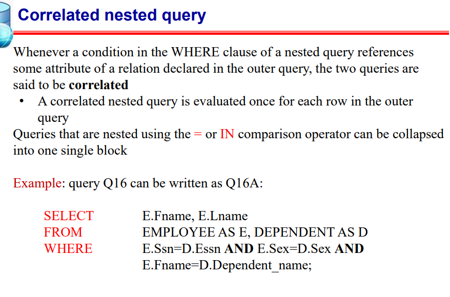

```sql
SELECT * FROM EMPLOYEE e 
	WHERE e.Ssn IN (
		SELECT d.Essn FROM DEPENDENT d WHERE e.Fname = d.Dependent_name AND e.Sex = d.Sex
	);
```

</details>

<details> 
<summary style="font-size: 30px; font-weight: 500; cursor: pointer;"> Section 6 | Joins, Exists, Unique and more Keywords
  </summary>
**Actual Study**
- SQL uses a three-valued logic:
*TRUE, FALSE, and UNKNOWN*

### General Null Syntax for SQL

## SQL Comparison Conditions and Logical Connectives

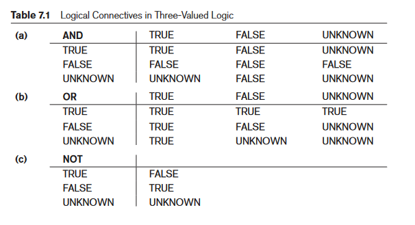

#### Table 7.1(a): AND Logical Connective
- Describes the result of combining two values using the `AND` logical connective.
- Example: `(FALSE AND UNKNOWN)` results in `FALSE`.

#### Table 7.1(b): OR Logical Connective
- Shows the result of using the `OR` logical connective.
- Example: `(FALSE OR UNKNOWN)` results in `UNKNOWN`.

#### Table 7.1(c): NOT Logical Operation
- Details the result of the `NOT` logical operation.
- In standard Boolean logic, only `TRUE` or `FALSE` are used, without an `UNKNOWN` value.

#### Select-Project-Join Queries
- General rule: Only tuples that evaluate the logical expression in the `WHERE` clause to `TRUE` are selected.
- Tuples evaluating to `FALSE` or `UNKNOWN` are not selected.
- Exceptions exist, e.g., in outer joins (see Section 7.1.6).

### SQL Null Value Handling
- SQL uses `IS` or `IS NOT` instead of `=` or `<>` for NULL comparison.
- Each NULL value is considered distinct; equality comparison is not used.
- In join conditions, tuples with NULL values in join attributes are usually excluded, except in OUTER JOINs (see Section 7.1.6).
- Example: Query 18 retrieves employees without a supervisor, demonstrating NULL comparison.

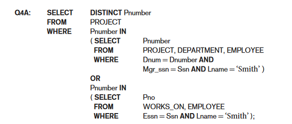

## SQL Query Explanation

The SQL query in question performs the following operations:

1. **Selection of Distinct `Pnumber`:**
   - The `SELECT DISTINCT Pnumber` statement is used to retrieve unique `Pnumber` values from the `PROJECT` table to avoid duplicates in the result set.

2. **Subquery for Department Projects:**
   - The first subquery `(SELECT Pnumber FROM PROJECT, DEPARTMENT, EMPLOYEE WHERE Dnum = Dnumber AND Mgr_ssn = Ssn AND Lname = 'Smith')` looks for `Pnumber` values in projects that are managed by an employee with the last name 'Smith' in a specific department.

3. **Subquery for Work Assignments:**
   - The second subquery `(SELECT Pno FROM WORKS_ON, EMPLOYEE WHERE Essn = Ssn AND Lname = 'Smith')` identifies `Pnumber` values (labeled as `Pno` here) from the `WORKS_ON` table where there are work assignments involving an employee with the last name 'Smith'.

4. **Combining Results with OR:**
   - The query selects `Pnumber` values that are found in either the first or the second subquery or in both. The `OR` operator ensures that if a `Pnumber` meets either condition, it will be included in the result set.

In essence, this query retrieves the project numbers (`Pnumber`) for all projects that either:
- Belong to a department managed by an employee with the last name 'Smith'.
- Have work assignments associated with an employee with the last name 'Smith'.

The use of `OR` broadens the selection criteria, ensuring that all unique project numbers meeting either condition are retrieved.

Here IN or = would've worked equally fine, as we're searching for exact 1 element, however for a query with a WHERE (tuple0, tuple1), it's gotta be with *IN*


When you have a nested query in SQL, and both the outer and inner queries refer to tables that have columns with the same name, you need to be careful to specify which column you're referring to. This is similar to how in programming languages with nested functions, you have to be clear about which variable you're referring to if the same variable name is used in different scopes.

In the example given *(Query 16)*, E and D are aliases for the EMPLOYEE and DEPENDENT tables, respectively. In the nested query, they specifically qualify E.Sex to refer to the Sex column in the EMPLOYEE table because DEPENDENT also has a Sex column. If you didn't qualify E.Sex, the query would automatically refer to Sex from DEPENDENT in the nested query because that's the inner scope.

**Example that is NOT Ambiguis**
```sql
SELECT E.Name
FROM Employees AS E, Departments AS D
WHERE E.DepartmentID = D.ID;
```

**Example that needs qualification**
```sql
SELECT E.Name, D.Name
FROM Employees AS E, Departments AS D
WHERE E.DepartmentID = D.ID;
```

**Nested Query Example:**
```sql
SELECT E.Name
FROM Employees AS E
WHERE E.ID IN (SELECT D.ManagerID FROM Departments AS D);
```

### Lecture Nested Query Examples:

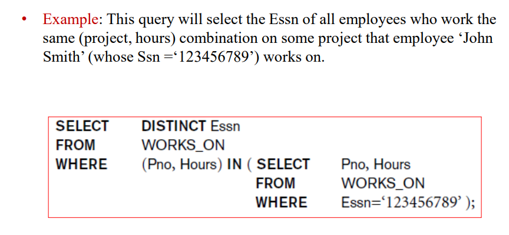


### Using `ALL` Keyword in Nested Queries

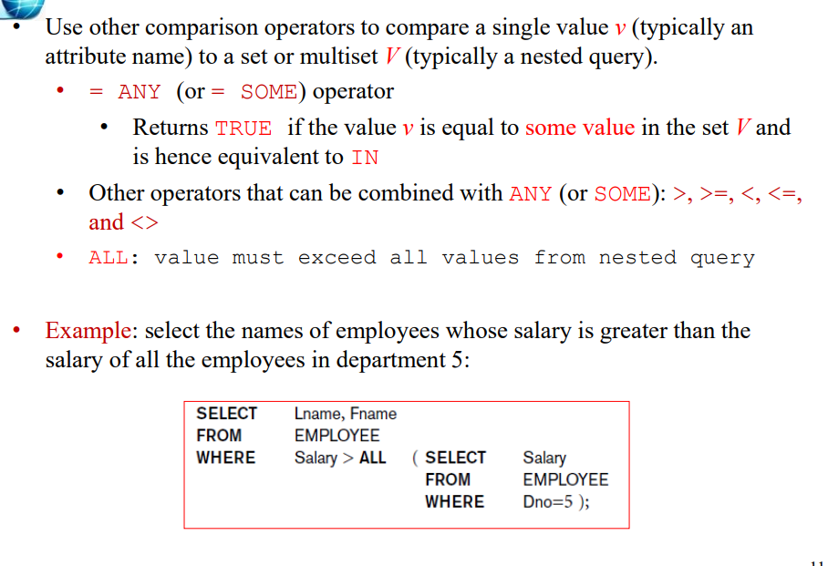

---
## The EXISTS and UNIQUE Functions in SQL
The query provided (Q6) is using the NOT EXISTS function to find employees who do not have any dependents.

**SQL EXISTS and NOT EXISTS:**

**EXISTS** is a Boolean function that checks if there are any rows resulting from a subquery.
**NOT EXISTS** is the opposite; it checks if a subquery returns no rows.

```sql
SELECT Fname, Lname
FROM EMPLOYEE
WHERE NOT EXISTS (
    SELECT *
    FROM DEPENDENT
    WHERE Ssn = Essn
);
```

1. It looks at each row in the EMPLOYEE table.
2. For each employee, it then runs the subquery to check in the DEPENDENT table for any dependents linked to the employee's Social Security Number (Ssn).
3. If the subquery finds no dependents that match the employee's Ssn (meaning the DEPENDENT table has no rows with Essn equal to the employee's Ssn), then the NOT EXISTS condition is true.
4. For every EMPLOYEE row where the NOT EXISTS condition is true (meaning they have no dependents), that employee's first and last name (Fname, Lname) are selected.

The **EXCEPT** keyword in SQL is used to return all the rows from the first query that are not in the second query. It's a way to subtract one set of data from another.

**Q3A breakdown**
Retrieve the name of each employee who works on all the projects controlled by department number 5
```
SELECT Fname, Lname
FROM EMPLOYEE
WHERE NOT EXISTS (
    (SELECT Pnumber
     FROM PROJECT
     WHERE Dnum = 5)
    EXCEPT
    (SELECT Pno
     FROM WORKS_ON
     WHERE Ssn = Essn)
);
```

1. The subquery `(SELECT Pnumber FROM PROJECT WHERE Dnum = 5)` selects all project numbers (`Pnumber`) that are controlled by department number 5.
2. The subquery `(SELECT Pno FROM WORKS_ON WHERE Ssn = Essn)` selects all project numbers (`Pno`) on which an employee works. This is a correlated subquery because it uses Essn from the outer query's `EMPLOYEE` table.
3. The **EXCEPT** operation then takes the set of all projects controlled by department 5 and subtracts the set of projects that the employee works on.
4. The **NOT EXISTS** clause checks if the resulting set from the **EXCEPT** operation is empty. If it is empty, it means the employee works on all projects controlled by department 5 because there are no projects *(controlled by department 5)* that the employee does not work on.
5. Finally, the main query SELECT Fname, Lname FROM EMPLOYEE retrieves the names of the employees for whom the NOT EXISTS condition holds true.

**Set 1**: All project numbers from PROJECT where Dnum (department number) is 5.
**Set 2:** All project numbers from WORKS_ON where the employee is working (Ssn = Essn).
The *EXCEPT* subtracts Set 2 from Set 1. If there are any projects in Set 1 not covered by Set 2, the result will not be empty.


#### Explicit Sets & Renaming in SQL


Here we're selecting an distinct ESSEN from WORKS ON where Pno is in an **Explicitly Defined Set**

*Renaming is also possible like so*


---

## Joined Tables & Outer Joins in SQL
For example, consider query Q1, which retrieves the name and address of every employee who works for the ‘Research’ department. 

**JOIN**
```sql
SELECT Fname, Lname, Address
FROM (EMPLOYEE JOIN DEPARTMENT ON Dno = Dnumber)
WHERE Dname = ‘Research’;
```
This query selects the first name, last name, and address of all employees who work in the 'Research' department.

- The **JOIN** here is an inner join which combines rows from **EMPLOYEE** and **DEPARTMENT** tables where the condition `Dno = Dnumber` is met. `Dno` is a column in **EMPLOYEE** indicating the department number the employee belongs to, and `Dnumber` is the corresponding department number in **DEPARTMENT**.
- When these tables are joined, each row from **EMPLOYEE** that has a matching Dno in **DEPARTMENT** (Dnumber) is combined into a single row in the result set. The resulting row has all the columns from both tables.

<br/><br/>

**NATURAL JOIN**
```sql
SELECT Fname, Lname, Address
FROM (EMPLOYEE NATURAL JOIN
 (DEPARTMENT AS DEPT (Dname, Dno, Mssn, Msdate)))
WHERE Dname = ‘Research’;
```
This query also selects the first name, last name, and address of all employees who work in the 'Research' department.
- A **NATURAL JOIN** automatically joins two tables based on columns with the same name and compatible data types.
- In this example, before the **NATURAL JOIN** is performed, the **DEPARTMENT** table is being renamed to **DEPT** and its columns are also being renamed so that they match exactly with the columns in **EMPLOYEE**. This is done using the `AS` clause.
- Specifically, `Dnumber` is renamed to `Dno` to match the **EMPLOYEE** table's column for department number. Because `Dno` is now the same in both tables, **NATURAL JOIN** will join the tables on this column without explicitly specifying a condition.
- After the **NATURAL JOIN**, the joined table will only include the `Dno` column once. The values in this column come from the matching rows in the original tables.

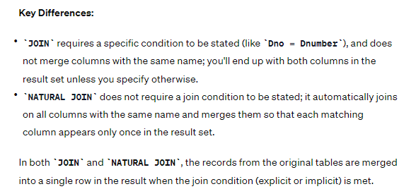

## OUTER JOINS *(Left, Right, FULL)*

**Left Join**
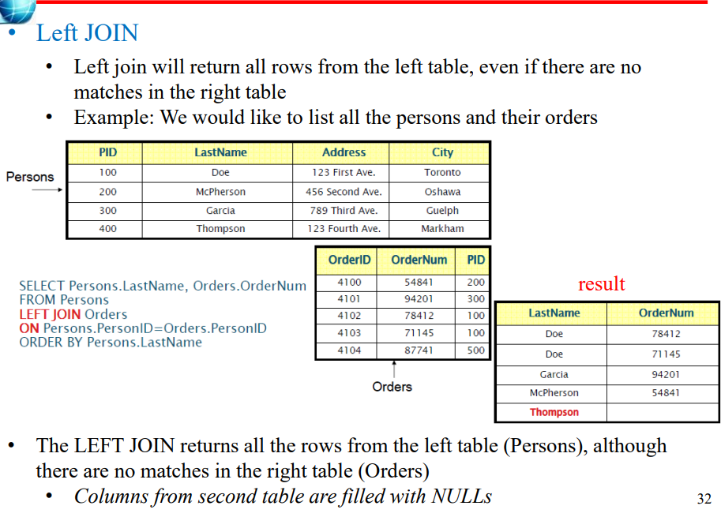

<br></br>

**Right Join**
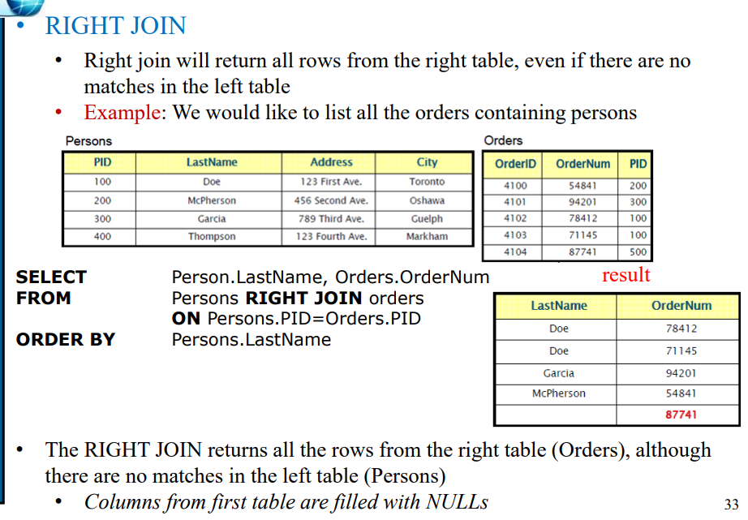

**FULL Join**
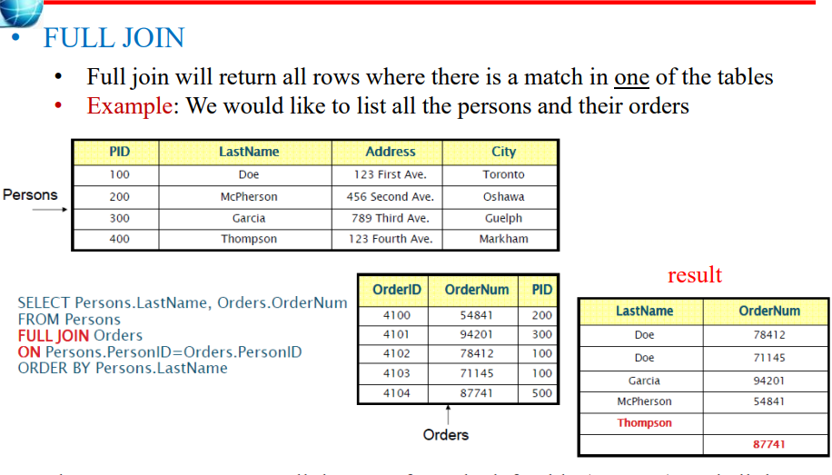


It is also possible to nest join specifications, called a **Multiway Join**
  </details>

<details>
  <summary style="font-size: 30px; font-weight: 500; cursor: pointer;"> Section 6 | GROUP BY, Assertions & Triggers, Views
</summary>

# Aggregate Functions: *Trivial*


---


**Another Example**


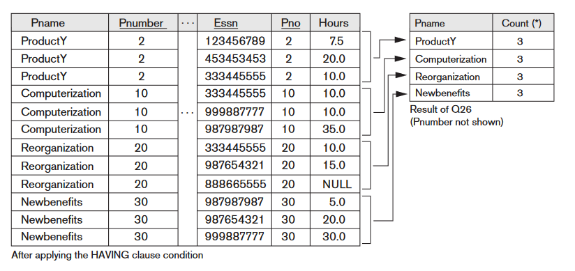

---

## WITH and CASE

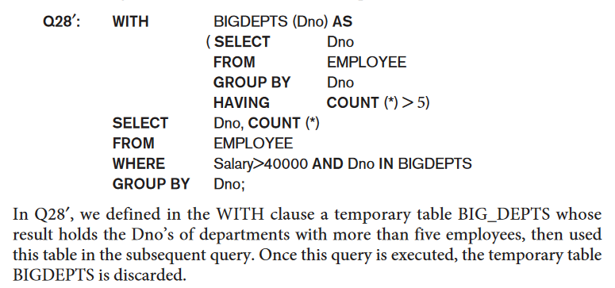

**Case, Like switch case equiv. in SQL**


Giving some employees a raise based on their DEPT, some departments getting a higher raise than others.


### SQL Query Structure and Clauses

#### Clause Descriptions
- **SELECT**: Lists attributes or functions to be retrieved.
- **FROM**: Specifies relations (tables) required, including joined but excluding nested query relations.
- **WHERE**: Conditions for selecting tuples, including join conditions.
- **GROUP BY**: Specifies grouping attributes.
- **HAVING**: Condition on the groups rather than individual tuples.
- **ORDER BY**: Orders the result of the query.

#### Evaluation Order
1. **FROM**: Identify or materialize joined tables.
2. **WHERE**: Select and join tuples.
3. **GROUP BY** and **HAVING**: Applied next if present.
4. **ORDER BY**: Sorts the query result.

#### Aggregate Functions
- Functions like COUNT, SUM, MIN, MAX, AVG can be used with or without a GROUP BY clause.

#### Query Execution
- Conceptually, queries evaluate each tuple combination in the FROM clause, selecting those where the WHERE clause is TRUE, placing their SELECT attributes in the result.
- Real DBMS uses query optimization for efficient execution.

#### Flexibility and Optimization
- SQL allows various ways to specify the same query, affecting comfort and efficiency.
- It's preferable to write queries with minimal nesting and implied ordering for optimization.
- Users need to be aware of more expensive constructs for efficient query processing.

---

## Specifying Constraints as Assertions and Actions as Triggers

The salary of an employee must not be greater than the salary of the manager of the department that the employee works for in SQL, we can write the following assertion:


The `CREATE ASSERTION` statement in SQL is used to define general database constraints that are more complex or broad than those that can be specified at the column or table level. These assertions can enforce rules across multiple tables or complex conditions that are not easily represented by standard column constraints.

Regarding your specific question about when the assertion is checked:

1. **Triggering of Assertions**: The assertion defined by `CREATE ASSERTION` is checked by the database management system (DBMS) whenever an operation (such as `INSERT`, `UPDATE`, or `DELETE`) could potentially violate the constraint. In your example, the assertion `SALARY_CONSTRAINT` is designed to ensure that no employee has a salary greater than their manager's. This means the DBMS will need to check this constraint whenever there is an `INSERT` or `UPDATE` operation on the `EMPLOYEE` table, or potentially on the `DEPARTMENT` table, as changes in these tables could affect the validity of the constraint.

2. **Scope of Assertion Checks**: The scope of checking an assertion like this is typically broader than checks performed on individual column constraints. This is because the assertion is not tied to a specific column or table, but rather to a condition that spans across potentially multiple tables. In your case, any change to the `EMPLOYEE` or `DEPARTMENT` table might necessitate a check against the `SALARY_CONSTRAINT` assertion.

## Understanding SQL Triggers

1. **Purpose of Triggers**: 
   - Triggers are used to specify actions that the database should automatically perform when certain events occur and specific conditions are met. 
   - They are useful for tasks like maintaining database consistency, monitoring updates, or implementing complex business rules.

2. **Trigger Components (ECA Rule)**:
   - **Event**: This is what initiates the trigger. In SQL, these are usually database update operations (INSERT, UPDATE, DELETE). For example, inserting a new employee record or changing an employee's salary.
   - **Condition**: This optional element is evaluated after the event. If the condition is met (evaluates to true), the trigger action is executed. If there's no condition, the action is executed immediately after the event.
   - **Action**: The response or task that the trigger performs. It could be a series of SQL statements, a database transaction, or an external program.

### Example: Salary Violation Trigger

- **Scenario**: Monitoring employee salaries to ensure they do not exceed their supervisor's salary.
- **Trigger Name**: `SALARY_VIOLATION`.
- **Triggered Events**: Inserting a new employee record, changing an employee's salary, or changing their supervisor.
- **Trigger Condition**: The trigger checks if an employee's new salary exceeds that of their supervisor.
- **Trigger Action**: If the condition is met, it calls an external stored procedure, `INFORM_SUPERVISOR`, which presumably notifies the supervisor of the violation.

### SQL Trigger Syntax (Oracle):

```sql
CREATE TRIGGER SALARY_VIOLATION
BEFORE INSERT OR UPDATE OF SALARY, SUPERVISOR_SSN
ON EMPLOYEE
FOR EACH ROW
WHEN ( NEW.SALARY > ( SELECT SALARY FROM EMPLOYEE WHERE SSN = NEW.SUPERVISOR_SSN ) )
INFORM_SUPERVISOR(NEW.Supervisor_ssn, NEW.Ssn);
```

- **Explanation**:
  - This trigger is set to activate `BEFORE` either an `INSERT` or `UPDATE` operation related to `SALARY` or `SUPERVISOR_SSN` on the `EMPLOYEE` table.
  - It applies to each affected row individually.
  - The condition checks if the `NEW.SALARY` of an employee is greater than the salary of the employee identified by `NEW.SUPERVISOR_SSN`.
  - If the condition is true, the `INFORM_SUPERVISOR` procedure is executed with the supervisor's SSN and the employee's SSN as parameters.

### Key Takeaways

- Triggers are powerful for automating reactions to data changes in a database.
- They help in ensuring data integrity and implementing complex business rules.
- However, they should be used judiciously as they can add complexity and potentially impact performance.

This example illustrates how triggers function in a real-world scenario, ensuring adherence to business rules (like salary caps relative to supervisors) and automating responses to data changes.

---
### SQL Views: Basics and Creation

1. **What is a SQL View?**
   - A View in SQL is essentially a virtual table created from a query on other tables (which can be base tables or other views).
   - It doesn't physically store data but represents a saved SQL query.

2. **Creating a View:**
   - Use the `CREATE VIEW` statement.
   - Assign a name to the View and specify the SQL query that defines its content.
   - For example:
     - `CREATE VIEW view_name AS SELECT columns FROM table WHERE condition;`

3. **Example Views:**
   - **View V1:** Joins employee and project tables.
     ```sql
     CREATE VIEW WORKS_ON1 AS
     SELECT Fname, Lname, Pname, Hours FROM EMPLOYEE, PROJECT, WORKS_ON
     WHERE Ssn = Essn AND Pno = Pnumber;
     ```
   - **View V2:** Aggregates data from the department and employee tables.
     ```sql
     CREATE VIEW DEPT_INFO(Dept_name, No_of_emps, Total_sal)
     AS SELECT Dname, COUNT(*), SUM(Salary) FROM DEPARTMENT, EMPLOYEE
     WHERE Dnumber = Dno GROUP BY Dname;
     ```

### Why Use Views Instead of Direct Select Statements?

1. **Simplification:**
   - Views can simplify complex queries. Instead of writing lengthy joins or subqueries, you reference a view.

2. **Reusability:**
   - Once created, views can be used in multiple places, promoting code reusability.

3. **Consistency & Maintenance:**
   - Views ensure consistency in data representation across different parts of an application.
   - Easier to maintain and update a single view than multiple query instances.

4. **Security:**
   - Views can restrict access to certain data, enhancing security. You can allow users to access data through views without giving them direct access to the underlying base tables.

5. **Performance:**
   - In some cases, particularly with materialized views, there can be performance benefits as they store the result of the query.

6. **Abstraction:**
   - Views provide an abstraction layer, allowing you to change underlying table structures without impacting the API or application logic.

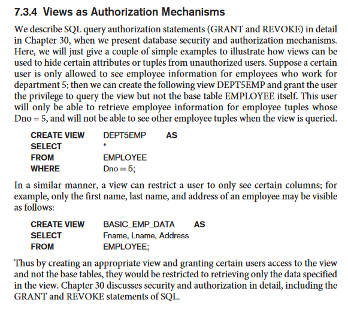

In summary, while direct `SELECT` statements in your API might work for straightforward data retrievals, views offer advantages in terms of simplification, reusability, consistency, security, performance, and abstraction, particularly when dealing with complex queries or multiple applications accessing the same database.

---

## Schema Changes in SQL

#### DROP Command 
**Purpose:** Used to remove schema elements *(tables, domains, types, constraints)* or an entire schema.

```sql
DROP TABLE table_name CASCADE;
DROP TABLE table_name RESTRICT;
```

**CASCADE** deletes the table and any constraints or views referencing it.
**RESTRICT** only drops the table if it's not referenced by any constraints or views.

```sql
DROP SCHEMA schema_name CASCADE;
DROP SCHEMA schema_name RESTRICT;
```

**CASCADE** removes the schema and all its elements.
**RESTRICT** only removes the schema if it has no elements.

#### ALTER Command 
**Purpose:** Used to modify the definition of base tables or other schema elements.

---


**TODO:  Hafeez Ch.6 Slides questions**

</details>

---

<details>
  <summary style="font-size: 30px; font-weight: 500; cursor: pointer;"> Section 7 | DB Programming & Impedence Mismatch
  </summary>
  
**Notable Database Programming Language:** Oracle’s PL/SQL (Programming Language/SQL).

### Approaches to Database Programming:

**Embedded database commands in general-purpose langs**

Embedded SQL integrates database statements into a host programming language, marked by a special prefix like "EXEC SQL" for SQL commands. A precompiler identifies these statements, extracting them for the DBMS to process. They're replaced in the source code with function calls to the DBMS code.

## *Here's a simplified example of embedded SQL in C:*

```c
#include <stdio.h>
#include "sqlca.h"

/* Assume necessary DB connection setup */

int main() {
    /* Declare a variable for SQL interaction */
    char name[30];

    /* Embed SQL command with EXEC SQL prefix */
    EXEC SQL SELECT name INTO :name FROM employees WHERE employee_id = 101;

    /* Use the retrieved data */
    printf("Employee Name: %s\n", name);

    /* Close the DB connection if necessary */
    return 0;
}
```
In this example, the SQL query is embedded directly into the C code and preceded by *"EXEC SQL"*. The query retrieves the name of an employee with a specific ID and stores it in a C variable.

## *Here's a simplified example of using a library of db functions or classes*:

In this approach, a library provides functions or classes for database operations. Functions for connecting to a database, preparing queries, executing them, and processing results are used. These database interactions are encapsulated within function calls or class methods, forming an Application Programming Interface (API). For object-oriented languages like Java, class libraries such as JDBC (Java Database Connectivity) are used, offering various object types for connections, queries, and results, each with its own set of methods.

Here's a simple example in Java using JDBC:

```java
import java.sql.Connection;
import java.sql.DriverManager;
import java.sql.PreparedStatement;
import java.sql.ResultSet;
import java.sql.SQLException;

public class DatabaseExample {
    public static void main(String[] args) {
        // Database URL and credentials
        String url = "jdbc:mysql://localhost:3306/mydatabase";
        String user = "username";
        String password = "password";

        try {
            // Establishing a connection
            Connection connection = DriverManager.getConnection(url, user, password);

            // Preparing a query
            String sql = "SELECT name FROM employees WHERE employee_id = ?";
            PreparedStatement statement = connection.prepareStatement(sql);
            statement.setInt(1, 101); // Setting the employee ID

            // Executing the query
            ResultSet resultSet = statement.executeQuery();

            // Processing the result
            if (resultSet.next()) {
                String name = resultSet.getString("name");
                System.out.println("Employee Name: " + name);
            }

            // Closing resources
            resultSet.close();
            statement.close();
            connection.close();
        } catch (SQLException e) {
            e.printStackTrace();
        }
    }
}
```

In this example, JDBC is used to connect to a MySQL database, prepare a query to fetch the name of an employee with a specific ID, execute the query, and print the result. The JDBC classes `Connection`, `PreparedStatement`, and `ResultSet` are utilized for database interaction.

## *Designing a brand-new lang, db programming. lang*
In this approach, a database programming language is created from the ground up, integrating database functionalities directly into its syntax. This language is then expanded with standard programming constructs like loops and conditional statements, transforming it into a complete programming language. Oracle's PL/SQL and SQL/PSM in the SQL standard are examples of this. These languages allow database queries and updates to be seamlessly combined with regular programming structures.

Here's a concise example using PL/SQL:

```sql
DECLARE
    emp_name VARCHAR2(100);
BEGIN
    SELECT name INTO emp_name FROM employees WHERE employee_id = 101;
    DBMS_OUTPUT.PUT_LINE('Employee Name: ' || emp_name);
END;
```

In this PL/SQL block, the SQL query is embedded within the PL/SQL code. It fetches the name of an employee and stores it in a variable, which is then printed. PL/SQL allows for more complex programming constructs, but this example demonstrates its basic integration with SQL.


---

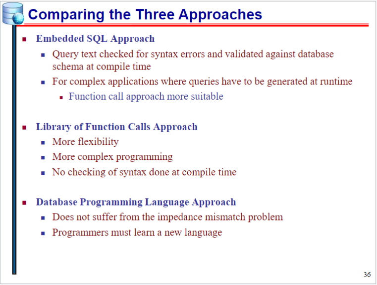

---

## Impedance Mismatch

**The first** problem that may occur is that the *data types of the programming language* differ from the *attribute data types* that are available in the data model. Hence, it is necessary to have a binding for each host programming language that specifies for each attribute type the compatible programming language types.

**The Second** discussed here is the "Impedance mismatch" between the set-oriented nature of database query results (tables of rows and columns) and the imperative, object-oriented nature of most programming languages. To address this, programming constructs are needed to map and iterate over these tabular query results, typically using **cursors or iterators**. This process involves extracting and assigning each row's values to program variables for further processing. The mismatch is less pronounced in specialized database programming languages like PL/SQL or SQL/PSM, or when using object databases with languages like Java, due to their similar data models.

Here's a concrete example using Java and JDBC:

```java
import java.sql.Connection;
import java.sql.DriverManager;
import java.sql.PreparedStatement;
import java.sql.ResultSet;
import java.sql.SQLException;

public class DatabaseIterationExample {
    public static void main(String[] args) {
        String url = "jdbc:mysql://localhost:3306/mydatabase";
        String user = "username";
        String password = "password";

        try {
            Connection connection = DriverManager.getConnection(url, user, password);
            String sql = "SELECT id, name, salary FROM employees";
            PreparedStatement statement = connection.prepareStatement(sql);
            ResultSet resultSet = statement.executeQuery();

            while (resultSet.next()) {
                int id = resultSet.getInt("id");
                String name = resultSet.getString("name");
                double salary = resultSet.getDouble("salary");

                System.out.println("ID: " + id + ", Name: " + name + ", Salary: " + salary);
            }

            resultSet.close();
            statement.close();
            connection.close();
        } catch (SQLException e) {
            e.printStackTrace();
        }
    }
}
```

In this Java example, JDBC is used to execute a SQL query that retrieves multiple rows from an `employees` table. The program then iterates over the `ResultSet` *(a cursor-like structure)*, extracting each row's data into Java variables **(ID, name, salary)** and printing them. This demonstrates the process of mapping and accessing database query results in a programming language.
</details>


<details>
  <summary style="font-size: 30px; font-weight: 500; cursor: pointer;"> Section 8 | DB Programming & Impedence Mismatch
  </summary>

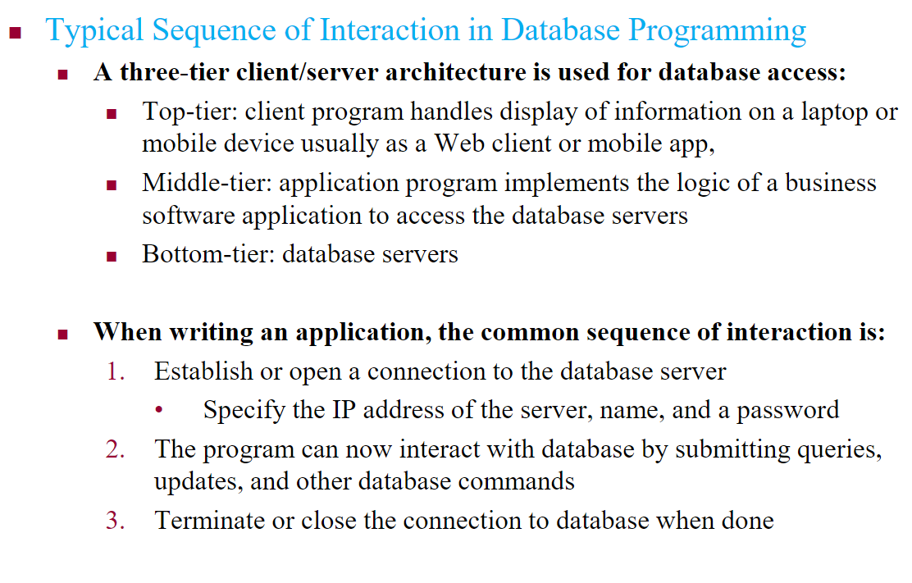

## Embedded SQL (We'll focus on the C Language)

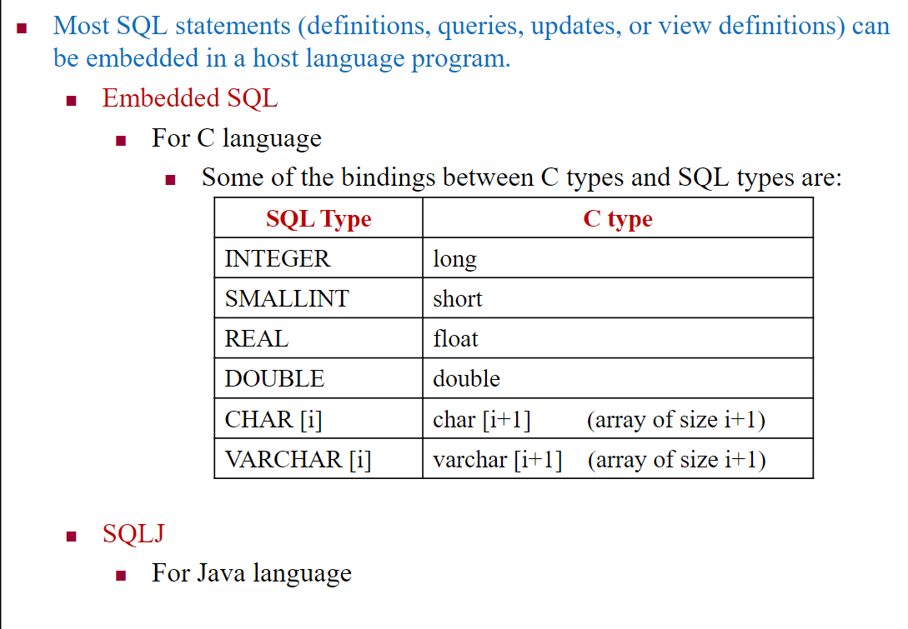

In a C program, an embedded SQL statement is distinguished from pro-
gramming language statements by prefixing it with the keywords EXEC SQL so that
a preprocessor (or precompiler) can separate embedded SQL statements from the
host language source code. The SQL statements within a program are terminated
by a matching END-EXEC or by a semicolon (;).

Yes, in embedded SQL programming within a C program, a variable prefixed with a colon (e.g., `:salary`) is indeed a C variable that is "shared" with the SQL statement. This sharing mechanism allows for the transfer of data between the SQL database and the C program.

In the context of embedded SQL, the `INTO` clause of the SQL statement is used to specify which C program variables should receive the values of the specified attributes from the database record. For example, if you have a line in your SQL statement like:

```sql
EXEC SQL SELECT salary INTO :salary FROM EMPLOYEE WHERE ssn = :ssn;
```

Here, `:salary` and `:ssn` are variables declared in your C program. When this SQL statement is executed:

- The value of `:ssn` (already set in your C program) is used to filter the records in the `EMPLOYEE` table.
- The `salary` attribute of the retrieved record is then stored in the `:salary` variable in your C program.

## Using Cursors
**The cursor** is a variable that refers to a *single tuple (row)* from a query result that retrieves a collection of tuples. It is used to loop over the query result, one record at a time. *The cursor* is declared when the SQL query is declared. Later in the program, an **OPEN CURSOR** command fetches the query result from the database and sets the cursor to a position before the first row in the result of the query. 

Subsequently, **FETCH** commands are issued in the program; each FETCH moves the cursor to the next row in the result of the query, making it the current row and copying its attribute values into the C *(host language)* program variables specified in the FETCH command by an **INTO** Clause


In the segment of embedded SQL code you're looking at, the `SELECT dnumber INTO :dnumber` statement is used to retrieve data from the database and store it in a C program variable.

Here's a step-by-step explanation of what's happening:

1. `prompt("Enter the Department Name: ", dname);`
   - This line is prompting the user to input the department name, and it's stored in the C variable `dname`.

2. `EXEC SQL SELECT Dnumber INTO :dnumber FROM DEPARTMENT WHERE Dname = :dname;`
   - This SQL statement is executed within the C program (noted by the `EXEC SQL` prefix).
   - It selects the department number (`Dnumber`) from the `DEPARTMENT` table in the database where the department name (`Dname`) matches the value stored in the `dname` variable.
   - The retrieved `Dnumber` is then stored into the C variable `dnumber`.
   - The colon (`:`) before `dnumber` indicates that it is a host variable *(a variable in the C program)* rather than a database column name.

So, the `SELECT ... INTO` statement is used to assign the value from a single row and column *(in this case, the department number corresponding to the given department name)* directly to a variable in the host language (C). This allows the program to work with this data without needing to handle a result set or multiple rows; it's a direct single-value transfer. 

The rest of the program segment likely uses this `dnumber` to perform further operations, such as fetching employee information from that department and processing updates to their salaries.

TODO: ch.7 16-39

</details>