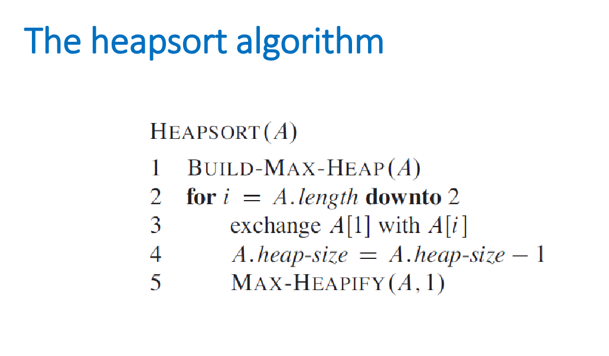

  
Chapter 6. HeapSort

# Build Max Heap

Here we're dividing `A.length/2` As we don't need to check the Leaf Nodes, only the nodes with children, 
As in 1 iteration, for a node **i** in the tree, we can access **Left** and **Right** child in O(1).

Left: `2 * i` | Right: `2 * i + 1`
---

# Pop Max 

---

# Max Heapify

---

# Heap Sort Algorithm
- Using the building blocks

**Note:**
- Pop Max does the `MaxHeapify()`, so calling PopMax is sufficient, whereas the sudo-code does it directly in the Algo

---

# Time Complexity Analysis

### Max Heapify

Worst Case Scenario: Root is violating with Max-Heap Property *(Needs to access left side)*

**a** : 1 , **b** : 3/2 , **F(n)** : O(1)

In a B-Tree (Max/Min Heap Tree) with **n** elements:

*Nodes above last layer N#*: n/2
*Leaf Nodes N#*: n/2

*T(n) = T(2n/3) + C*

n^log base (3/2) 1 ~= n^1

**Therefore, Heapsort Complexity** T(n) = n * lg(n)

It takes time *O(n lg n)*, since the call to *BUILD-MAX-HEAP* takes time **O(n)**
and each of the **n-1** calls to *MAX-HEAPIFY* takes time **O(lg n)**.

Usually we're only checking quadrant **I** & **II**, and section **IV** is usually empty as we start filling in Leaf-Nodes from the left, so in general it's *2/3*, sometimes *2/4* tho
---

### Priority Queue
- Application of Max Heap 
- Actually `Heapsort` is **SLOWER** than `Quicksort`, so it isn't used...

Max Heap has more applications tho...

- Used in Heuristics *(Priority of Best-First Strategy)*, Discrete Event Simulations
- Shortest Path Algorithms *(What is the current best path, at iteration)*

#### Insert:
  - Insert a new Task, with a Priority
  - **Boss** gives me a Low Priority Task, **Boss #2** gives me a High Priority Task

##### Extract Max:
  - Extracts Max, Ruins the Priority Queue, so we gotta `MaxHeapify` again

##### Increase Key
  - Increase value *(priority)* of a Node, so you need to `MaxHeapify` again aswell

---

