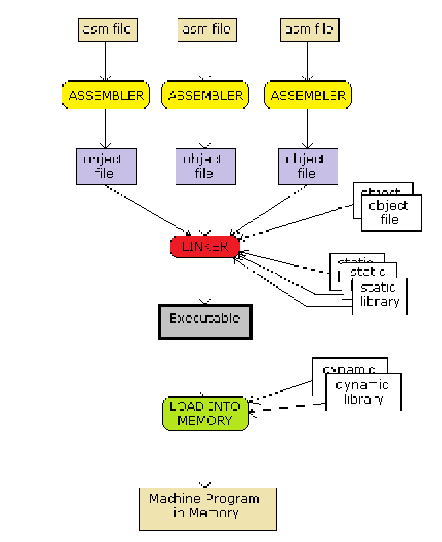
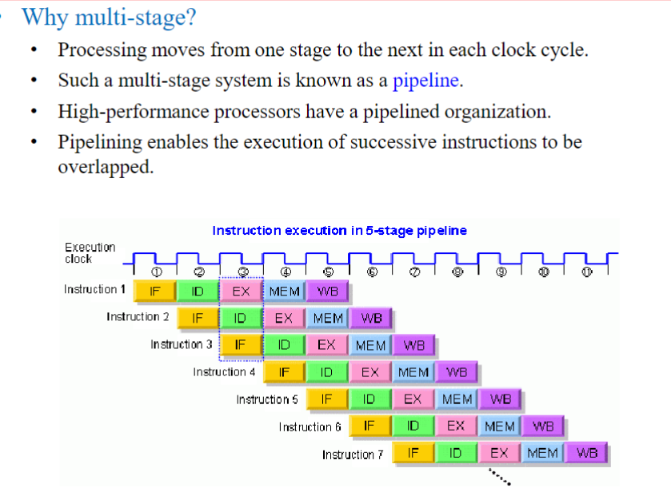
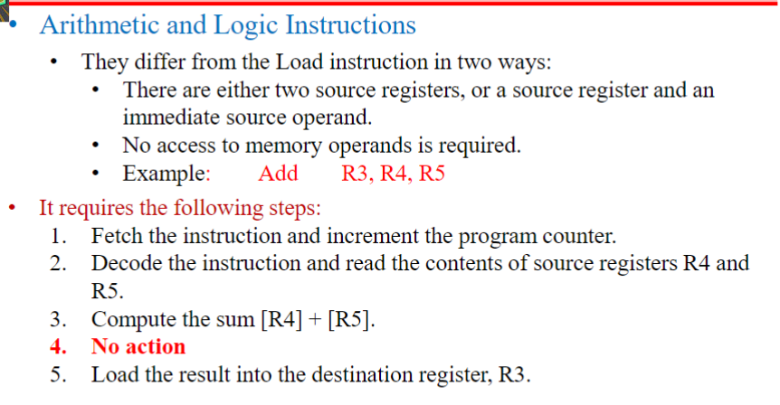
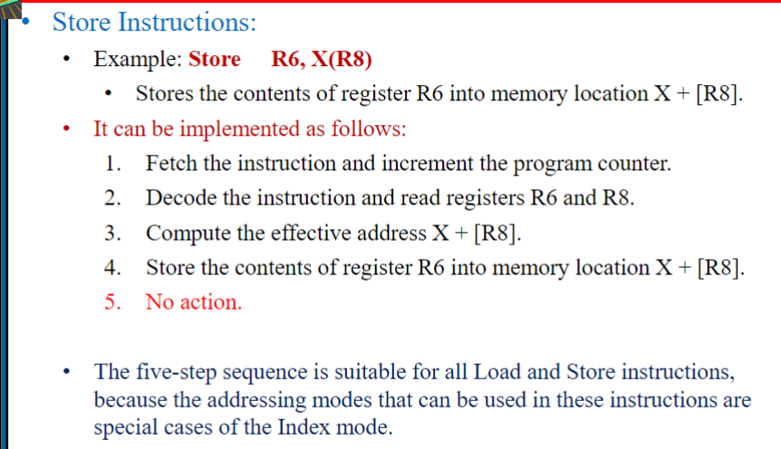
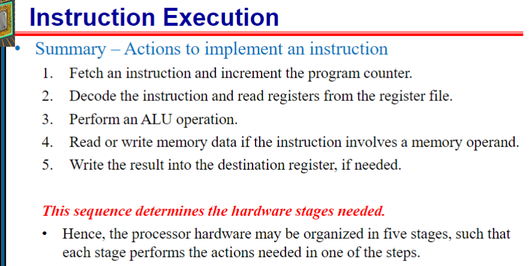
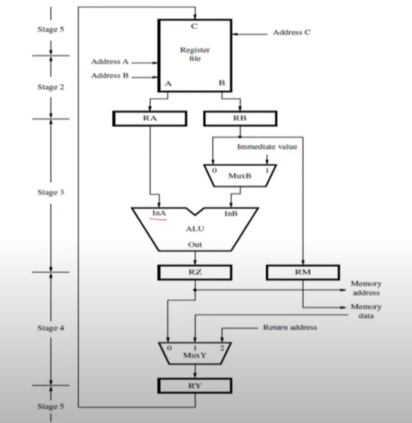
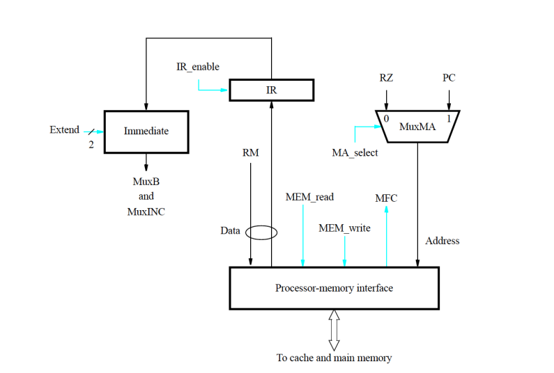
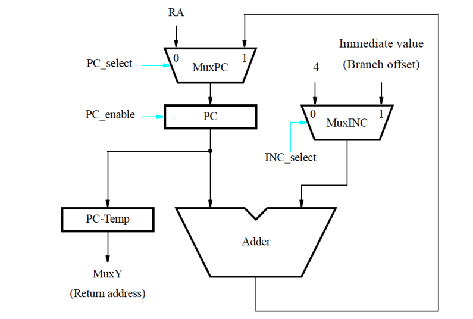
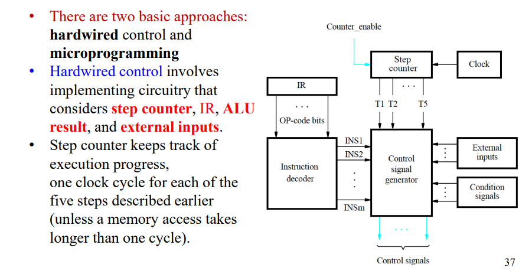

## Chapter 4 : Software

<details>
  <summary style="font-size: 30px; font-weight: 500; cursor: pointer;"> October 25th </summary>
  


*High Level Languages build constructs* For loops, If statements, look at Python, lots of High Level Abstraction

*In Assembly you need to trace, it's harder*

**Compiler** : Program that takes High Level Constructs and converts into Assembly
- Optimizations are done at the Compiler level

**Assembly** : Takes Assembly Files, and turns it into Machine Code
- No optimizations are done, only directly translations here

Object files aren't Executable !!!

**Linker** : Link all the functions together, so that the program can be executed. *(Since the program goes Instruction by Instruction, and so everything needs to be together, including source files, library files which are already compiled object files)*

-  For EX: if I use `cos()` and don't include `<cmath>` I'll get **Linker** Error.
Now the **Executable File** from the Linker, is able to Execute

**Loader** : You can use Origins, in Assembly, which the Loader will take into account (Put labels at origin: **0x1000**, and Instructions at **0x400**)

#### Loader Header
- Loader reads the "Header" of the File for origin info, how to load it in...
- Hey Loader, we've got some libraries that might not be resolved yet... `cos()` for ex: pls know where this fn is in memory, and use it

- It's stored in memory once, and All programs using the `cos()` knows where it is, and Calls it. *(Loader Only Knows where it is)*

---

### Assembler Process

We know we've got 3 formats **J Type**, **R Type**, **I Type**

##### Two-Pass Assembler

#### First Pass

In the first pass, the assembler goes through the source code to generate all machine instructions and populate the symbol table with addresses of labels.

**Example:**
```assembly
LOOP:  ADD R1, R2
       SUB R3, R4
       JMP END
       MUL R1, R2
END:   HLT
```

In the first pass, the symbol table might look like: *(Pass 1 builds the symbol table)*

```
| Label | Address |
|-------|---------|
| LOOP  | 0000    |
| END   | 0011    |

```

#### Second Pass

During the second pass, the assembler uses the symbol table to resolve unknown branch offsets or addresses.

**Example:**
From the previous code, JMP END can now be resolved to jump to address 0011.

After the second pass, the machine code might look like:

```assembly
ADD R1, R2
SUB R3, R4
JMP 0011
MUL R1, R2
HLT
```

---


</details>


---

## Chapter 5: Basic Processing Unit

<details>
<summary style="font-size: 30px; font-weight: 500; cursor: pointer;"> Addressing Modes Review </summary>

  Addressing modes in computer architecture dictate how the instructions in a machine language program identify the data they operate upon or the destinations where they deposit results. Different addressing modes offer various ways to specify this data.

  **Immediate Mode:**

  The operand is a constant value and is present within the instruction itself. *(operand is IMMED16 here)*
  For example, in the instruction `ADD R1, 5`, the value "5" is an immediate operand.

  **Register Mode:**

  The operand is a register; the name or number of the register is given in the instruction.

  *Example:* `ADD R1, R2` adds the contents of register R2 to register R1.

  **Absolute or Direct Mode:**

  The address of the operand is given directly in the instruction.
  Example: `LOAD R1, 1000` loads the content of **memory location 1000** into register R1.

  **Indirect Mode:**

  The **address of the operand** is held in a register or memory location. The instruction specifies this register or memory location, and the actual operand is fetched from the resulting address. *(Here the operand holds an address)*

  *Example:* If R2 contains the address 2000, `LOAD R1, (R2)` loads the content of memory location 2000 into R1.

  **Indexed Mode:**

  This mode uses the sum of a base address and an index register to find the effective address.
  *Example:* If the instruction is `LOAD R1, 100(R2)` and R2 contains the value 50, then the data is loaded into R1 from memory location 150 (100 + 50).

  **Auto-increment and Auto-decrement Mode:**

  In auto-increment, after fetching the operand, the content of the register *(usually an address)* is automatically incremented. This is useful for accessing consecutive memory locations.
  In auto-decrement, the content of the register is decremented before fetching the operand.

  <br>

  *Example AUTO-INCR*: If R2 contains the address 1000, `LOAD R1, (R2)+` loads the content of memory location 1000 into R1 and then increments R2 to 1001. 

  <br>

  *EXAMPLE AUTO-DECR*
  If it was `LOAD R1, -(R2)`, R2 would first decrement to 999, then its content would be loaded into R1.

  ---

  ### Bringing it back to this Chapter:

  Every instruction cycle begins with fetching the next instruction from memory. Once fetched, the CPU decodes the instruction to determine which operation to perform and which addressing mode is used. The addressing mode will then dictate how the CPU retrieves or identifies the operands for the operation.

  **Operand Fetches**
  Based on the addressing mode, the data path will be set up differently to fetch operands!


  **Immediate Mode:** The operand data might be fetched as part of the instruction itself. Thus, the operand would be directly routed from the instruction register.

  **Direct or Absolute Mode:** The operand's address is directly specified. The CPU uses this address to fetch the operand from memory.

  **Register Mode:** The operand is in a CPU register, so no memory access is required. The data path will route data from the specified register.

  **Indexed Mode:** The CPU must add the base and index values to get the effective address. This involves the ALU in the data path to calculate the sum, and then memory is accessed using the effective address.

  **Indirect Mode:** The data path will first fetch an address from a register or memory location and then use that address to fetch the operand from memory.

  **Auto-increment/Auto-decrement Mode:** The data path fetches data from the memory address specified in a register. Then, the ALU increments (or decrements) the register's value.
</details>


  <details>
    <summary style="font-size: 30px; font-weight: 500; cursor: pointer;"> Fundementals, Pipelining & Instruction Execution</summary>

  

  proc. = processor

  **Processing Unit**
  - Executions of instructions, by the proc.
  - Functional Units of proc. how they are connected
  - Hardware for control signals (Control Unit)
  - Micro-programmed control

  ### SLOW
  One Logic Circuit taking a long time, and it's quite sequential *(NOT CONCURRENT)*

  

  ### Much Faster *(Pipelining)*
  Way more Thruput, and in a pipeline, the "Station" *(Smaller logic circuit)* is able to process a portion of the Compute!

  **Example:** Report writing *(Abstract, Intro, Body, Conclusion)* at every stage in pipeline, one paragraph is added, and once the *Intro* Writer finishes Intro for Report #1, next cylce he can do Report #2's Intro. **THRU-PUT is 5x!!!**

  
  
  
  **Notes**
  - In Pipeline, Stages should do equal amount of work, in a timeframe *(As our clock cycle is designed to support a whole stage/operation to preform within the single cycle)*
  - Design stages to keep clock cycle short *(Therefore, Frequency *(GHz)* gets faster, as `f = 1/l` , where `l` is clock cycle length)
  ---

  ### Instruction Executions

  We can have `n` stages, but due to Hardware limitations we usually have **5** with RISC and NIOS 2
  The **5** Steps we define, need to be as generic as possible to support the ut-most variety of instructions

  That's why some steps aren't use for certain Instructions, as that generic step isn't needed for a specific operation

  

  

  Generics:
  

</details>

<details>
  <summary style="font-size: 30px; font-weight: 500; cursor: pointer;"> Hardware Components </summary>

## Register File

"Access Circuitry" Enables 2 registers to be read in at the same time, for their contents to be available at 2 seperate outputs
- RA, and RB
- Register File has Data Input C *(Aswell as an indication to which Register File to Write in)*
- Connected with **IR** instruction register

- **Registers**: Super fast CPU memory spots.
- **Types**:
  - **Memory Access Registers**: MDR, MAR
  - **Instruction / Fetching Registers**: PC, IR
  - **Condition Registers**: Carry, Overflow, etc.
  - **Special**: Index, Stack Pointer
- **Implementation**: Registers often come in a 'register file' - a quick memory block allowing data read/write.

  

#### **Dual-ported Mem Block**

- **Concurrency**: Allows for simultaneous Read/Write
- **Complexity**: More complex hardware design to manage both ports
- **Size and Cost**: Larger / Costly
- **Applications** that require lots of simultaneous Read/Write want a **Dual-ported** mem block.

#### **Two Single-Ported Mem Blocks**

- **Synchronization**: Two single-ported may require additional synchronization.
- **Flexibility**: Two separate blocks can offer design flexibility.
- **Applications**: Dual-ported for high-speed access; two single-ported for cost-effectiveness or simpler systems.

## ALU (Arithmetic Logic Unit)

- **ALU's Role**: Processes data (both arithmetic and logical operations).
- **Hardware View**: Shows components needed for computational instructions.
- **Data Source & Destination**: Both come from the register file.
- **Notation**:
  - **[RA]** and **[RB]**: Values from registers at addresses A and B.
  - **new [RC]**: Result stored to the register at address C.
- **Immediate Values**: If a source operand is an immediate value, it's directly provided to the ALU without coming from a register.
      - Discussed in datapath, refer to *MUX B*

  

## Datapath

  #### Generic 5 Stages of Organization:

  

  #### Datapath *(From textbook)*

  

#### Mux B
This MUX selects wether it uses the Immediate Value, or RB *(Inter-state register, as output for Stage 2)* for the ALU operation.
This MUX will determine the value going into **InB** in ALU.

**Examples:**
`ADD R2, R3, R4` , the ALU's InA will be RA (R3) , InB wil be RB (R4)
`ADD R2, R3, #2` , the ALU's InA will be RA (R3) , InB wil be Immediate Value (`#2`)

#### Mux Y
This is the multiplexer situated at the bottom of the diagram. It has three input choices *(indexed 0, 1, and 2)* and decides which of these inputs will pass through to the RY output based on the control input it receives:

**0** - ALU output (RZ): The output from the ALU (Arithmetic Logic Unit) after a computation is completed.

**1** - Memory data: This is the data retrieved from the memory. This would be used in operations where data is being loaded from memory.

**2** - Return address: This is typically used in subroutine calls in assembly or machine code. When a subroutine is called, the address of the next instruction *(i.e., the one to be executed after the subroutine finishes)* is saved so that the program can return to it. This is the "return address."

---

#### Data Path Examples
*With Various Addressing Modes and instructions*

TODO:

</details>

<details>
  <summary style="font-size: 30px; font-weight: 500; cursor: pointer;"> Control Signals </summary>

  **Control Signals**
  - Selects MUX inputs to guide data flow (for MuxB, MuxY)
  
  - Determines when data is written into **PC**, **IR**, 
  Register File and the memory

  - Tells the ALU, the OpCode, so ALU knows which circuit to use *(Add, Substract, Shift)*

  - Handles incoming data on *C*

  **MuxC**
  Selects IR, or LINK to be taken from Register

  ---

  **Memory Interface Control Signals**

  

  - What address to send to mem.
  - If Load/Store, **RZ** is used
  - If we need to store from **RM** ...

  TODO: understand this

  ---

  **Instruction Address Generation**

  

  Branch (with offset)? or goto next instruction +4

  If Instruction is a Call; 

  ---

  ### Hardwired Control

  **Hardwired** : Hardwired to support every instruction *(Derived from Truth Tables, and physical circuits)*

  

  - Clock here is the Processor Clock, and the Step counter just counts... and resets

  - Step Counter *(goes from steps 1-5)* and repeats
  - External Inputs *(Interrupts)*

  Control Signal Gen: Takes in the Inputs & Signals, and generates *Control Signals*, to be sent to *Datapath*


  ---

  ## CISC STYLE processors

  

  *Microprocessor* Is the control Circuit

  Bus can only have **1 driver**

  If want to read from bus, *Rin* = 1, Reading in (MUX = 1) to store into FlipFlop

  If want to write to bus, *Rout* = 1, Write to mux from FlipFlop

  **Think about it, high level**

  

  Done in 7 Cycles, instead of 5 for risc

  **MICROPROGRAMMED** control: Software based approach to generation of signals. Easier phyiscal implementation, over hardware. *(Stores Control Words, and gives the right word to right instruction)* It's like stored in a **ROM** chip.

  
  
  Sends the control signals per clock cycle from *Control Store*

  ---

  ### Examples:

  **Q1**

  1- GHz Clock

  Load & Store is 20% Percent of the Dynamic Instruction Count in a program

  5- Clock Cycles *(Every clock cycle, there is a fetch)*

  **Whats the frequency of Memory Access?**

  Stage 1. Fetch Instruction *(Mem Access, 1 access)*
  ...
  Stage 4. on average uses the memory by 20% *(Mem Access, 2 access for Load & Store)*

  (1 + 1 + 1 + 2 + 1) = 6 / 5 = 1.2

  On Average... 1.2 memory accesses

  *(Mem Access / Stages) * Frequency of Clock*

  (1.2 / 5) * 10^9 = 240 million memory accesses a second

  ---

  **Q2**

  ...

  Goes into program counter circuit from **RA**


  ---

  **Q3**

  Load R6, 1000(R9)

  Let's say R6 has value 4200
  R9 has value 85320

  Mem.loc: 86320 has value 75900

  R9 goes to Addr. A *RA=85320*
  R6 goes to Addr. B *RB=4200*

  **Link register** Address 31

  **ALU** will add *1000* + *RA=85320*

  **RZ** how has 86320

  Beginning of stage 4:

  **RM** has whatever is in **RB**

  RZ get's looked up, and MuxY gets back the value (75900)

  Will send it thru MuxY thru stage 4; 

  End of Stage 4, RY has 75900 *Access of Data*

---

**Q4**

```
ADD R5, R2, R3
ADD R6, R3, #20
```


R2 = 15
R3 = 25
R6 = 50


Step RA RB RZ RM RY
1. * * * * *
2. * * * * *
3. 15 25 * * * 
4. 25 50 40 25 *
5. * * 40 50 40  
6. * * 45 * * 
7. * * 45 * 45


---

Step 
</details>


