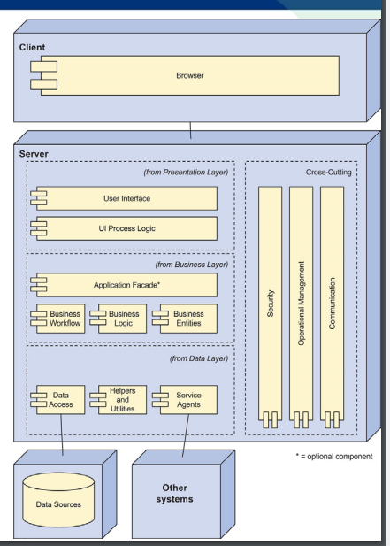
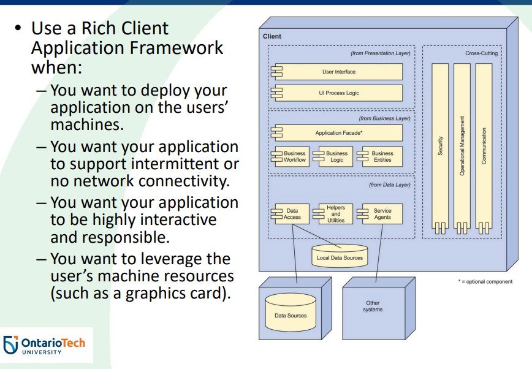
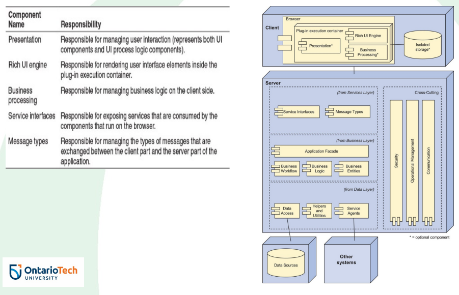
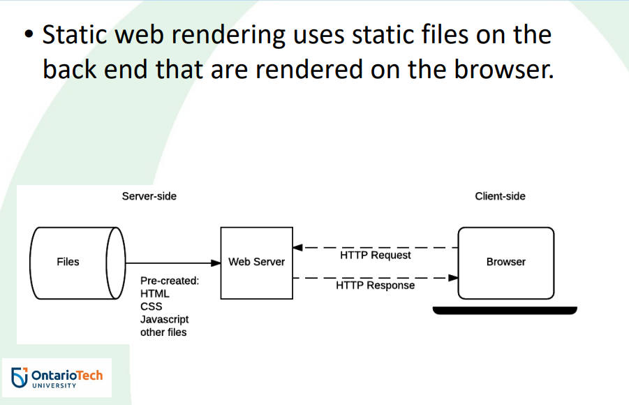
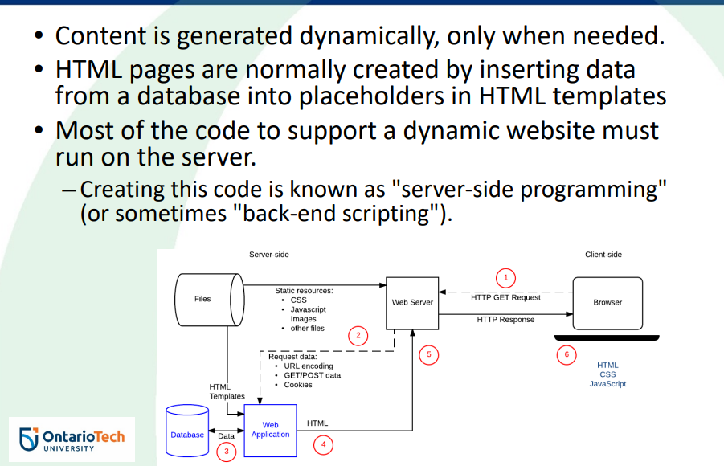
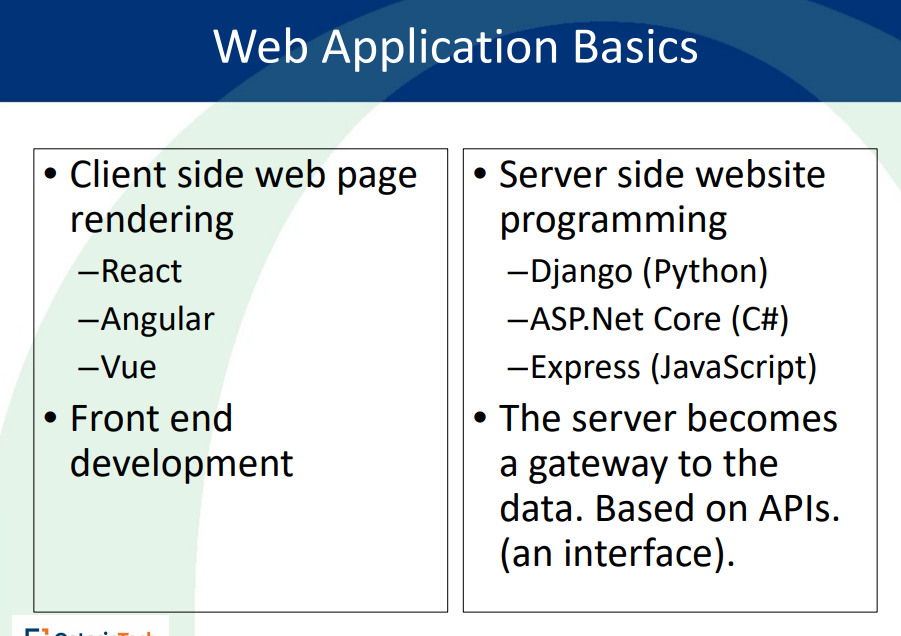
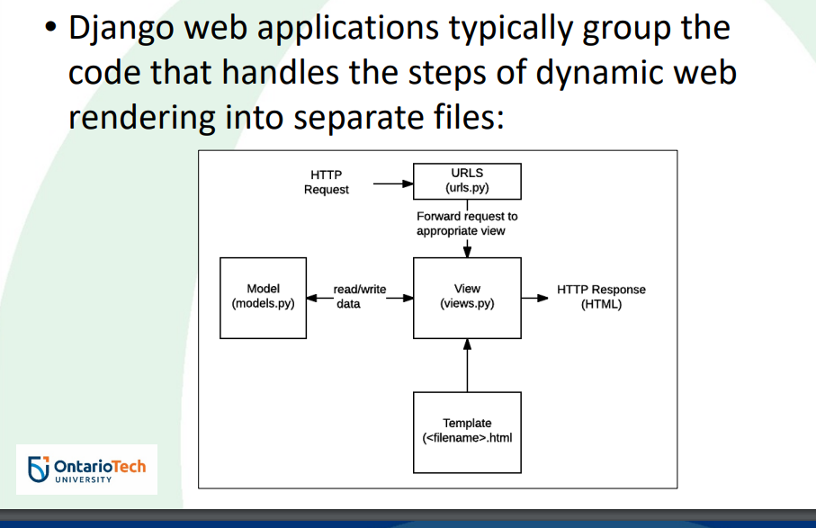
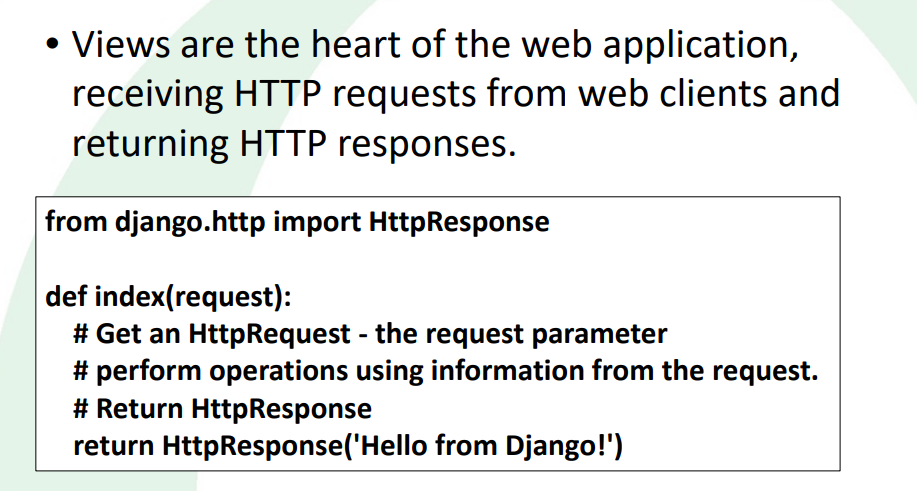

  
October 27th Lecture

*Natural Language Scenario*:
- Trying to get a better sense of Quality Components

*In FCAPS* they talk about Quality Attributes with N.L.

**Exam Question Hint**

Take this Description, and move it into a Quality Attribute Scenario
*(Source, Stimulus, Artifact, Environment Response, Response Measure)*

*Architecture* Is more influenced by Quality Attributes

### Utility Tree:

- 2nd Column : Seperating Q.A Attributes more specifically
- 3rd Column : (Priority, Technical Risk)
    - Priority of Q.A *(important or not)*
    - Technical Risk; can we develop this !?

**(H,H)** Is the ones you need to address first always, *High Priority, High Risk*

**Utility Tree : ASR**
Core Functionality of LMS System for EX: *Content Distribution for Students & Teachers*

*Q.A Scenario* Which gives you a bit of an insight on the *(Source, Stimulus, Artifact, Environment Response, Response Measure)*

---

**QAW** vs **Utility Tree**

- Different, but same goal "Listing and Prioritizing the most Important Quality Attributes"

---

### Integrability General Scenario:

---

**Package Diagram**
- Use Dependency 
- Can have 1 layer with many different seperations

--- 

*Hint | SD 5*:

Highlighting the Natural Language:

**Identify Different Attributes**

Quality Attribute table | Source | Stimulus | Artifcat | Response & Measure

*Modifiability*, *Interop*, etc... *Reliability*

  
November 1st Lecture

**ADD Iteration 1:** Due Nov. 12

- Question on the Example
- Design Process that covers overview of Design

**ADD Iteration 2:**

- ???

--- 

**Layer Architecture**

- Layers seperate dependencies

## **Reference Architecture**

- Refference model, mapped onto an Architectural Pattern
- *Blueprint:* 

**WEB Reference Architecture Example**
- Distributed Client/Server Architecture

**Presentation Layer**
- Here it's in the backend, similar to Django filling out *Template HTML* JINJA

**Web Frameworks**:
- Emphasize the Business Layer, as the Developer will be modifying this alot, for their SaaS app or wtv.

Isn't an Implementation !!!!

**Cross Cutting**
- Security *(On The business side, On the Data side)*
- Communication *(Comms across layers)*

---

**Rich Client Applications Reference Architecture**
- For example, Gaming, where the entire game is on 1 machine
- No Deployment *(Like no browser)*

---

**Rich Internet Applications Reference Architecture**
- JavaScript & XML *(AJAX)*

- **Plugin**: has business logic
- **Caching**: Permanency, Isolated files *(Outside the browser)* 

#### Limitations with RIA
  - Loading time is non-negligible
  - Access to local ressources can be limited

---

## Application Frameworks

- Re-usable software element to produce specific App
- Based on Patterns, Tactics
- Domain Specific *(Web, Game, Desktop App)*
- Increases productivity of Programmers *(Don't need to implement from scratch)*

**Static Web Rendering**

**Dynamic Web Servers**
Like DJANGO
- Templating Language *(JINJA)*

---

--- 

**DJANGO**
- You don't need to deal with Cross-Cutting, WE GOT IT
- Just do the Business Logic
- Debugging is hard, as you're working at quite a High Level of Abstraction
- ORM *(Abstraction layer for DB)*

- "Batteries Included" Philosophy
- Completeness, Versatility, Security, Scalability, 
Maintainability, Portability

- Django: VIEW for every URL
- Data Driven Framework

**Hint**: Which package does all Logic?

URLS.py

path('catalog/') ROUTING

VIEWS.py

**request** can be broken down, to get req. parameters
For example `/book/1` , DJANGO can decode that with `HTTPRequest` obj to have `request.id`

MODELS.py

---

Querying from VIEWS.py

Rendering of Data, "The template has access to a list variable called *youngest_teams* that is contained in the context
variable inside the render() function."

**Django also includes:**

- HTML Forms: to collect data for processing on the
server.
- User authentication:
- Caching: to improve the performance of accessing the
HTML pages.
- Administration: provides admin pages to create, edit,
and view data models.
- Serializing data: can serve data as XML or JSON. Good
for creating a Web service as opposed to Web application.

---

**Web Service**
API based, Service application provides service to other Applications

**Web Applications**
Actual Web Application that serves content to Client

