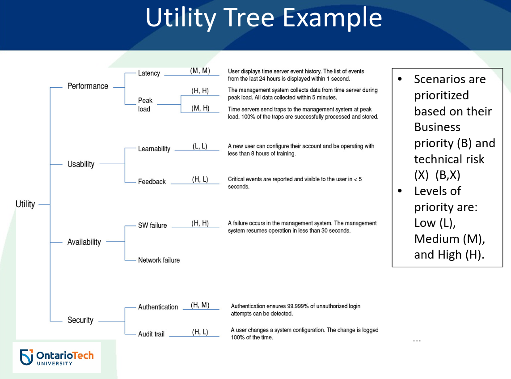
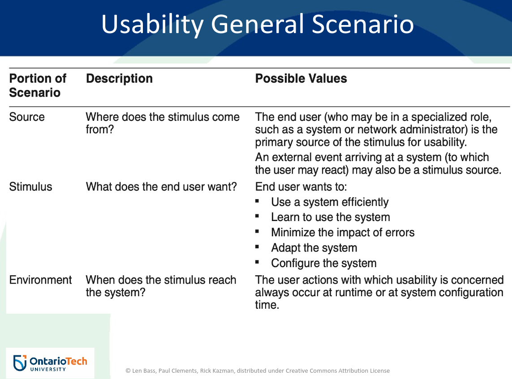
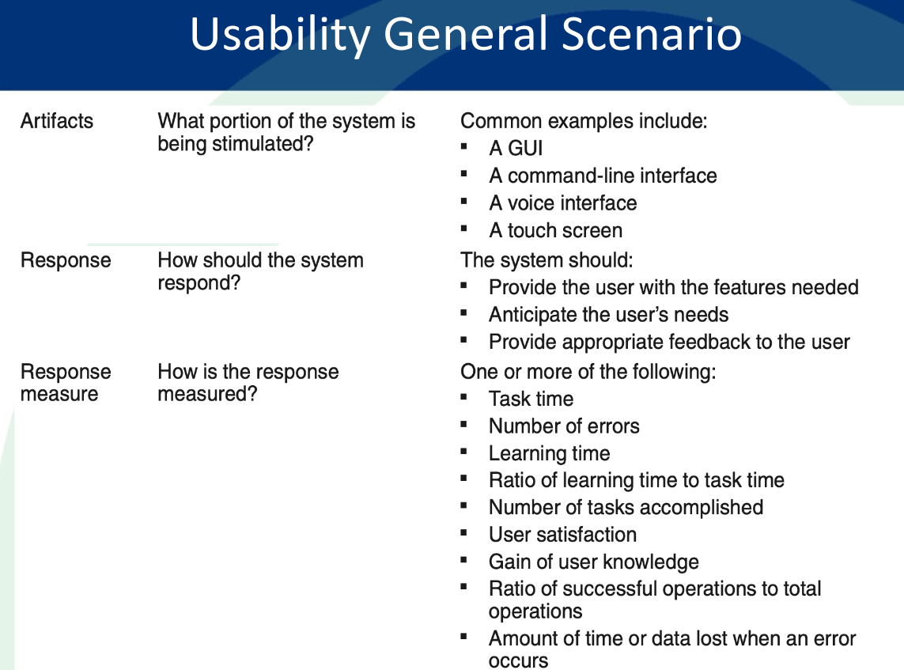

  
October 27th Lecture

*Natural Language Scenario*:
- Trying to get a better sense of Quality Components

*In FCAPS* they talk about Quality Attributes with N.L.

**Exam Question Hint**

Take this Description, and move it into a Quality Attribute Scenario
*(Source, Stimulus, Artifact, Environment Response, Response Measure)*

*Architecture* Is more influenced by Quality Attributes

### Utility Tree:

- 2nd Column : Seperating Q.A Attributes more specifically
- 3rd Column : (Priority, Technical Risk)
    - Priority of Q.A *(important or not)*
    - Technical Risk; can we develop this !?

**(H,H)** Is the ones you need to address first always, *High Priority, High Risk*

**Utility Tree : ASR**
Core Functionality of LMS System for EX: *Content Distribution for Students & Teachers*

*Q.A Scenario* Which gives you a bit of an insight on the *(Source, Stimulus, Artifact, Environment Response, Response Measure)*

---

**QAW** vs **Utility Tree**

- Different, but same goal "Listing and Prioritizing the most Important Quality Attributes"

---

### Integrability General Scenario:

---

**Package Diagram**
- Use Dependency 
- Can have 1 layer with many different seperations

--- 

*Hint | SD 5*:

Highlighting the Natural Language:

**Identify Different Attributes**

Quality Attribute table | Source | Stimulus | Artifcat | Response & Measure

*Modifiability*, *Interop*, etc... *Reliability*

