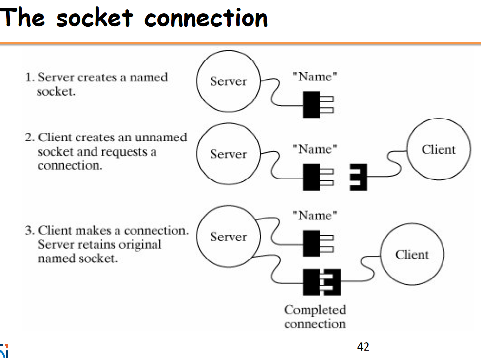

<details>
  <summary style="font-size: 30px; font-weight: 500; cursor: pointer;"> Week 6 | Sockets </summary>

- Mechanism that allows processes to talk to each other even if they're on different machines.
- For example, the **rlogin** utility, which allows a user on one machine to log into a remote host, is implemented using sockets.

**Server Process**
- Creates the socket, which is accessible by client socket processes.
- Client processes can "talk" to the server.

**Client Process**
- Creates an `un-named socket` then requests it to be connected to a `server's named socket`
- Successful connection returns file descriptor to client, and to server
- Sockets are Bi-Directional! Unlike **pipe**



### 1. **Domains**

   **Definition**: Domains in socket programming define the communication space where both client and server operate.

   **Types**:
   - `PF_LOCAL` or `PF_UNIX`: 
     - **Usage**: Communication between client and server on the same machine.
     - **Example**: Inter-process communication in Unix systems.
     - **C Example**: 
       ```c
       struct sockaddr_un {
           sa_family_t sun_family;       /* AF_UNIX */
           char        sun_path[108];    /* pathname */
       };
       ```
   - `PF_INET`: 
     - **Usage**: For IPv4 Internet protocols.
     - **Example**: HTTP/FTP servers and clients.
     - **C Example**: 
       ```c
       struct sockaddr_in {
           short            sin_family;   /* AF_INET */
           unsigned short   sin_port;     /* Port number */
           struct in_addr   sin_addr;     /* Internet address */
       };
       ```
   - `PF_INET6`: 
     - **Usage**: For IPv6 Internet protocols.
     - **Example**: Modern web applications supporting IPv6.
     - **C Example**: 
       ```c
       struct sockaddr_in6 {
           sa_family_t     sin6_family;   /* AF_INET6 */
           in_port_t       sin6_port;     /* Port number */
           struct in6_addr sin6_addr;     /* IPv6 address */
       };
       ```

### 2. **Types**

   **Definition**: Socket types determine the nature of communication (data transmission) between client and server.

   **Types**:
   - `SOCK_STREAM`: 
     - **Usage**: Provides sequenced, reliable, two-way, connection-based byte streams.
     - **Example**: TCP (Transmission Control Protocol).
     - **C Example**: 
       ```c
       int sockfd = socket(AF_INET, SOCK_STREAM, 0);
       ```
   - `SOCK_DGRAM`:
     - **Usage**: Supports datagrams (connectionless, unreliable messages of a fixed maximum length).
     - **Example**: UDP (User Datagram Protocol).
     - **C Example**: 
       ```c
       int sockfd = socket(AF_INET, SOCK_DGRAM, 0);
       ```

### 3. **Protocols**

   **Definition**: The protocol specifies the specific protocol mechanism being used by the sockets.

   **Usage**: Usually set to `0` to choose the default protocol for the given domain and type.

   **Example**:
   - For a TCP socket, the default protocol is TCP.
   - For a UDP socket, the default protocol is UDP.

   **C Example**:
   ```c
   // For TCP
   int sockfd = socket(AF_INET, SOCK_STREAM, 0);

   // For UDP
   int sockfd = socket(AF_INET, SOCK_DGRAM, 0);
   ```

### Summary:
- Domains (`PF_LOCAL`, `PF_INET`, `PF_INET6`) determine where clients and servers are located.
- Types (`SOCK_STREAM`, `SOCK_DGRAM`) define the communication method.
- Protocols are usually set to `0` to auto-select the standard protocol for the chosen domain and type.
- TCP is used with `SOCK_STREAM` for reliable connections, and UDP is used with `SOCK_DGRAM` for connectionless messages.

</details>