# Data Management Systems ( SOFE3700 )

| Category                 | Mark   |
|--------------------------|--------|
| Quizzes and Assignments  | 10%    |
| Labs                     | 15%    |
| Final Project            | 15%    |
| Midterm (Oct. 6th)       | 20%    |
| Final                    | 40%    |


**Quizzes:**
- Lockdown browser will be used in quizzes and must be done in class.
- Expect a quiz every week. *(I will drop the lowest quiz mark)*

**Midterm:**
- The exam will be on Oct. 6th during the class time.
- No midterm deferral, marks will be added to the final exam

**There will be a group project. (Final Project)**
Team: 4 students
You will be given case studies *(or bring your own project – it
has to be approved by the TA/Professor)* and you need to
apply the design principles and submit a software design
- Report on each phase
- Presentation at the end of the term
- More details will be on Canvas

---

<details>
  <summary style="font-size: 30px; font-weight: 500; cursor: pointer;">Lecture 1 | Databases & DB Users</summary>
  
  **Intro:**

  With the boom of Social Media, New types of database systems, often referred to as **big data** storage systems, or **NO-SQL Database Systems** (Google, Amazon, Yahoo)

  Corrolated with **Cloud Storage** aswell.

  We will give an overview of these new types of database systems in Chapter 24.

  **Databases don't only store Text & Numbers!**
  - Multimedia Databases *(Image, Video, Volumetric Files, etc...)*

  - Geographic Information Systems (GISs)

  - Online Analytical Processing (OLAP) *Example a company that makes stock predictions based on Real-time Market Analytics*

  - **Real-time** and **active database technology** is used to control industrial and manufacturing processes.

---

#### Definition: Database management system (DBMS)

- Collection of programs that enables users to create and maintain a database. *(Easier DB Management)*
- DBMS is a general‐purpose software system that facilitates the processes of defining, constructing, manipulating, and sharing databases among various users and applications...
**Examples:**
• MySQL,
• PostgreSQL,
• Microsoft SQL Server,
• Oracle,
• Sybase,
• SAP HANA,
• IBM DB2.

**Main Functions of a DBMS:**

- Defining DBs | Specify data types, structures, constraints of the data to be sorted, titled "meta-data"

- Construction of DBs | Processing of actually storing data on some storage medium controlled by DBMS

- Manipulation of DB | **Retrieval:** query and update the database to reflect the miniworld, and generate reports, **Modification:** Insertions, deletions and updates to its content. The API Layer of a Web Application interfaces with DBMS.

- Sharing of Database to DB Users | Allow multiple users and programs to access the database simultaneously

- System & Security Protection | Preventing crashes & software malfunctions, whilst having Security Safeguards for malicious access.

- Maintain the database system | Allow the system to evolve as requirements change over time


## Application Activities Against a Database (TLDR: GPT is a better prof than the prof)

In a Database Management Systems (DBMS) course, it's crucial to understand the various application activities that interact with a database. These activities are fundamental to the functioning of database systems and play a vital role in data manipulation and retrieval. Below are two key application activities:

### Queries

Queries are a fundamental aspect of interacting with a database. They allow users or applications to access different parts of the data stored in a database and formulate a result for a specific request. Queries can range from simple requests for data retrieval to complex operations that involve multiple database tables. Here's why queries are essential:

- **Data Retrieval:** Queries enable users to fetch specific information from the database, making it possible to obtain the data they need for analysis, reporting, or other purposes.

- **Data Manipulation:** Queries can also be used to modify data in the database. For example, users can update existing records, insert new data, or delete unnecessary information.

- **Data Analysis:** Complex queries can perform calculations, aggregations, and transformations on data, allowing users to derive valuable insights and make informed decisions.

- **Interjoining Tables:** In many cases, queries involve joining multiple database tables to retrieve related information. This interjoining of tables enhances the response to the request by providing a more comprehensive dataset.

### Transactions

Transactions are critical for ensuring data consistency and integrity in a database. They represent a set of operations that are executed as a single unit of work. Transactions can include reading data, updating values, generating new data, and storing it in the database. Here's why transactions are essential:

- **Atomicity:** Transactions are atomic, meaning that they are treated as a single, indivisible unit. This ensures that all the operations within a transaction are either completed successfully or rolled back entirely in case of failure. Atomicity guarantees that the database remains in a consistent state.

- **Consistency:** Transactions help maintain data consistency by enforcing rules and constraints defined in the database schema. If a transaction violates any integrity constraints, it is rolled back, preventing the database from entering an inconsistent state.

- **Isolation:** Transactions run in isolation from each other. This means that the changes made by one transaction are not visible to other transactions until the first transaction is committed. Isolation prevents interference between concurrent transactions.

- **Durability:** Once a transaction is committed, its changes are permanently stored in the database, even in the event of a system failure. This ensures that data remains persistent and can be relied upon.

- It is an executing program or process that includes one or more database accesses (i.e. reading or updating records)

---

#### Example (UNIVERSITY DATABASE) :

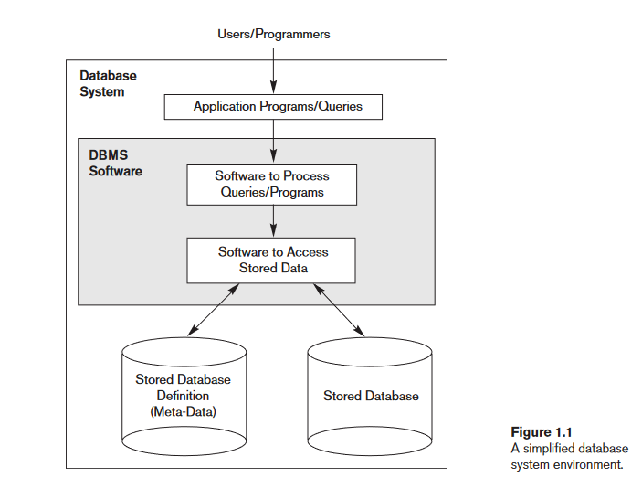

**Elaboration on "Meta-Data" in the context of DBs**

In the context of databases, **"Meta-Data"** refers to data that provides information about the structure, definition, and organization of the actual data within the database. This includes details about tables, columns, data types, constraints, indexes, and more. Metadata essentially defines how the data is structured and what kind of data it contains.


DB Manipulation Example:

Query for All of Student 8's Enrolled Sections

```sql
SELECT Section_identifier FROM Grade_Report WHERE Student_number = 8;
```
I'll be trying to regularly annotate word related db problems into SQL cuz why not


More examples from the book:

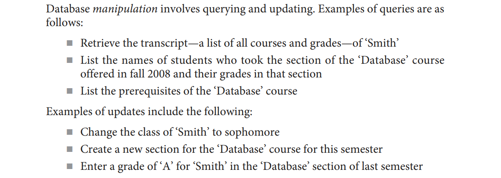

---

### The Database Approach TL:DR

Here's a concise point-by-point comparison of the traditional file processing approach versus the modern database approach:

**Traditional File Processing: (Legacy)**
- Each user defines and implements separate files for specific software applications. (Reading JSONS for ex.)
- Multiple users maintain their own files and programs for data management.
- Redundant data storage due to each user's separate files. *(5 Million users = 5 Million .dat files in a legacy application)*
- Customized programs for different functions like reporting and data entry.
- Results in wasted storage space and duplicate data maintenance. *(It's messy, it takes up alot of space, issues happen with files laying everywhere)*

**Database Approach:**
- Centralized repository for data.
- Data defined once and accessed by various users.
- Users access data through queries, transactions, and applications.
- Eliminates redundancy in data storage.
- Efficient and consistent data management.

- A multiuser DBMS must allow multiple users to access the database at
the same time
- 
- DBMS must have Concurrency control software to ensure that several users trying to update the same data do so in a controlled manner *Example assigning seats for airline reservation systems*

    - This type of application is called Online transaction processing (OLTP) application
- Ensure that concurrent transactions operate correctly and
efficiently
- This allows hundreds of concurrent transactions to execute per
second.


---

### Actors on Scene


**Actors on the Scene (Actual Database Users):**
- **Professional Users:** Responsible for database development, design, and application.
- **End Users:** Access and interact with the database for their specific needs.

**Workers Behind the Scene of DBMS (Back-end):**
- **DBMS System Designers:** Develop and implement DBMS modules and interfaces.
- **Tool Developers:** Create software tools for database modeling and performance enhancement.
- **Operators and Maintenance Personnel:** Manage the hardware and software infrastructure for the database system.

</details>

---

<details>
  <summary style="font-size: 30px; font-weight: 500; cursor: pointer;">Lecture 2 | Database System Concepts and Architecture</summary>

## 2.1 Data Models, Schemas, and Instances

**Data abstraction** generally refers to the suppression of
details of data organization and storage, and the highlighting of the essential features for an improved understanding of data. 

**A data model** is a collection of concepts that
can be used to describe the structure of a database—provides the necessary means to achieve this abstraction.

Most data models also include a set of **basic operations** for specifying retrievals and updates on the database.

1. Client module
- Run on a user workstation or personal computer.
- Handles user interaction and provides the user-friendly interfaces
such as forms- or menu-based GUIs (graphical user interfaces).
2. Server module,
- Handles data storage, access, search, ...


### Categories of Data Models

- **High-level** or Conceptual data models provide concepts that are close to the way many users perceive data.
  - **Conceptual data models** use concepts such as entities, attributes, and relationships.
  An entity represents a real-world object or concept, such as an employee or a project
  from the miniworld that is described in the database
  - Attribute represents some property of interest that furthert describes the entity. *(Name, age, height, sex)*
  - Relationship  among two or more entities represents an association among the entities, for example, a works-on relationship between a employee and a project.  
  - Chapter 3 presents the entity–relationship model—a popular high-level conceptual data model.

- **Low-level** or Physical data models provide concepts that describe the details of how data is stored on the computer storage media, typically magnetic disks.

- **Representational data models** hide many details of data storage on disk but can be implemented on a computer system directly. *(middle-ground)*

- **Implementation (representational) data models:** Provide concepts that fall between the above two, used by many
commercial DBMS implementations *(e.g. relational data models used in many commercial systems).* Such as the Object Data Model.

- **Self-Describing Data Models:** Combine the description of data with the data values. Examples include XML, key-value stores and some NOSQL systems.

#### Schemas, Instances, and Database State (more vocabulary)
**Database schema**
- Description of a database, database structure, data types, and
constraints
- Specified during database design and is not expected to change
frequently
- The DBMS stores the descriptions of the schema constructs and constraints—also called the meta-data
- **schema evolution** is when the schema updates, and the structure of the tables & DB changes *(example, added D.O.B construct for students)*

**Schema diagram**
- Illustrative display of selected aspects of a database schema *(DBeaver Database - UML View)*

**Schema construct**
- A component of the schema or an object within the schema, e.g., STUDENT, COURSE


**NOTE**: A schema diagram displays only some aspects of a schema, such as the names of
record types and data items, and some types of constraints. Other aspects are not
specified in the schema diagram; for example, Figure 2.1 shows neither the data
type of each data item nor the relationships among the various files.


#### Distinction made in book: DB Schema (RED) vs. DB State (GREEN)

Schema is the actual Meta-data telling the DBMS how data is structured within Tables, the current data refers to actual entries


*empty state* -> No data
*initial state* -> Data after large load-in or something of this nature
*current state* -> After users do numerous operations on it, the data is at a latest state

The DBMS is also partially responsive for ensure **Valid State**

### Three-Schema Architecture and Data Independence

The goal of the three-schema architecture, illustrated in Figure 2.2, is to separate
the user applications from the physical database. In this architecture, schemas can
be defined at the following three levels:


**External Level** includes many External Schemas or User Views. an External Schema describes the part of the DB that the user is interested in, or a JOIN of tables for the user *(External Schema uses representational data model to make it's own schema views)*

**Conceptual Level** refers to the conceptual schema which describes the structure of the whole db, without touching on the physical storage itself. Usually, a **representational data model** is used to describe the conceptual schema when a database system is implemented.

**Internal Level** which refers to the lower-level, closer to the hardware. Describes physical storage structure of DB, describes complete details of data storage, with access `path`s for access to higher level components.

The **three-schema architecture** distinguishes between the user's external view, the database's conceptual design, and the internal storage level in a database system. Although many DBMSs don't strictly separate these levels, they often support this structure, with some even combining the physical and conceptual schemas. Crucially, the three schemas are mere data descriptions, with actual data stored only at the physical level, and transitions between these levels, known as mappings, can be resource-intensive.

---

## Data Independence

**DEFINITION**: The three-schema architecture can be used to further explain the concept of data independence, which can be defined as the capacity to change the schema at one level of a database system without having to change the schema at the next higher level. We got 2 types of data independence:

### **Logical Data Independence** : 
Allows for modifications to the conceptual schema without altering external schemas or application programs. For instance, when expanding or reducing the database, only the view definition and the mappings need adjustment. Even after significant changes, applications referencing the external schema should function as they did before, ensuring stability and flexibility.

Imagine you have a database for a bookstore.  *(GPT EXAMPLE)*

###### Conceptual Schema (Initial):
- **Books**: Title, Author, ISBN, Price, Genre

###### External Schema (User View):
- **User A**: Sees Title, Author, Price
- **User B**: Sees Title, Genre

Now, let's say the bookstore starts storing an additional piece of information: the `Publication Year` of each book.

###### Conceptual Schema (Updated):
- **Books**: Title, Author, ISBN, Price, Genre, Publication Year

Despite this change in the conceptual schema:

- **User A** will still see only the Title, Author, and Price.
- **User B** will still see only the Title and Genre.

The application or interface through which **User A** and **User B** interact with the database remains unchanged, even though the underlying conceptual schema has been modified. This demonstrates _**Logical Data Independence.**_
<br>
<br>

### **Physical Data Independence** 
Is the capacity to change the internal schema without having to change the conceptual schema. Hence, the external schemas need not be changed as well. Changes to the internal schema may be needed because some physical files were reorganized, *for example* by creating additional access structures—to improve the performance of retrieval or update.
 *(GPT EXAMPLE)*
###### Conceptual Schema:
- **Books**: Title, Author, ISBN, Price, Genre

###### Internal Schema (Initial Storage):
- Data is stored in sequential files.
- **Books** are accessed based on their ISBN numbers.

Given the growth of the bookstore, the management decides to enhance data retrieval speed. They introduce an indexing system based on `Genre` for faster searches.

###### Internal Schema (Updated Storage):
- Data still stored in sequential files.
- **Books** can now also be accessed quickly through a `Genre` index.

Despite this change in the internal storage mechanism:

- The conceptual schema remains as **Books**: Title, Author, ISBN, Price, Genre.
- Applications or interfaces querying books by genre *(e.g., "Find all Sci-Fi books")* might see performance improvements, but the query itself remains unchanged.

This example demonstrates how changes to the physical storage level (internal schema) don't impact the higher levels of the database system, showcasing physical data independence.

---

## Database Languages and Interfaces

The DBMS provides appropriate languages and interfaces for each category of users!

**Data Definition Language (DDL)** : Used by the database administrators and designers to define both conceptual and internal schemas.
- The DBMS has a DDL compiler to process DDL statements in order to identify descriptions of the schema constructs and to store the schema description in the DBMS catalog.
- In many DBMSs, the DDL is also used to define internal and external schemas *(user views)*.

In DBMSs where a clear separation is maintained between the conceptual and internal levels, the DDL is used to specify the conceptual schema only. Another language, the **storage definition language (SDL)**, is used to specify the internal schema.

**View Definition Language (VDL)**
- Specifies user views and their mappings to the conceptual schema
- In relational DBMSs, **SQL** is used in the role of DDL, VDL , and DML

**This makes zero fuckn sense, so let's break it down !!!**

---

#### 1. Data Definition Language (DDL)
DDL is used to define and manage the structure of the database.
##### Example:
Imagine you're creating a new bookstore database. You'd use DDL commands to set up the initial structure.

```sql
CREATE TABLE Books (
    BookID INT PRIMARY KEY,
    Title VARCHAR(255),
    Author VARCHAR(255),
    ISBN VARCHAR(13),
    Price DECIMAL(5,2),
    Genre VARCHAR(50)
);
```

#### 2. Storage Definition Language (SDL)
SDL focuses on how data is stored and organized at the physical level.
##### Example:
You might have requirements related to the performance of your bookstore database, like faster data retrieval based on genres. SDL would be used to define the storage and access methods, like specifying a particular type of indexing system or how data blocks are stored on disk. *(Here we're speeding our indexing up with a Binary Tree)*

```sql
DEFINE INDEX GenreIndex ON Books(Genre) USING BTREE;
```

#### 3. View Definition Language (VDL)
VDL is used to define views for particular users or user groups, focusing on the data they can access and the way they see it.
#### Example:
Suppose you want a view for customers that only shows them the **Title**, **Author**, and **Price** of the books, without any internal identifiers like **BookID** or **ISBN**. 

```sql
CREATE VIEW CustomerBookView AS
SELECT Title, Author, Price FROM Books;
```

In the above example, VDL is used to create a view named **CustomerBookView** which displays only selected columns from the Books table.

#### Data Manipulation Language (DML)

DML is responsible for data operations within a database, including:

- **Retrieving** data
- **Inserting** new entries
- **Deleting** existing entries
- **Modifying** data

##### Types of DML

1. **High-level (nonprocedural) DML**
   - Allows concise specification of complex operations.
   - Known as set-at-a-time or set-oriented, meaning it can handle multiple records simultaneously.
   - Example: **SQL**.

2. **Low-level (procedural) DML**
   - Needs to be part of a general programming language like **C++** or **Java**.
   - Operates record-at-a-time, meaning one record is processed at a given moment.
   - Example: **DL/I** commands such as `GET UNIQUE`, `GET NEXT`, etc.

---
### DBMS Interfaces

## Types of Database Interfaces

1. **Menu-based Interfaces for Web Clients/Browsing**
   - Present options through menus, eliminating the need for command memorization.
   - Commonly used: Pull-down menus.
   - Example: A website navigation bar.

2. **Apps for Mobile Devices**
   - Tailored interfaces for mobile users to access data.
   - Example: Banking apps allowing account checks and bill payments.

3. **Forms-based Interfaces**
   - Displays a form for users to input or retrieve data.
   - Designed for naive users for specific transactions.
   - Example: A login form with username and password fields.

4. **Graphical User Interfaces (GUIs)**
   - Show a schema in a diagrammatic form.
   - Users can query by manipulating the diagram.
   - Often use menus and forms.
   - Example: Database visualization tools or ER diagram software.

5. **Natural Language Interfaces**
   - Accepts requests in plain language (e.g., English).
   - Utilizes a dictionary for interpretation.
   - Example: "Find all employees who started after 2020."

6. **Keyword-based Database Search**
   - Similar to web search engines, but for databases.
   - Matches words with documents or records.
   - Example: Searching for a term within a database, like "Python" in a programming tutorial DB.

7. **Speech Input and Output**
   - Allows users to interact with databases using speech.
   - Limited vocabularies but growing in use.
   - Example: Voice assistants checking flight details or credit card balances.

Programmer interfaces:
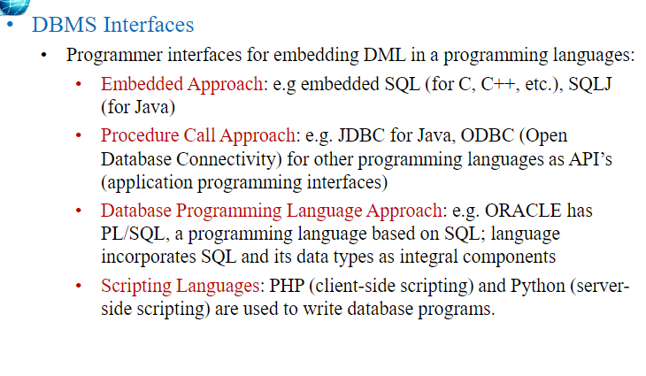

---
### The Database System Environment

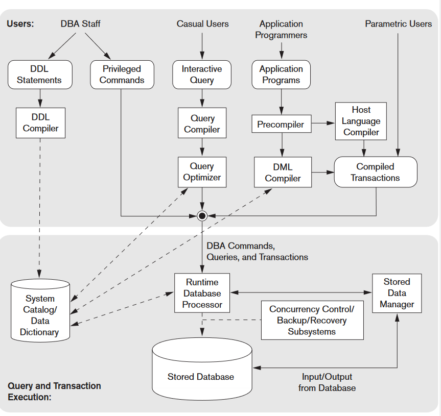

Components:
- **The database & DBMS catalog** are usually stored on disk. Access to the disk is controlled primarily by the operating system *(OS)*, which schedules disk read/write.
- **Buffer Management** module to schedule disk read/write, since management of buffer storage has a considerable effect on performance. Reducing disk read/write improves performance considerably.
- **Higher-level stored data manager** module of the DBMS controls access to DBMS information that is stored on disk, whether it is part of the database or the catalog.

_**TOP SECTION OF DIAGRAM**_
It shows interfaces for the DBA Staff, Casual Users, Interactive Users *(Make Queries, Formulate queries aswell)* , App. Programmers who create programs with C++/Java, and parametric users who do data entry work by supplying parameters to predefined transactions.

- DDL Compiler Processes Schema Definitions specified, and stores the **Meta-data** in the DBMS catalog.
- Catalog includes info such as: *Names, Size of Files, Data Types, Data Items, Storage Detail per file, mapping info for schemas, constraints*

# GPT's say on this:

### Key Actors & Components

- **Casual Users**
  - Interaction: Use interactive query interfaces.
  - Tools: Menu-based, form-based, and mobile interactions.

  - **Parametric Users**
  - Interaction: Execute canned transactions using parameters.
  - Example: Supplying parameters like account number for bank transactions.

  - **Application Programmers Users**
  - Languages: Java, C, C++, scripting languages like PHP and Python.
  - Process: Submit code to a precompiler to extract DML commands.

- **Query Compiler**
  - Purpose: Validate and compile queries into an internal form.
  - Operation: Checks syntax, file names, and data elements.

- **Query Optimizer**
  - Purpose: Enhances query performance by optimizing its operations.
  - Consults: System catalog for data statistics.

- **Precompiler**
  - Purpose: Extracts DML commands from host language programs.
  - Result: Object code for database access.

- **Runtime Database Processor**
  - Role: Executes privileged commands, queries, and canned transactions.
  - Interfaces: System catalog, stored data manager, and possibly OS for buffer management.

- **Stored Data Manager**
  - Role: Manages low-level I/O operations between disk and memory.
  
- **Concurrency Control & Backup/Recovery Systems**
  - Purpose: Ensure transaction management, safety, and consistency.

- **DBMS Client Software & Database Server**
  - Structure: Client-server model where the client accesses the DBMS on a separate device.
  - Variations: Clients may also access an intermediate application server.

##### Notes

- The provided architecture isn't specific to one DBMS but represents typical modules.
- The DBMS interfaces with the OS for disk accesses and may control main memory buffering.

---

## Database System Utilites
There are some functions that are provided through additional programs called utilities, it helps the DBMS do specific tasks, thanks to these utils!

#### Database Utilities

- **Loading Utility**
  - Purpose: Used to load existing data files, such as text files or sequential files, into the database. Automates the reformatting of data for storage in the database.
  - Example: Transferring data from one DBMS to another using conversion tools that generate loading programs based on source and target storage descriptions.
  - Some vendors offer conversion tools that generate the appropriate loading programs, given the existing source and target database storage descriptions *(internal schemas)*.

- **Backup Utility**
  - Purpose: Creates backup copies of the database, either as a full dump or using incremental backups to save only changes since the last backup.
  - Example: An incremental backup mechanism that only saves records modified after the last full backup, Incremental Backups conserve storage space. Dumps are quite large *(full-dumps)*

- **Database Storage Reorganization Utility**
  - Purpose: Reorganizes database files into different structures, possibly adding new access paths, to enhance performance.
  - Example: Altering the structure of a product database to add new indexes, optimizing search performance.

- **Performance Monitoring Utility**
  - Purpose: Monitors database usage, collecting statistics for the Database Administrator **(DBA)** to aid in performance-related decisions.
  - Example: Analyzing query performance over time to determine if additional indexes are required or if certain files need reorganization.

Other utilities may be available for sorting files, handling data compression, monitoring access by users, interfacing with the network, and performing other functions.

#### Tools, Application Environments, and Communications Facilities

- **CASE (Computer-Aided Software Engineering) Tools**
  - Purpose: Used during the design phase of database systems.
  - Examples: Rational Rose, TOAD

- **Data Dictionary (Data Repository) System**
  - Purpose: Beyond cataloging, stores design decisions, usage standards, application program descriptions, and user data.
  
- **Application Development Environments**
  - Purpose: Facilitates the construction of database applications, including:
    - Database design
    - GUI development
    - Query and update operations
    - Application program development
  - Examples: PowerBuilder *(Sybase)*, JBuilder *(Borland)*, JDeveloper

- **Communications Software**
  - Purpose: Allows users to connect to databases remotely.

---

## Centralized and Client/Server Architectures for DBMSs

### Centralized DBMSs Architecture

Figure 2.4 illustrates the physical components in a centralized architecture. Gradually, DBMS systems started to exploit the available processing power at the user side, which led to client/server DBMS architectures. *(Better for the DB host, and needed nowadays)*


Old Computer Systems at Work used to be a bunch of Display Terminals, connected to a central computer, which housed the DBMS itself.
Now everyone uses PC or Mobile Device, so it's different, however the figure shows the O.G style of Display Monitors connecting to the 1 DBMS!

### Basic Client/Server Archs.
The client/server architecture was developed to deal with computing environments in which a large number of PCs, workstations, file servers,
printers, database servers, Web servers, e-mail servers, and other software and equipment are connected via a network.


- Has **specialized servers** with specific use-cases / functionalities. for example, here we've got
  - File server: Maintains the files of the client machines.
  - Printer server: Connected to various printers; all print requests by the clients are forwarded to this machine
  - DBMS server
  - Web servers or e-mail servers

- The **client machine**(s) provide the user with the appropriate interfaces to utilize these servers, as well as with local processing power to run local applications. **(Rest API Layer, LAN Network, WiFi Network, etc..)** comms.

### Two-Tier Client/Server Architectures for DBMSs

In the realm of Relational Database Management Systems (RDBMSs), the two-tier architecture represents a clear division between the **client** and the **server**.

#### Key Components:

- **Client Side**:
  - Contains: User interface programs and application programs.
  - Role: Connects to the DBMS server when database access is required.

- **Server Side**:
  - Often termed as: Query server, transaction server, or SQL server.
  - Contains: The functionality related to SQL processing.
  
#### Standard Protocols:

- **Open Database Connectivity (ODBC)**:
  - Role: Serves as an Application Programming Interface (API) for client-side programs to interact with the DBMS.
  - Universality: Works across systems provided both client and server have the necessary software.

- **Java Database Connectivity (JDBC)**:
  - Purpose: Similar to ODBC but designed for the Java programming language.
  - Role: Enables Java client programs to access DBMSs using a standardized interface.

#### Overview:

In this architecture, the client communicates directly with the server. When a client needs data, it establishes a connection to the DBMS on the server side, sends query or transaction requests, processes the received data, and then displays results as necessary. The server, meanwhile, focuses on querying and transactions, keeping the heavy-duty data processing away from the client. 

### N-Tier Architecture

While the two-tier architecture divides the system into client and server, n-tier architectures (like three-tier) involve additional layers, offering more flexibility and scalability.

#### Example: Three-Tier Architecture

1. **Presentation Tier**: User interface (like a web page).
2. **Application Tier**: Logic, processing, or API layer (like a backend API server).
3. **Data Tier**: Database servers, where data is stored and retrieved.

In a three-tier setup, the application tier acts as a mediator, processing client requests before accessing the data tier. It separates the business logic from user interface concerns, leading to more maintainable and scalable systems.

#### Broader Context:

The concept of "n-tier" signifies multiple layers or tiers in the system architecture. Each additional tier allows for further separation of concerns, potentially making systems more modular, scalable, and maintainable. However, each added layer might introduce additional complexity.


##### Three-Tier Architecture

- **Intermediate Layer**: Often termed as the *application server* or *Web server*, depending on the context.
  
  - **Roles**:
    - Runs application programs.
    - Stores business rules (like procedures or constraints) for data access.
    - Enhances database security by verifying client credentials.
    - Processes client requests and relays database commands/queries to the database server.
    - Transfers (partially) processed data from the database server to the client.

- **Clients**: Include user interfaces and Web browsers.

- **Three Tiers**:
  1. **User Interface**: Interacts with end-users. *(React)*
  2. **Application Rules**: Houses intermediate rules, constraints, and business logic. *(API / SQL Assertions)*
  3. **Data Access**: Manages the retrieval and storage of data. *(JDBC, or DB Connection Library)*

- **Web Integration**: The middle layer can double as a Web server, fetching query results and converting them into dynamic Web pages for client-side Web browsers. The client is typically a PC or a mobile device.

#### N-Tier Architecture

- **Overview**: Splits the system layers further than the three-tier model, resulting in n-tiers where n can be four, five, or more layers.
  
  - **Fine-grained Layers**: Typically, the business logic layer gets subdivided into multiple layers.
  
  - _**Advantages**_:
    - Distributes both programming and data across the network.
    - Each tier can operate on a suitable processor or OS platform.
    - **Offers independence & modularity**: Layers can be managed and scaled separately.

---

## Classification of Database Management Systems (DBMSs)

### 1. Based on Data Model:

- **Relational Data Model**: Widely used in many current commercial DBMSs, known as SQL systems.
- **Object Data Model**: Exists in commercial systems but isn't widespread.
- **NOSQL Systems** (Big Data Systems): Includes various models like:
  - Document-based
  - Graph-based
  - Column-based
  - Key-value data models
- **Legacy Data Models**: Hierarchical and network models.
- **Object-Relational DBMSs**: Combination of object and relational DBMSs.
- **XML-Based DBMSs**: Based on the tree-structured XML model.

### 2. Number of Users:

- **Single-User Systems**: Supports one user at a time, mainly for PCs.
- **Multiuser Systems**: Supports multiple concurrent users.

### 3. Distribution of Database:

- **Centralized DBMS**: Data stored at a single site.
- **Distributed DBMS (DDBMS)**: Database and DBMS software spread over multiple sites linked by a network. Big data systems may have data replicated across hundreds of sites.

---

## Deep Dive: Object-Relational DBMSs

Object-Relational Database Management Systems (ORDBMSs) are a hybrid that aims to combine the best features of both relational and object-oriented databases. They enable users to develop database applications with a more sophisticated data structure compared to relational databases, while still benefiting from relational database features.

### Key Features:

1. **Complex Data Types**: ORDBMSs support complex data and varied data structures like arrays and multimedia formats.
2. **Inheritance**: Just like in object-oriented databases, objects in ORDBMS can inherit properties and methods from other objects.
3. **Object Identity**: Each object in the database has a unique identifier, irrespective of its value.
4. **Encapsulation**: Bundling of data with the methods that operate on that data.
5. **Extended SQL**: ORDBMSs offer extensions to standard SQL to handle object-oriented features.
6. **Relational Capabilities**: Despite the added object features, ORDBMSs still maintain the relational view and capabilities of databases, including ACID properties and SQL querying.

### Advantages:

- **Flexibility**: Easily model real-world entities.
- **Reusable Components**: Code reusability through inheritance.
- **Efficiency**: Handles complex data types more efficiently than RDBMS.

### Disadvantages:

- **Complexity**: Introducing Object Oriented features may increase complexity.
- **Performance**: Due to added features, there might be a performance overhead compared to traditional RDBMSs.

ORDBMSs are suitable for applications where there's a need for complex data modeling, like CAD applications, telecommunication systems, and molecular biology databases.

---

# Slide Questions... TODO !
</details>

---

<details>
  <summary style="font-size: 30px; font-weight: 500; cursor: pointer;">Lecture 3 | Data Modeling Using the Entity Relationship (ER) Model</summary>

#### What is a Database Application? 

Generally, the term **database application** refers to a particular database and the associated  programs  that  implement  the  database  queries  and  updates.  For  example,  a *BANK  database*  application  that  keeps  track  of  customer  accounts  would  include programs  that  implement  database  updates  corresponding  to  customer  deposits and withdrawals.
  
---

**Section 3.1** discusses the role of high-level conceptual data models in database design.
**Section 3.2** Introduce the requirements for a sample database application in to illustrate the use of concepts from the ER model. This **sample database is used throughout the text. 
**Section 3.3** we present the concepts of entities and attributes, and we gradually introduce the diagrammatic technique for displaying an ER **schema. 
**Section 3.4** we introduce the concepts of binary relationships and their roles and structural constraints. 
**Section 3.5** introduces weak entity types. 
**Section 3.6** shows how a schema design is refined to include relationships. 
**Section 3.7** reviews the notation for ER diagrams, summarizes the issues and common pitfalls that occur in schema design, and discusses
how to choose the names for database schema constructs such as entity types and
relationship types. 

---

## Total Vs. Partial Participation

### Total Participation:

In the context of ER diagrams and database design, total participation means that every entity in an entity set must participate in at least one relationship in the given relationship set.

**Example:**
Consider two entity sets: `STUDENT` and `CLASS`. Let's say every student must enroll in at least one class. So, there is a total participation of `STUDENT` in the relationship `ENROLLS_IN` with `CLASS`. If there is any student who hasn't enrolled in any class, it would violate the total participation constraint!

### Partial Participation:
In contrast, partial participation means that while some entities in an entity set participate in the relationship set, it's not mandatory for all of them.

**Example:**
Now, consider the entities `EMPLOYEE` and `PROJECT`. While some employees might be assigned to projects, others might not be assigned yet *(maybe they are new hires or between projects)*. In this case, `EMPLOYEE` has a partial participation in the relationship `ASSIGNED_TO` with PROJECT.

**In visual ER diagrams:**

=== Total Participation ===: Double Line connecting the entity to the relationship.
--- Partial participation ---: Represented by a single line.

---


**MANAGES:** It's a specific relationship type that associates an `EMPLOYEE` with a `DEPARTMENT` indicating that the employee manages that department. Not every employee manages a department, but every department must have a manager. That's why `DEPARTMENT`'s participation to `MANAGES` is Total, whereas the link between `EMPLOYEE` and `MANAGES` is partial... 

</details>

<details>
  <summary style="font-size: 30px; font-weight: 500; cursor: pointer;">Section 3.1 & 3.2
  </summary>

**Using High-Level Conceptual Data Models for Database Design**


**Note** We start off quite high level, "DBMS Independent" and once Implementation an storage comes into play, that's where it gets "DBMS Specific"

**DBMS Independent**

**Step 1.)** Gather Functional Requirements from Stakeholders and End Users
**Step 2.)** Analysis, and the Database Designers will then kind of know the Data Requirements, and be able to model a high-level transaction spec.
**Step 3.)** Once the requirements have been collected and analyzed, the next step is to create a **conceptual schema** for the database, using a high-level conceptual data model. AKA "Conceptual Design"

- Easier to understand and can be used to communicate with nontechnical users. 
- The high-level conceptual schema can also be used as a reference to ensure that all users’ data requirements are met and that the requirements do not conflict.
- Enables DB designers to concentrate on specifing properties of the data without concerns of Actual Storage or implementation.

**DBMS Specific**

**Step 4.)**  "last" step is the physical design phase, during which the internal storage structures, file organizations, indexes, access paths, and physical design parameters for the database files are specified.
**Step 5.)** In parallel to step 4: Activities & application programs are designed and implemented as database transactions corresponding to the high-level transaction specifications.

---

The **COMPANY** database keeps track of a company’s employees, departments, and
projects. Suppose that after the requirements collection and analysis phase, the
database designers provide the following description of the *miniworld*—the part of
the company that will be represented in the database.


## Loose / High-Level Mapping of our Database (High Level Phase)

- **Departments:**
  - Unique name, number, and manager with start date.
  - Multiple locations.

- **Projects:**
  - Unique name and number, with a single location.
  - Controlled by a department.

- **Employees:**
  - Name, Social Security number, address, salary, gender, and birth date.
  - Belong to one department.
  - Work on multiple projects and have tracked hours.
  - Track hours per week on each project.
  - Have a direct supervisor (another employee).

- **"Dependents":**
  - Name, gender, birth date, and relationship to the employee.
  - Tracked for insurance purposes.


In the Entity-Relationship (ER) model, we focus on entities, which represent real-world things or concepts. An entity can be a physical object like a person or a car, or it can be a conceptual object like a company or a job. 

Each entity has attributes, which are specific properties describing it. For instance, an EMPLOYEE entity might have attributes like name, age, address, salary, and job. These attribute values constitute a significant part of the database's stored data.
---

## Entity Types, Entity Sets, Attributes, and Keys

ER Model describes data as:
- Entities
- Relationships
- Attributes


### Composite VS. Simple (Atomic) Attributes
  - Composite attributes can be divided into subparts with independent meanings, forming a hierarchy if necessary.
  - **Composite Example:** The Address attribute of an EMPLOYEE entity can be subdivided into Street_address, City, State, and Zip (e.g., '2311 Kirby', 'Houston', 'Texas', '77001').
  - Simple (atomic) attributes cannot be further divided. EX: `1234 Street St. L5F R1Z, Manitoba, CANADA`
  - Use composite attributes when users refer to the attribute as a unit but may also reference its components.
  - If the attribute is always referenced as a whole, it can be designated as a simple attribute.

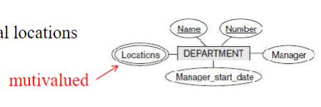

### Single-Valued vs Multivalued Attributes
  - **Single-Valued Attributes:** Have only one value for a particular entity.
    - **Example:** Age of a person.
  - **Multivalued Attributes:** Can have multiple values for a particular entity.
    - **Example:** Colors attribute for a Car or College_degrees for a Person.
    - Multivalued attributes can have lower and upper bounds to restrict the number of values. *(MIN: 2, MAX: 1000 posts on IG)*
    - **Bounds Example:** A car's Colors attribute may be limited to one or two values.

### Stored vs Derived Attributes
  - **Stored Attributes:** The actual data that is stored in the database.
    - **Example:** Birth_date of a person.
  - **Derived Attributes:** Can be computed from other attributes. These are not stored but derived as needed.
    - **Example:** Age of a person can be derived from the current date and the Birth_date.
    - Some derived values can be obtained from related entities.
    - **Derived Example:** Number_of_employees of a DEPARTMENT can be derived by counting the employees working for that department.

### NULL Values
  - Represent missing or not applicable data in the database.
  - **Not Applicable:** Attribute doesn't apply to the entity.
    - **Example:** Apartment_number for single-family homes.
  - **Unknown:** The actual value of the attribute is not known.
    - **Example:** Home_phone of a person when the phone number is unknown.
    - There are two categories for unknown NULLs:
      1. Known to exist but missing: The value is known to exist but is not available.
         - **Example:** The Height attribute of a person is NULL.
      2. Existence is uncertain: It's unknown whether there's an actual value or not.
         - **Example:** The Home_phone attribute of a person is NULL and it's unclear if they have one or not.
</details>

<details>
  <summary style="font-size: 30px; font-weight: 500; cursor: pointer;">Section 3.3 & 3.4
  </summary>

  
  
  > [!NOTE]  
  > Displays the COMPANY ER database schema as an ER diagram

### Relationship Types, Relationship Sets, Roles, and Structural Constraints
- Can be defined as a subset of the Cartesian product of the entity Sets `E1 x E2 x ... x En` (cool xD)

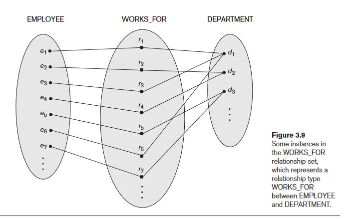

In ER diagrams, relationship types are displayed as diamond-shaped boxes, which
are connected by straight lines to the rectangular boxes representing the participat-
ing entity types.

### Relationship Degree, Role Names, and Recursive Relationships

> [!NOTE]  
> Degree of a Relationship Type

**Degree:** Refers to the number of participating entity types in a relationship type.
**Binary:** A relationship of degree two.
**Ternary:** A relationship of degree three.

The `WORKS_FOR` relationship is a binary relationship because it involves two entity types.

Another example, the `SUPPLY` relationship, is ternary. In this case:
- A relationship instance associates three entities: a supplier (s), a part (p), and a project (j).
- This association is established whenever supplier `s` provides part `p` to project `j`.

Most common is Binary Relationships

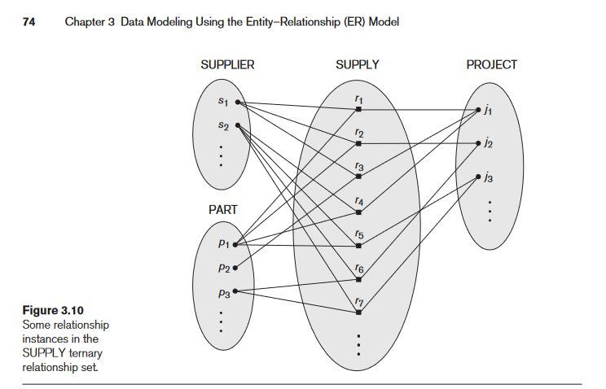

## Recursive Relationships and Roles

**Role Names:** Describe the specific role an entity type plays within a relationship.

For instance, within the `WORKS_FOR` relationship:
**EMPLOYEE** might have a role such as "worker."
**DEPARTMENT** might have a role like "employer."

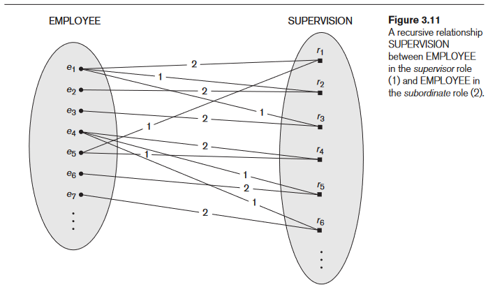

Consider the `SUPERVISION` relationship. Here, one `EMPLOYEE` might be another `EMPLOYEE's` supervisor. In this case:
- The same `EMPLOYEE` entity type is involved twice in the relationship.
  - Once as a "supervisor" (or boss).
  - Once as a "supervisee" (or subordinate).

Visualize it:
- `e1` is the boss of `e2` and `e3`.
- `e4` is the boss of `e6` and `e7`.
- `e5` supervises `e1` and `e4`.

In this model, lines labeled ‘1’ represent the supervisor role, and those labeled ‘2’ depict the supervisee role. Therefore, every instance of this relationship has two connections:
  - One indicating the supervisor (‘1’).
  - The other indicating the supervisee (‘2’).


### Constraints on Binary Relationship Types

Relationship types often come with constraints. These constraints determine which combinations of entities can participate in a relationship set. They are derived from the real-world scenario that the relationship represents.

For instance:
- Imagine a company scenario (as shown in Figure 3.9) where every employee is required to work for exactly one department. This rule or constraint would be captured in the database schema.

There are mainly two types of constraints for binary relationships:
1. **Cardinality Ratio**: Specifies the number of relationship instances an entity can participate in.
2. **Participation**: Determines if the participation of an entity in a relationship is mandatory or optional.

### Cardinality Ratios for Binary Relationships

The **cardinality ratio** in binary relationships indicates how many instances of an entity can be involved in the relationship.

**Key Points**:

1. **Definition**:
   - For the **WORKS_FOR** relationship between `DEPARTMENT` and `EMPLOYEE`, the cardinality ratio is **1:N**. This denotes:
     - A single department can employ numerous employees (N indicates no upper limit).
     - However, an employee can work for only one department at a time.

2. **Possible Ratios**:
   - Binary relationships can have these cardinality ratios: **1:1, 1:N, N:1, and M:N**.

3. **Examples**:
   - **1:1**: The **MANAGES** relationship. Here, an employee can manage only one department, and vice versa. It ensures exclusivity on both ends.
     - *Real-world Scenario*: Think of a school system where each class can have only one head teacher and each head teacher can be responsible for just one class.
   
   - **M:N**: The **WORKS_ON** relationship. It's more flexible, where an employee might be involved in multiple projects, and a project can also have numerous employees working on it.
     - *Real-world Scenario*: In a software development company, developers (employees) often work on multiple projects (like frontend, backend, or mobile development). Conversely, a single project may require multiple developers.

4. **ER Diagrams**: 
   - Cardinality ratios in ER (Entity-Relationship) diagrams are often indicated using 1, M, and N. For example, in Figure 3.2.
   - Advanced notations might even specify exact numbers, like having a max of 4 or 5 participants.

Remember, the cardinality ratio helps to establish and clarify the rules or constraints in the relationship between two entities, ensuring the database structure adheres to real-world scenarios.

---

### Participation Constraints and Existence Dependencies

- **Participation Constraint**: Dictates if the existence of an entity is tied to its relationship with another entity.
  - Specifies the minimum relationships an entity can have.
  - Types:
    1. **Total Participation (or Existence Dependency)**: Every entity must participate in the relationship.
       - **Example**: Every employee must work for a department.
    2. **Partial Participation**: Only some entities need to participate.
       - **Example**: Not all employees manage a department.
  - **ER Diagram Representation**:
    - Total participation: Double line.
    - Partial participation: Single line.

### **Attributes of Relationship Types**

- Just as entities can have attributes, so can relationships.
  - **Example**: The `Hours` an employee works on a project, or the `Start_date` when a manager began overseeing a department.
  
- **Migration of Attributes in 1:1 or 1:N Relationships**: 
  - Attributes can sometimes be moved (or "migrated") to one of the entities in the relationship.
    - **Example**: `Start_date` in `MANAGES` could belong to either `EMPLOYEE` or `DEPARTMENT`.
  
- **Placement of Attributes in M:N Relationships**:
  - For many-to-many relationships, some attributes are influenced by the combination of participating entities.
  - These attributes must remain with the relationship.
    - **Example**: The `Hours` an employee works on a project is determined by the pairing of that employee with a specific project.

In database design, understanding these concepts ensures that the structure closely mimics real-world scenarios and constraints.
---

## 3.3.2 Entity Types, Entity Sets, Keys, and Value Sets
**Entity Type:** Defines a collection of entities with the same attributes.
**Entity Set:** Collection of all entities of a particular entity type in the database at any point in time.

**Entity Type Name:**
- COMPANY: Attributes - Name, Headquarters, President
- EMPLOYEE: Attributes - Name, Age, Salary

**Entity Set (Extension):**
- COMPANY:
    - Sunco Oil, Houston, John Smith
    - Fast Computer, Dallas, Bob King
- EMPLOYEE:
    - John Smith, 55, 80k
    - Fred Brown, 40, 30K
    - Judy Clark, 25, 20K

### Key Attributes of an Entity Type
**Key Attribute:** An attribute whose values are distinct for each entity. It's used to identify each entity uniquely.
Composite attributes can also serve as a key if the combination of their values is unique for each entity.

**EX:**
In the COMPANY entity type, the `Name` attribute is a key because no two companies can have the same name. Similarly, for a PERSON entity type, `SSN` (Social Security number) might be the typical key attribute.

### Value Sets (Domains) of Attributes
Every simple attribute has a value set which specifies the set of values that can be assigned to that attribute.

**EX:**
In the EMPLOYEE entity type:
- `Age` attribute might have a value set ranging from 16 to 70 (integers).
- `Name` attribute might allow strings of alphabetic characters.

---

## Initial Conceptual Design of the COMPANY Database
We can Identify 4 Entity Types from our requirements

1. An entity type `DEPARTMENT` with attributes Name, Number, Locations,
Manager, and Manager_start_date. Locations is the only multivalued attribute.
We can specify that both Name and Number are *(separate)* key attributes
because each was specified to be unique.

2. An entity type `PROJECT` with attributes Name, Number, Location, and
Controlling_department. Both Name and Number are *(separate)* key attributes.

3. An entity type `EMPLOYEE` with attributes Name, Ssn, Sex, Address, Salary,
Birth_date, Department, and Supervisor. Both Name and Address may be
composite attributes; however, this was not specified in the requirements.
We must go back to the users to see if any of them will refer to the individual
components of Name—First_name, Middle_initial, Last_name—or of Address. 
- In our example, Name is modeled as a composite attribute, whereas Address is
not, presumably after consultation with the users.

4. An entity type `DEPENDENT` with attributes Employee, Dependent_name, Sex,
Birth_date, and Relationship (to the employee)
</details>

<details>
  <summary style="font-size: 30px; font-weight: 500; cursor: pointer;">Section 3.5 - 3.7
  </summary>

## Weak Entity Types:

Entity types that do not have key attributes of their own are called **weak entity types**. In contrast, regular entity types that do have a key attribute—which include all the examples discussed so far—are called **strong entity types**.

- Relationship that relates a weak Entity Type to it's owner is named **Identifying Relationship**

- A weak entity type always has a total participation constraint *(existence dependency)* with respect to its identifying relationship because a weak entity cannot be identified without an owner entity. 

- An owner entity can itself be a weak entity.
- A weak entity can have more than one identifying entity type.

**EXAMPLE** A `Driver_License` Entity can't exist, unless it's got a related `Person` Entity. Here `Driver_License` isn't a weak entity however, since a field like `License_Number` is a key, thus can be uniquely identified.

- **Weak Entity Type**
  - Represents entities that **do not have a key attribute** of their own and cannot be uniquely identified by their attributes alone.
  - Relies on a related strong entity for its unique identification.
  
- **Example: DEPENDENT and EMPLOYEE**
  - `DEPENDENT` is a weak entity related to `EMPLOYEE` via a 1:N relationship.
  - Attributes of `DEPENDENT`: 
    - `Name`
    - `Birth_date`
    - `Sex`
    - `Relationship` to the `EMPLOYEE`.
  - While two dependents might have the same attributes, they are identified uniquely when associated with a specific `EMPLOYEE`.

- **Partial Key**
  - An attribute that can **uniquely identify** weak entities that are related to the same owner entity.
  - In the example, if no two dependents of the same employee have the same name, `Name` becomes the partial key.
  - In some cases, a combination of all attributes of the weak entity might serve as the partial key. *(SOMETIMES)*

- **ER Diagram Representation**


  - Weak entities and their identifying relationships are shown with **double lines**.
  - The partial key attribute is underlined with a **dashed or dotted line**.

<br></br>

- **Weak Entity vs. Complex Attributes**
  - Weak entities can sometimes be represented as **complex attributes**.
  - In the given example, an alternative representation could be a multivalued attribute `Dependents` for `EMPLOYEE` with attributes: `Name`, `Birth_date`, `Sex`, and `Relationship`.
  - The decision of which representation to use lies with the **database designer**.
  - A good rule: If the weak entity participates in other relationships apart from its identifying relationship, use the weak entity representation.

---

## 3.7 ER Diagrams; Conventions, Design & Issues

UML Diagram Standard:

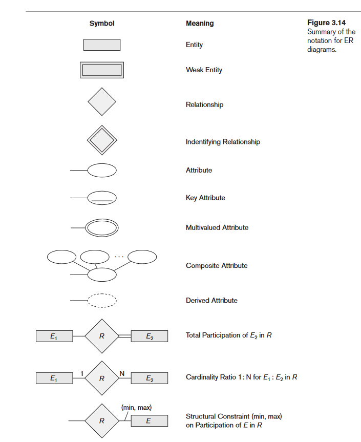

In ER diagrams the emphasis is on representing the schemas rather than the instances. This is more useful in database design because a database schema changes rarely, whereas the contents of the entity sets may change frequently. In addition, the schema is obviously easier to display, because it is much smaller.

#### 3.7.2 Proper Naming of Schema Constructs

- **Naming Significance**
  - Names for schema constructs *(entity types, attributes, relationship types, roles)* should be meaningful and convey their intended purposes.
  
- **Naming Convention Examples**
  - **Entity Types**: Singular names, represented in uppercase (e.g., `EMPLOYEE`).
  - **Relationship Types**: Uppercase letters.
  - **Attributes**: Initial letter capitalized (e.g., `BirthDate`).
  - **Roles**: Lowercase letters.

- **Naming Based on Descriptions**
  - Nouns in narratives often lead to entity type names.
  - Verbs suggest relationship type names.
  - Additional nouns (that describe the main nouns) often indicate attribute names.

- **Readability of ER Diagrams**
  - Aim to make ER diagrams readable from left to right and top to bottom.
  - **Example**: 
    - Initially, the relationship was named `DEPENDENTS_OF`, reading from `DEPENDENT` (bottom) to `EMPLOYEE` (top).
    - For top to bottom readability, it could be renamed `HAS_DEPENDENTS`, meaning an `EMPLOYEE` (top) `HAS_DEPENDENTS` (relationship) of type `DEPENDENT` (bottom).

#### 3.7.3 Design Choices for ER Conceptual Design

- **Conceptual Design Ambiguities**
  - Challenges may arise when deciding if a concept should be modeled as an entity type, attribute, or relationship type.

- **Iterative Refinement Process**
  - Begin with an initial design, then iteratively refine until the best design is achieved.

- **Refinements in Conceptual Design**
  - **Example**: 
    - A concept might first appear as an attribute but then get refined into a relationship if found to reference another entity type.
    - Two attributes, which are inverses of one another, can evolve into a binary relationship.

---

## "OPTIONAL READ" | 3.7.4 Alternative Notations for ER Diagrams

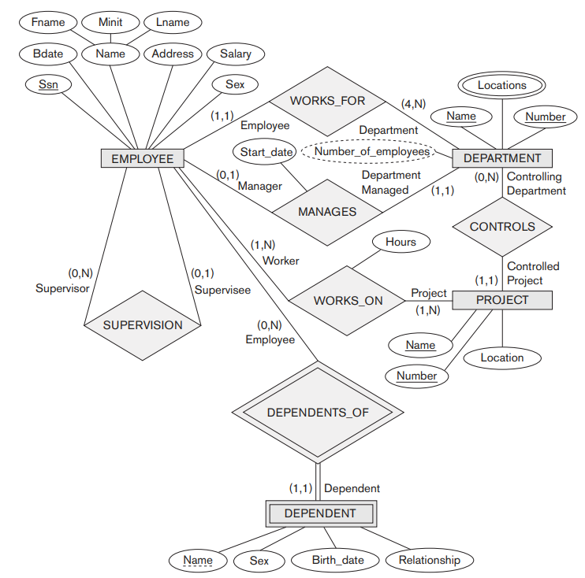

- **Variety of ER Diagram Notations**
  - Multiple diagrammatic notations exist for representing ER diagrams.
  - **Popular Notations**: Detailed in Appendix A.
  - **UML Notation**: Introduced in Section 3.8 as a standard for conceptual object modeling.

- **Alternative ER Notation: (min, max) Notation**
  - An alternative to the traditional cardinality ratio **( 1:1, 1:N, M:N )** and participation constraints (single/double-line).
  - **How it Works**:
    - For an entity type `E` participating in a relationship type `R`, associate a pair of integers `(min, max)`.
    - Constraints: \(0 \leq \text{min} \leq \text{max}\) and \(\text{max} \geq 1\).
    - The numbers represent how many relationship instances an entity `e` in `E` must participate in `R` at any time.
  - **Interpretation**:
    - `min = 0`: Partial participation of the entity.
    - `min > 0`: Total participation of the entity.

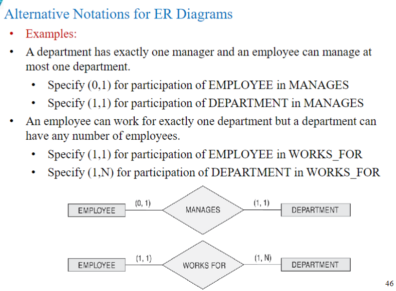

</details>

---

<details>
  <summary style="font-size: 30px; font-weight: 500; cursor: pointer;"> Section 3 | IN LECTURE MATERIAL
  </summary>

</details>
