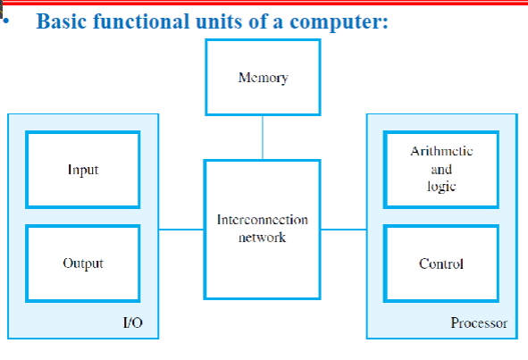

# Microprocessors & Computer Architecture

---

  
Recall: Digital Systems Concepts

  

  Multiplexer, Adders (Half & Full)
  Transistors, Flip Flops, Latches

  General information about registers

  
Lecture 0.

  
## Basic Info & Textbook :
**Computer Organization and Embedded Systems, 6th Edition**
- Authors: Carl Hamacher, Zvonko Vranesic, Safwat Zaky, Naraig
Manjikian,
- Publisher: McGraw‐Hill , 2011

| Category    | Weight   |
|-------------|----------|
| Quizzes     | 10%      |
| Assignments | 10%      |
| Labs        | 15%      |
| Midterm     | 20%      |
| Final       | 45%      |

#### Quizzes:
• Lockdown browser will be used in quizzes.
• Expect a quiz every week. *(I will drop the lowest quiz mark)*
#### Tutorial Assignments:
• There will be assignment in almost every tutorial
#### Midterm:
• will be on **Oct. 4th** during the class time.
• No midterm deferral, marks will be added to the final exam

---

#### ** Course Overview: **

- Introduction to Computer Architecture:
    - CPU, ALU, I/O devices, Busses and Memory – RAM and ROM;
    - RISC vs. CISC architecture;
    - Assembly language programming using a microprocessor and the Hardware/Software Development Tool;
    - Register block and associated registers;
- Microcontroller systems: Interrupt, timer, memory, clock and reset generation
- Analog to Digital conversion (A/D) and Serial Communication Interface Systems.

---

| Week of  | Topic                               | Other Info                |
|----------|-------------------------------------|---------------------------|
| Sep. 05  | Introduction                        |                           |
| Sep. 11  | Basic Structure of Computers        |                           |
| Sep. 18  | Introduction to Microcontrollers    |                           |
| Sep. 25  | Instruction Set Architecture        |                           |
| Oct. 02  | Instruction Set Architecture Midterm| Midterm **( October. 4th )**    |
| Oct. 09  | Fall Study Week                     |                           |
| Oct. 16  | Basic Input/output                  |                           |
| Oct. 23  | Software                            |                           |
| Oct. 30  | Pipelining                          |                           |
| Nov. 06  | Memory Hierarchy                    |                           |
| Nov. 13  | Computer Arithmetic                  |                           |
| Nov. 20  | Serial Communication Interface Systems|                       |
| Nov. 27  | A/D converters, Review              |                           |

  
Lecture 1. | Basic Structure of Computers

**Computers just add numbers, most important circuit in any given Computer System**

| Computer Types                      | Description |
|-------------------------------------------|----------------------------------------------------------------------------------------------------------------------------------------------------------------------------|
| **Embedded Computers**             | - Integrated into a larger device or system for monitoring and control of physical processes.  - Used for specific purposes, e.g., industrial automation, appliances, telecommunication, and vehicles. |
| **Personal Computers (PCs)**       | - Widespread use in homes, education, and offices.  - Support various applications: computation, document preparation, design, entertainment, communication, and internet browsing.   **Classifications:** Desktop, Workstation, Portable/Notebook. |
| **Servers and Enterprise Systems** | - Large computers shared by many users over networks.  - Host large databases and provide information processing for organizations.                                                          |
| **Supercomputers and Grid Computers** | - Offer highest performance, used in demanding computations (e.g., weather forecasting, engineering, science).  - Expensive and large.  - Grid computers are cost-effective, using distributed networked PCs and storage. |
| **Cloud Computing**                | - Users access distributed computing and storage resources via the internet.  - Operated as a utility, charging on a pay-as-you-use basis.                                               |

 

*Every Computer has a CPU *(Central Processing Unit)*

CPU's can have multiple cores.

### Functional Units
---
**Input:**

Computers accept coded information through input units.

*Example devices:* Keyboard, Trackpad, Mouse, Mic, Camera, Communication Lines (Network)

**Output:**

It's function is to send processed results, out to the world.

*Example devices:* Text & Graphical Displays, Printers, LCD Displays, LEDs

Some Devices provide Input & Ouput like *Touch Screen Displays*!

**Memory Unit:**

It's function is to storage programs and data

Stores data in flipflops **(1 flipflop = 1 bit)**

*Classes of Storage:*
- Primary Memory
- Cache Memory
- Secondary Memory

### Classes of Storage (explained):

**Interconnection Network**

The actual "Flow" of how data is working to preform operations.

**Primary (Main) memory**

Main Memory (RAM), after you turn it off, flipflops will loose their contents.

**Cache Memory**

It is an adjunct to main memory to facilitate high instruction execution rate.

It is a smaller faster RAM unit that is used to hold sections of a program that are currently being executed, along with any associated data.

Cache is tightly coupled with the processor and is usually contained on the
same integrated‐circuit chip

**Secondary Memory**

External Storage (Hard-Disk) usually an SSD now.

**Arithmetic and Logic Unit (ALU):**

Does Additional, has `add`
Does Multiplication, has `mul`

Does Logic Operations

**Control Unit:**

ALU & Control Unit make up the processor

It's function is to "Control" everyone, Oh this needs an addition? Give it to the Adder!

**Relies on timing** heavily! Programs need to be ran in order to work properly.

**Processor is composed of:**
- Arithmetic and Logic circuits
- Timing and control circuits
- Registers

**NOTE:** Processors don't deal with the RAM Directly, they just interact with the *Cache Memory* which is constantly being pulled from RAM

Cache gets stored into Registers on CPU *(known as Processor Registers)*

---

Lec01 - Page 20+

  
Lecture 2.

  
ASM Self Study

  

  

