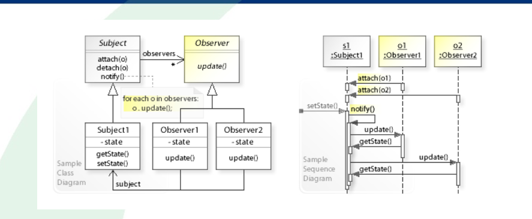
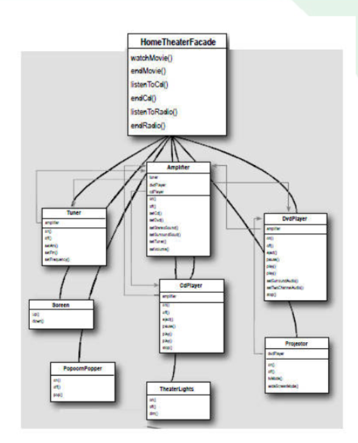
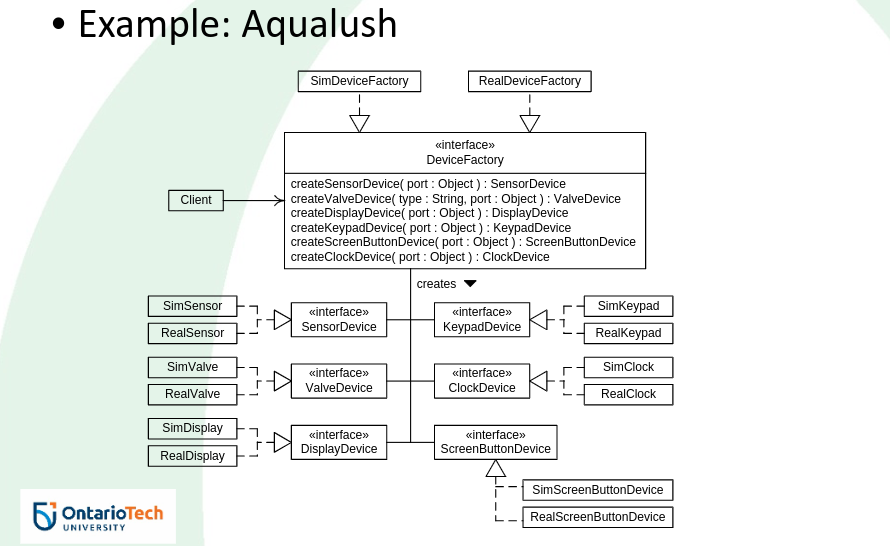
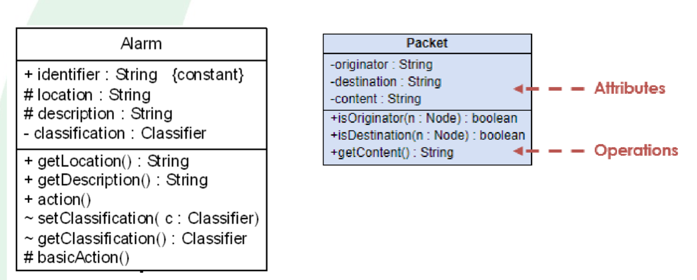
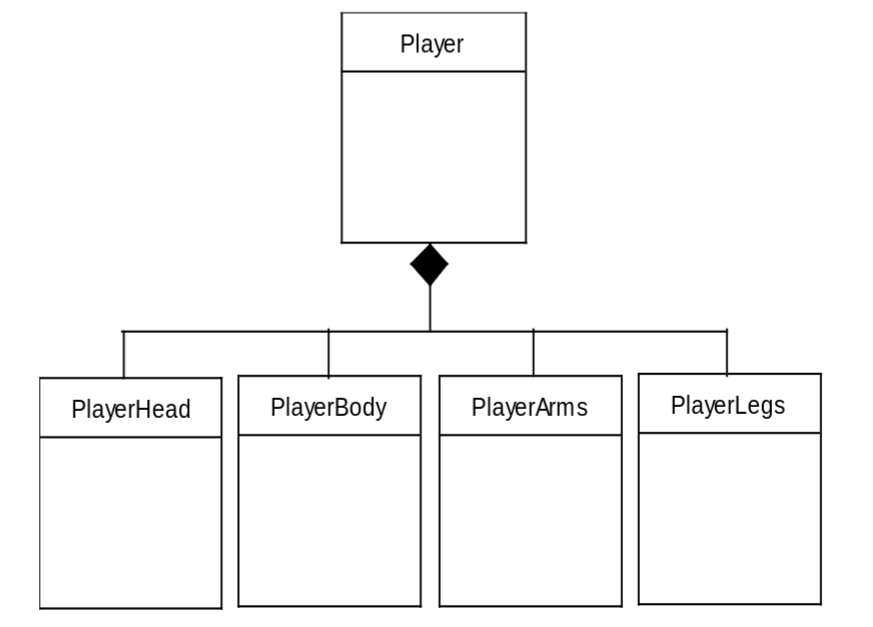
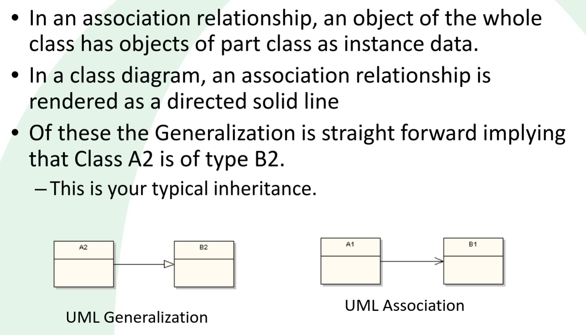
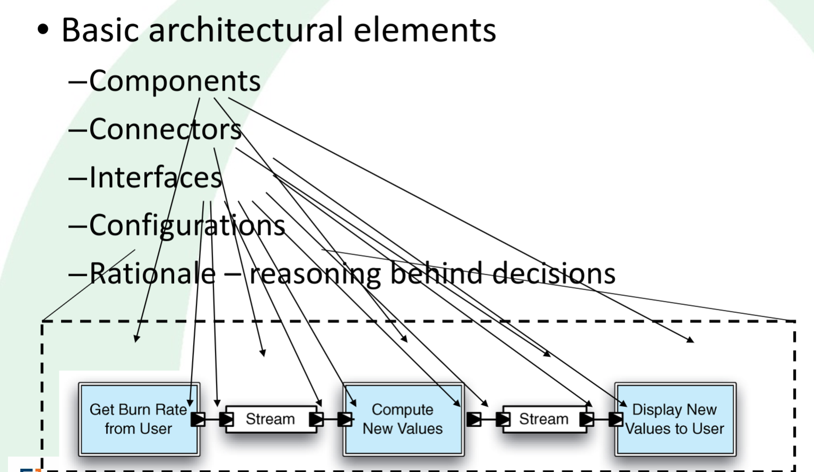
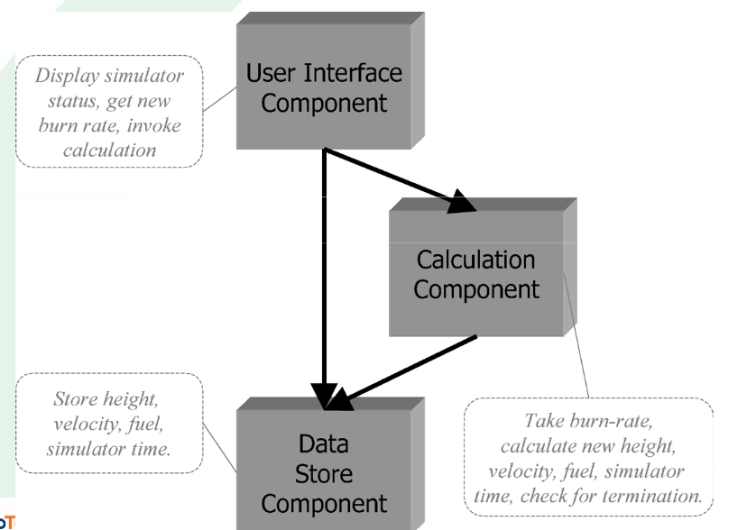
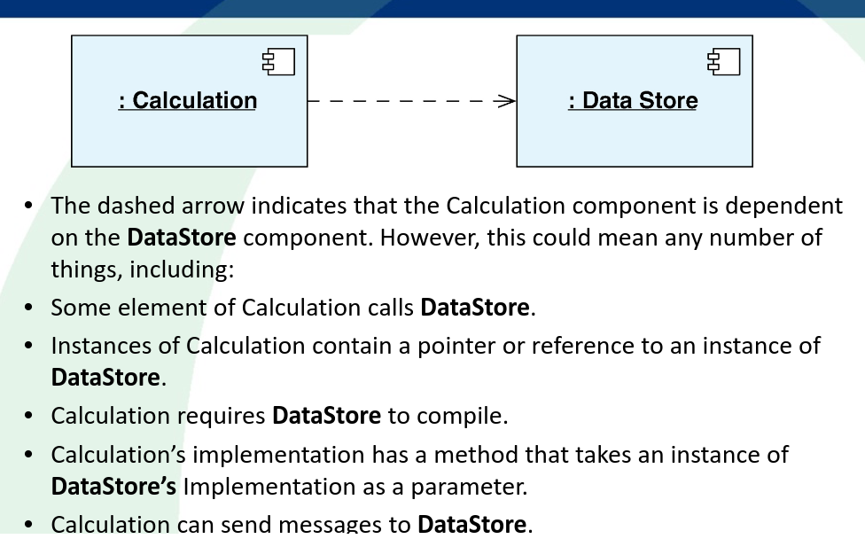
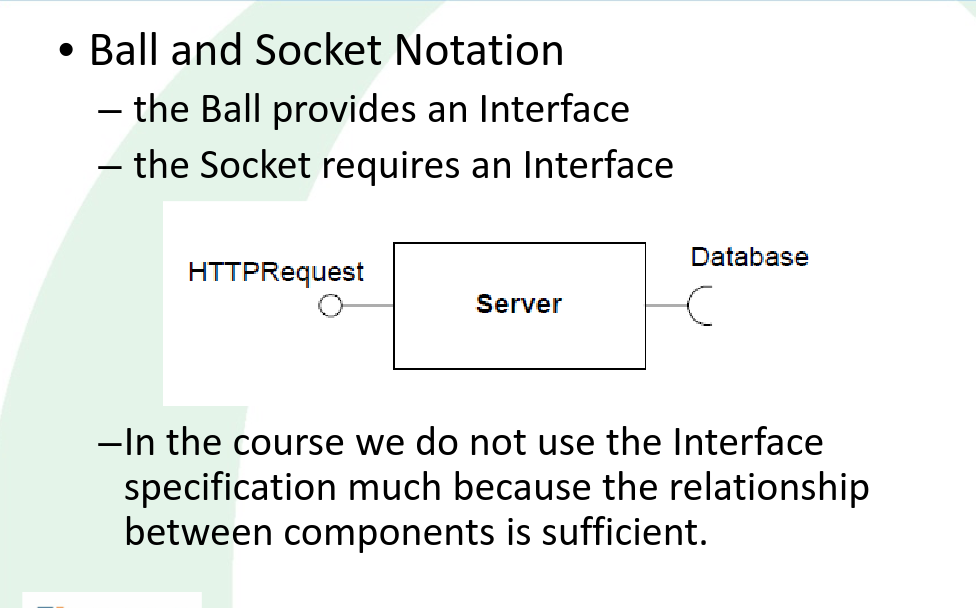

# Software Design and Architectures

<details>
  <summary style="font-size: 30px; font-weight: 500; cursor: pointer;">Lecture 1. | Info Session with Prof</summary>

Dr. Ramiro Liscano | SIRC 3360

*3rd & 4th year Software Engineer Prof (IoT Prof)*

Teaching Methods:

**Fridays:** Finish Lecture, Do an Exercise that will done in Tutorial

---

3 Assignments, (2 Before Midterm, 1 After)

**Project:** Learning an Agile Project

*NO PROGRAMMING, IT'S ABOUT DESIGN !!!*

---

Actual System Design

We'll talk about Design Patterns that are successful in the Industry

---

Design is Iteration, the *IPhone 14* is good for a reason...


Architecture is based on "Qualitative Analysis"

Run Redundancy "Parallelized Systems, so incase 1 goes down, you scale"


**Design Purpose:**

**Quality Attributes:**

**Primary Functionality:**

**Architectural Concerns:**

**Constraints:**

*Examples:* Operation Systems, Memory Constraints

---

**HINT:** Looks for consistency, Easy to start with Sequence Diagrams.


**General Form API** : Calls them "Interface"


### Architecture Matters

Software Architecture Example
**3D-Slit-Scanner_ESP32 I chose**

</details>

<details>
  <summary style="font-size: 30px; font-weight: 500; cursor: pointer;">Lecture 2. | Design Patterns (0 - 29)</summary>

### Design Patterns Overview

**Designing Software is Difficult** , especially when it comes to designing re-usable software, that's very hard.

Difficult tasks:
- Find pertinent objects.
- Factor them into classes or higher-level abstractions at the right granularity. *(Too much Abstraction is restrictive, too little is overwelhming)*
- Define class interfaces and inheritance hierarchies. *(Base Class, is Inherited by More Specific Class)*
- Establish key relationships among them

- Designing software is challenging, especially when aiming for reusability.
- Key tasks in software design include identifying relevant objects, organizing them into classes or abstractions, defining class interfaces, and establishing relationships.

### Value of Design Experience

- Design patterns help capture and reuse successful design experiences.
- They allow designers to apply proven solutions to design problems.
- Analogous to novelists and playwrights using storytelling patterns, software designers use design patterns to streamline their work.

### Recording Design Patterns

- Software design books and catalogs document design experience as design patterns.
- Design patterns systematically name, explain, and evaluate recurring design concepts.
- The goal is to make design experience usable for others.

### Why Use Design Patterns?

- Design patterns make it easier to reuse successful designs and architectures.
- Expressing proven techniques as patterns makes them accessible to new system developers.
- Design patterns enhance documentation and system maintenance.

#### Describing Design Patterns

- Graphical notations alone are insufficient for capturing design patterns.
- Design patterns must include decisions, alternatives, and concrete examples.
- A template for describing design patterns is used, as seen in *"Design Patterns, Elements of Reusable Object-Oriented Software" (commonly known as the "Gang of Four").*

### Template for Describing Design Patterns

- **Pattern Name and Classification:**
  - Name conveys the essence of the pattern.
- **Intent:**
  - A brief statement explaining the pattern's purpose.
- **Also Known As:**
  - Any other well-known names for the pattern.
- **Motivation (Forces):**
  - A scenario illustrating a design problem and how the pattern solves it.
- **Applicability:**
  - Situations where the pattern can be applied and examples of poor designs it can address.
- **Structure:**
  - A graphical representation of classes in the pattern using UML notation.
- **Participants:**
  - Classes/objects in the pattern and their responsibilities.
- **Collaborations:**
  - How participants collaborate to fulfill their responsibilities.
- **Consequences:**
  - How the pattern supports objectives and trade-offs/results of using it.
- **Implementation:**
  - Pitfalls, hints, or techniques for implementing the pattern, including language-specific issues.
- **Sample Code:**
  - Code fragments illustrating pattern implementation.
- **Known Uses:**
  - Examples of the pattern in real systems.
- **Related Patterns:**
  - Other design patterns closely related to this one and important differences.

</details>

<details>
  <summary style="font-size: 30px; font-weight: 500; cursor: pointer;">Lecture 2. | Design Patterns (30 - 75)</summary>

# The Behavioural Patterns
- This is a family of patterns:
    - The OBSERVER pattern
    - The COMMAND pattern
    - The MEDIATOR pattern
    - The ITERATOR pattern
 
### The Observer

*Observing changes in state, from a Subject*
*Very common is event systems, where events change and so the Observers are notified*

- Generally used for **ONE** to **MANY** relationships between Objects. *(One Store, to many Customers for E.X)*
- The **ONE** 's **MANY** dependent Objects are Notified Automatically Upon changes to **ONE**.

- Sometimes the update includes state, so the Observer doesn't need to be notified, to then ask for state.
- 




Observer Pattern uses three actor classes:

- Subject *(Object having methods to attach & detach observers, to and from Client Object)*
    - Holds list of Observers
    - Is Independent of how the objects are updated
    - Defines **attach(o)** , **detach(o)** , **notify(o)** Interface for Observers.
    - Dependency of Subjects to Observers *| Interface for Observer isn't cohesive, some Observers might have different notification methods, if it doesn't have to obide by the Interface*

- Observer *(The Customer, the MANY)*
    - Defines **update()** to be used by Subject

- Client *(The Store, the ONE)*

---

# The Broker Patterns
- This is a family of patterns:
    - The FACADE pattern
    - The DELEGATION pattern
    - The ADAPTER/WRAPPER pattern
    - The PROXY pattern

*ALL BROKER PATTERNS* have instances of **Broker** Class
- Broke class mediates the interaction between **Client** and **Supplier** class instances.

- **Client** can access the **Broker**, and the **Broker** can access the **Supplier** *(broker the middle man)*
    - These access associations are required to realize the behavior characteristic of broker patterns

- Communication Steps:
    -  Client requests a Supplier service from the Broker
    - Broker then interacts with the Supplier to obtain the service from the Supplier on behalf of the Client.

#### Broker Design Pattern Advantages

1. **Simplify the Supplier**
   - **Advantage:** A broker simplifies the client's interaction with a supplier by augmenting or enhancing its services without complicating its interface or design.
   - **Example:** Imagine a weather information service (supplier) that provides data in various formats. A broker can simplify the client's experience by offering a unified interface to access weather data in different formats without the client needing to handle the complexity.
<br></br>

2. **Decompose the Supplier**
   - **Advantage:** The broker allows you to decompose a complex supplier into manageable parts while presenting a consistent interface to the client.
   - **Example:** Consider a complex e-commerce platform (supplier) that handles orders, payments, and shipping. The broker can decompose these functions into separate components and provide a unified interface to the client. This way, each component can focus on its specific task, making the system more modular.
<br></br>

3. **Facilitate Client/Supplier Interaction**
   - **Advantage:** A broker streamlines interactions between the client and supplier, handling details to make it easier for the client to obtain required services.
   - **Example:** In a messaging application, the broker can handle low-level network communication, ensuring reliable message delivery. The client can simply send messages without worrying about the intricacies of establishing connections and dealing with network failures.

#### Facade Design Pattern

The Facade pattern is a type of broker pattern that simplifies the interaction between a client and a complex sub-system of suppliers. It provides a straightforward interface to the sub-system, making it easier for clients to access essential services without dealing with the sub-system's complexity.

**Advantages of Facade Pattern:**

1. **Simpler Interface to the Sub-system**
   - **Advantage:** Facade simplifies interactions by providing a clean and easy-to-use interface to a complex sub-system.
   - **Example:** Imagine a multimedia player application that includes audio and video playback, playlist management, and visual effects. The Facade can offer a single "play" method that handles all the intricacies of starting playback, selecting media, and managing visual effects. *Clients only need to call this simple "play" method.*

2. **Handling Complex Sub-systems**
   - **Advantage:** Sub-systems often comprise numerous classes with complex interfaces and relationships. Facade encapsulates this complexity, shielding clients from the inner workings.
   - **Example:** In a banking system, the Facade can manage various sub-systems like customer accounts, transactions, and loan approvals. Clients interact with the Facade to perform tasks like transferring funds, which involves interactions with multiple sub-systems. The Facade coordinates the underlying processes seamlessly.


Here we see a Client, accessing the *Facade* , which is the Broker to all these Components, that are either Low or High Abstraction Sub-systems, doing different things...

This *Facade* is very nice for the Client however, since it's a simplified interface for em.



Home Theater Example, the Facade will just Abstract all the Sub-systems of Theater. Lights, Popcorn Popper, WatchMovie, EndMovie

Me as the client, I just need to:
```java
facadeBroker.popcorn();
facadeBroker.lights(false); //Lights off
facadeBroker.watchMovie();

//Got bored of the Movie, let's listen to the radio instead
facadeBroker.endMovie();
facadeBroker.listenToRadio();
```

---
# The Generator Patterns

- These patterns are used for the creation of an instance of a **Class**.

- The **Factory** Method pattern
- The **Abstract Factory** pattern
- The Builder pattern
- The Singleton pattern


### Factory Patterns
- A factory method is an operation that creates and returns a new class instance.
- All generator patterns have factory methods.
- Factory patterns do not use factory methods to provide clients with new instances. *(generators do that)*

#### Factory vs. Abstract Factory

- These are Patterns are used for "Creational", used for Creating Object

**Why do I want an Object to create other objects !?**
- Pass that responsibility to a Factory
- Certain things I want to "occur" to the object based on settings..
- Have a Factory simply it for you
- **Biggest Reason for Factories** : De-coupling Client from Product *(Clients don't have to configure the products manually)*

## 1. Factory Pattern


*Lecture Example:*

- Consider Factory that produces Cars, *(Christler, Subaru, Ford)* 
- Factories are like Assembly Lines, first Instantiate, Load the Wheels on, Paint the Body, Q/A 


Interface is being *adopted* by all these companies, for their "Factories"

**ConcreteFactory** is the one, with the actual logic, which extends the AbstractFactory

Abstracts the **creation of Objects / Products** for the Client. *(Client can call a simple createProduct() method on Factory)*

The Factory pattern provides a way to create objects without specifying the exact class that will be created. Instead, it relies on subclasses or methods to determine this. 

### Java Example:

```java
interface Product {
    void describe();
}

class ConcreteProductA implements Product {
    @Override
    public void describe() {
        System.out.println("This is Product A");
    }
}

class Factory {
    public Product createProduct(String type) {
        if ("A".equals(type)) {
            return new ConcreteProductA();
        }
        //... other products
        return null;
    }
}
```

## 2. Abstract Factory Pattern


The Abstract Factory pattern extends the idea of the factory pattern. Instead of a single method to create objects, an abstract factory has multiple methods to create a family of related or dependent objects. *(It's an Abstraction of Factory)*

```java
interface Button {
    void render();
}

interface Checkbox {
    void check();
}

class WindowsButton implements Button {
    @Override
    public void render() {
        System.out.println("Rendering Windows style button");
    }
}

class MacOSButton implements Button {
    @Override
    public void render() {
        System.out.println("Rendering MacOS style button");
    }
}

class WindowsCheckbox implements Checkbox {
    @Override
    public void check() {
        System.out.println("Checking Windows style checkbox");
    }
}

class MacOSCheckbox implements Checkbox {
    @Override
    public void check() {
        System.out.println("Checking MacOS style checkbox");
    }
}

// ABSTRACT FACTORY HERE 
interface GUIFactory {
    Button createButton();
    Checkbox createCheckbox();
}
// ABSTRACT FACTORY HERE ^^^

class WindowsFactory implements GUIFactory {
    @Override
    public Button createButton() {
        return new WindowsButton();
    }

    @Override
    public Checkbox createCheckbox() {
        return new WindowsCheckbox();
    }
}

class MacOSFactory implements GUIFactory {
    @Override
    public Button createButton() {
        return new MacOSButton();
    }

    @Override
    public Checkbox createCheckbox() {
        return new MacOSCheckbox();
    }
}
```

In the Abstract Factory pattern example, rather than creating just one type of product like in the simple Factory pattern, the **GUIFactory** abstract factory can create a family of products *(Button and Checkbox).* There are concrete factories *(**WindowsFactory** and **MacOSFactory**)* that produce products (Instances) conforming to these interfaces, but suited to their specific platform.

### Aqualush Product 
*(complex product) , Measures pH levels from VATS, from various sensors*


</details>


<details>
  <summary style="font-size: 30px; font-weight: 500; cursor: pointer;">Lecture 3. (September 15) </summary>

Sometimes if he gives us open book test; We'll be ask to apply & use Design Patterns

Dr. Liscano says that **tutorialspoint.com** is a good ressource for Design Patterns

- He can't teach all patterns, so we focus on a few...

### Dependencies

- Can be quite dangerous, but you need them
- In Software Engineering we'd like to reduce Dependencies in our Architecture
- We can't really do this, so we use Interfaces to minimize Dependencies *(Interfaces Force Cohesive Functionality)*
- ALWAYS try to use Interface's which are implemented by Objects **(for COHESIVENESS)**

**Components** & **Time-line / Sequence** Diagrams match the same Components

**Details Design Approach**
- Try, Test, Simulate *(REQUIRES LOTS OF DOCUMENTATION!!!)*
- Used In Safety Critical Systems
- Used in Embedded Systems alot, will do this in 4th year

#### Concurrency & Architectural Patterns
- Used in Operation Systems
- Used for Concurrent Design of software, that requires parallelization of CPU


</details>


<details>
<summary style="font-size: 30px; font-weight: 500; cursor: pointer;">Lecture 4. (September 20th) </summary>

### UML Design Concepts: (Important Notation)

**Class Diagram** Attributes & Operations



3 Types of Relationships exists:
- Part of some relationship
- Knowledge relationship
- Dependency upon relationship

**Composite Aggregate Class**
*Example:* Player is composed of PlayerHead, PlayerBody, PlayerArms, PlayerLegs



**Class Associations**
*Directional* A2 has relation with B2, but not vice-versa



*B2* is the Generalization of *A2*
*A2* is the Specialization of *B2*

*Interface* is a generalization / Abstraction of the actual implementation *(Mitigates Dependency)*

#### Why Associations?

If I make a change in **B1**, I'll have to modify something in **A1**

Using something from the other class, **A1** might call methods from **B1**, as *A1 references B1*.

If **B1** doesn't reference **A1**, so it doesn't really care about modifications in **A1**

When stuff is Tightly Coupled, and it's interworking tightly.


#### Depends-upon Relationship
* The depends-upon relationship implies 2 classes have a dependency!

- One class sends a message to another (dep)
- One class has another as part of it's data *(Instance of class within another class object)*
- One class mentions another as a parameter to an operation


#### Association vs Dependency

Association represents that one entity uses another entity as part of it's behavior?
*(Association is a Dependency itself lmao)*

**Dependency** is the important, it's when one entity depends on the behavior of another entity. 

**IN EXAMS:** We use mostly associations *[Solid Lines with Arrow]*

#### Packages

**Look Like Folders** in UML Diagrams, it shows that we don't know the details of the package.

---

## Software Architecture Modelling

- Recall about Architecture, design decisions I'm making, named **Artifact**

- Architecture Decisions & Concepts.
- At what level of detail, with how much rigor or formality.

**Stakeholder-driven Modeling**

- Stakeholders identify aspects of the system they need/concerned about

  *Example: Lunar Lander*
  - 1960's computer game
  - Simple 2D Game, basic physics engine
  - **Blue** are the components, and it streams data via Interfaces to the next

  

#### What do we Model?
- Components, Connectors, Interface.
- Capture Constraint of the System to be Architectured.
- Business Rules, Concurrency, general Rsequirements.
- **Functional** and **Non-Functional** Requirements. *(Prof doesn't care about these lmao)*

**Architecture is generally static** design

### Views & View Consistency

You can have different views of the same system

I can look at EZCampus via **Sequence Diagram**, **Swimline Diagram**, **Component Diagram**

##### Logical View
- Capture the logical (often software) entities in a system and how they are interconnected.

**Example:** In a social media application, the logical view includes entities like User, Post, Comment, and Like. Users can create posts, comment on posts, and like posts, establishing relationships between these entities.

##### Physical View
- Capture the physical *(often hardware)* entities in a system and how they are interconnected.

**Example:** In a data center, the physical view includes servers, switches, and routers. Servers are connected to switches, and switches are connected to routers to form a network infrastructure. This physical setup ensures data can be processed and routed efficiently.

##### Deployment View
- Capture how logical entities are mapped onto physical entities. *(Where the components reside)*

**Example:** In a cloud-based web application, the deployment view shows how software components like web servers, application servers, and databases are deployed on physical servers or virtual machines in a data center or cloud provider's infrastructure. It specifies which software runs on which server, ensuring the application's availability and scalability.

---

### Common Types of Inconsistencies

_*PROF WANTS CONSISTENCY WITH VIEWS!*_

- **Direct Inconsistencies:** These occur when there are conflicting statements directly contradicting each other. For example, saying "The system runs on two hosts" and "The system runs on three hosts."

- **Refinement Inconsistencies:** These arise when high-level, abstract views of a system conflict with low-level, concrete views of the same parts. 

- **Static vs. Dynamic Aspect Inconsistencies:** These occur when dynamic aspects, such as behavioral specifications, conflict with static aspects like system topologies. For instance, a component mentioned in a sequence diagram might not exist in the component diagram.

*Sequence Diagrams capture Use-Cases only, so there are bound to be some Inconsistencies from other views...*

---

### Statement Templates for Design

- **Natural Language**: it's good to write it out, but it might be verbose for large and complex designs...
  

- **Informal Graphical Modelling**: Box & Line, informal, it's good to have a *Legende* and or Text descriptors
  
  *Ambigious!? what do these lines mean !?*

- **UML** : Formal definition of Diagrams


### More UML Notation: 

  The little white boxes within components are **Interfaces**

  

  *These are "Components" in UML, which can be made-up of other boxes, but here we show high-level component dependency*
  *Can specify an action like `<<import>>` or `<<call>>` on these lines, <-- stereotypes*


  #### Ball and Socket

  Server requires interface from Database, and Provides API (HTTP Request) Interface

  


</details>